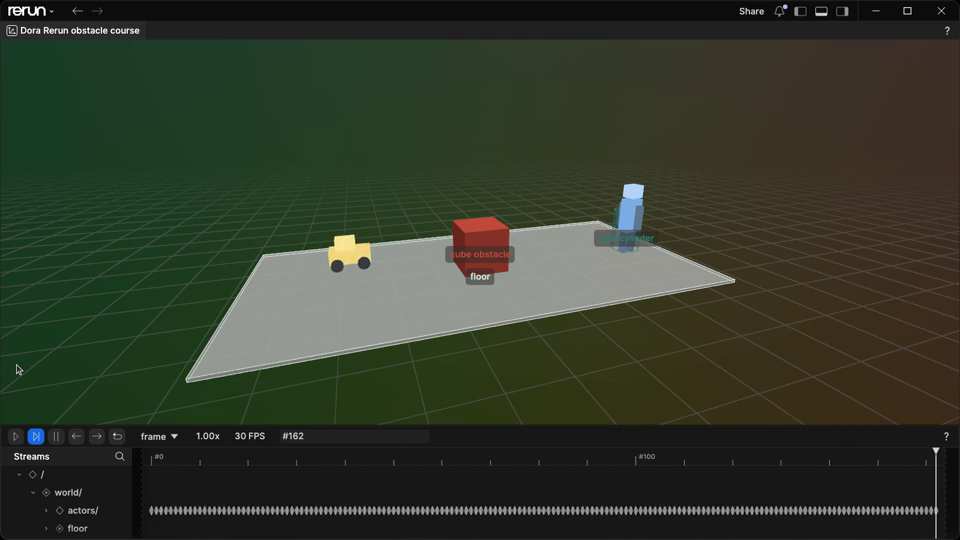

# Rerun Introduction and Static Scene

## Version Information

| Component | Version / Environment |
| --- | --- |
| Operating system | Ubuntu 22.04.5 LTS, x86_64 |
| Python | CPython 3.10.12 |
| Rerun CLI and Python SDK | 0.33.0 |

## Downloads

- [Complete Rerun and Dora reference project](../assets/week2-rerun-scene/rerun-scene-reference.zip)
- [Humanoid robot glTF model](../assets/week2-rerun-scene/source/models/humanoid_robot.gltf)
- [Small car glTF model](../assets/week2-rerun-scene/source/models/small_car.gltf)

The archive contains the exact glTF assets, pinned dependencies, scene logger,
Dora nodes, trajectory, capture script, and run script used in this and the
next chapter.

## Goal

This chapter creates the static foundation for the scene used in the next
chapter:

- A floor plane.
- A cube obstacle.
- A cylinder goal.
- A reusable glTF humanoid robot model.
- A reusable glTF small car model.
- A Rerun Viewer screenshot that proves the scene can be inspected visually.

The robot and car do not move in this chapter. Keeping the first Rerun example
static makes it easier to understand the coordinate system, scene hierarchy,
assets, and Viewer workflow before adding Dora-controlled motion.



## What Rerun Is

Rerun is a visualization and logging toolkit for robotics, computer vision, and
physical AI systems. A program records typed data such as transforms, boxes,
images, points, text, tensors, and time-series state. The Rerun Viewer can show
that data live, or open a saved `.rrd` recording later.

The official Python SDK package is `rerun-sdk`, and the Python import name is
`rerun`. Installing the Python SDK also provides the Viewer command line tool.

`rerun-sdk==0.33.0` requires Python 3.10 or newer. Wheels for this version are
available for Windows x86-64, Linux x86-64, Linux ARM64, and macOS ARM64. If
your platform is not covered by a wheel, use the official Rerun installation
and troubleshooting pages as the source of truth.

## Inspect the Static Scene

Extract the reference project into a new directory, then ask the assistant to
inspect the fixed inputs rather than recreate them:

```text
Inspect this supplied Rerun and Dora reference project.

Treat models/humanoid_robot.gltf, models/small_car.gltf, and the object
coordinates in visualizer.py as fixed tutorial assets. Do not replace,
regenerate, resize, or rearrange them.

Summarize the scene hierarchy, pinned Python packages, generated outputs, and
the commands run by run.sh. Check for missing dependencies and
machine-specific paths. Do not install, edit, or run anything yet, and do not
print usernames, hostnames, IP addresses, tokens, or unrelated system
information.
```

This keeps every reader on the same scene while still using the assistant to
explain dependencies and the execution path.

## Project Layout

After extraction, the runnable example has this layout:

```text
rerun-scene-reference/
├── capture_rerun_viewer.py
├── controller.py
├── dataflow.yml
├── generate_models.py
├── models/
│   ├── humanoid_robot.gltf
│   └── small_car.gltf
├── requirements.txt
├── run.sh
├── trajectory.py
└── visualizer.py
```

The next chapter extends the same example directory with Dora nodes and
motion capture. Generated runtime files stay out of the tutorial source:

- `.venv/` contains the local Python environment.
- `models/` contains reusable glTF assets for the humanoid robot and small car.
- `artifacts/` contains generated `.rrd` files and any local Viewer media.
- `logs/` contains runtime logs.
- `out/` contains Dora runtime session data.

The archive already contains the model assets. `generate_models.py` is included
so their deterministic construction can be reviewed, but the supplied glTF
files are the tutorial inputs.

## Dependencies

The static Rerun portion uses:

```text
rerun-sdk==0.33.0
```

Pinning versions is useful in a tutorial because it makes bugs easier to
reproduce. When you intentionally update a dependency, update the version
information at the top of the chapter and run the verification script again.

## Log Static Objects

The Rerun scene starts with a world coordinate system and a few static objects.
Static data is logged once and then reused across the recording.

```python
import rerun as rr

rr.init("dora_rerun_obstacle_course")
rr.save("artifacts/dora_rerun_scene.rrd")

rr.log("world", rr.ViewCoordinates.RIGHT_HAND_Z_UP, static=True)
rr.log(
    "world/obstacles/cube",
    rr.Boxes3D(
        centers=[[0.0, 0.0, 0.5]],
        half_sizes=[[0.5, 0.5, 0.5]],
        colors=[(190, 74, 58)],
        labels=["cube obstacle"],
        fill_mode="solid",
    ),
    static=True,
)
rr.log(
    "world/goal/cylinder",
    rr.Cylinders3D(
        centers=[[4.0, 0.0, 0.5]],
        lengths=[1.0],
        radii=[0.35],
        colors=[(45, 127, 111)],
        labels=["goal cylinder"],
    ),
    static=True,
)
```

The full `visualizer.py` also logs the floor, robot model, and car model under a
clear hierarchy:

```text
world/
├── floor
├── obstacles/cube
├── goal/cylinder
└── actors/
    ├── robot
    └── car
```

## Add Reusable glTF Assets

The robot and car are logged as glTF assets:

```python
from pathlib import Path

import rerun as rr

MODELS = Path("models")

rr.log("world/actors/robot", rr.Asset3D(path=MODELS / "humanoid_robot.gltf"), static=True)
rr.log("world/actors/car", rr.Asset3D(path=MODELS / "small_car.gltf"), static=True)
```

For this tutorial, glTF worked better than OBJ/MTL. OBJ was easy to generate,
but the Rerun Viewer rendered the model as a white material in this environment.
The glTF assets carried materials more reliably.

### Model Generator Source

The complete deterministic model generator is shown below for review:

```python
{{#include ../assets/week2-rerun-scene/source/generate_models.py}}
```

## Run the Static Scene

On Linux or an SSH machine with a desktop session:

```bash
mkdir rerun-scene-reference
unzip rerun-scene-reference.zip -d rerun-scene-reference
cd rerun-scene-reference
bash run.sh
```

The script creates `.venv`, installs the pinned dependencies, validates the
supplied glTF assets, saves the `.rrd`, and prints the verified versions. Set
`REGENERATE_MODELS=1` only when you intentionally want to reproduce the
deterministic model-generation step.

Expected success markers include:

```text
Verified: Rerun recording was generated.
```

If there is no desktop display, keep the generated `.rrd` and open it later on a
desktop machine:

```bash
cd rerun-scene-reference
CAPTURE_VIEWER=0 bash run.sh
source .venv/bin/activate
rerun artifacts/dora_rerun_scene.rrd
```

## Next Step

The next chapter keeps this scene layout and uses Dora to publish changing
robot and car transforms. That turns the static Rerun scene into a small
Dora-controlled motion example.
