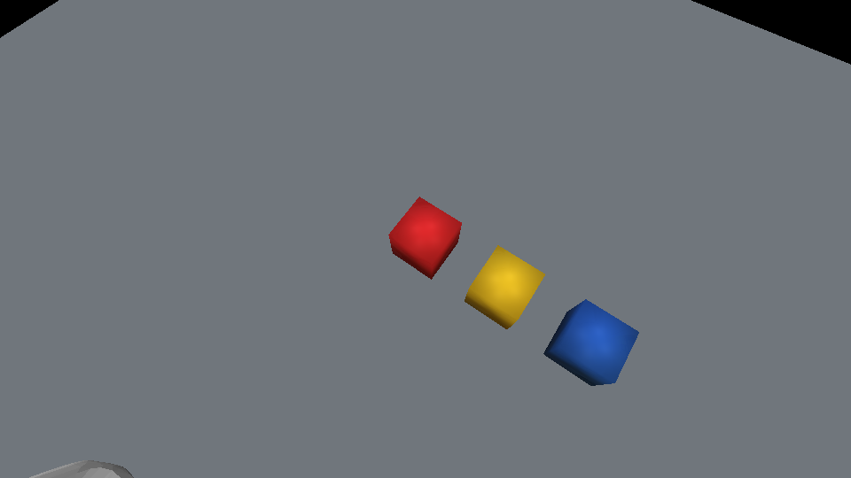

# Analyze Visual Information with Multimodal Models

## Version Information

| Component | Version / Environment |
| --- | --- |
| Operating system | Ubuntu 22.04.5 LTS, x86_64 |
| GPU | NVIDIA GeForce RTX 5090 Laptop GPU, 24 GB VRAM |
| NVIDIA driver | 580.159.03 |
| Dora CLI and Python API | 0.5.0 |
| Habitat-Sim | 0.3.3 |
| Ollama | 0.32.1 |
| Local model | `qwen3-vl:8b-instruct`, Q4_K_M |
| Model digest | `0533d74300e4f9bc367d675d4e64ffd073d50ff16a2b4096cc2e8a1cf8c96319` |

The example uses Dora `v0.5.0`. Before reproducing it, compare that version
with the [latest official release](https://github.com/dora-rs/dora/releases/latest)
and check the [official installation guide](https://dora-rs.ai/dora/getting-started/installation.html),
because releases and model availability change.

## Goal

You will use an AI coding assistant to build a vision-gated pick-and-place
application. The Habitat-Sim scene contains a Franka Panda arm, an RGB wrist
camera, and three separated cubes arranged red, yellow, and blue.

Dora connects the complete task:

1. Capture the initial wrist image.
2. Ask a vision-language model whether the red and blue cubes are visible and
   whether the red cube is already on the blue cube.
3. Run a deterministic trajectory only when both cubes are visible and are not
   stacked.
4. Pick up the red cube, place it on the blue cube, and return the arm home.
5. Capture another wrist image and ask the model to verify the result.
6. Report success only when the second structured result says the red cube is
   on the blue cube.

The simulation motion is deliberately deterministic. The experiment evaluates
visual judgment and Dora orchestration, not grasp-policy uncertainty.

## Before You Begin

The commands in this chapter target Ubuntu/Linux and assume that the repository
is open at its root. Reuse the working Dora, Python, and Habitat-Sim environment
from the previous camera chapter. Ollama is installed below; FFmpeg and
FFprobe are needed only to prepare and inspect tutorial media. Keep generated
outputs under `work-product/verification/multimodal-pick-and-place/outputs/`.

## Hardware Requirements

For local inference, an NVIDIA GPU with at least 12 GB VRAM, 24 GB system
memory, and about 15 GB free disk space is recommended. Use an 8B Q4 model on a
24 GB GPU, or a smaller vision model on a lower-spec system. Keep peak GPU
memory below 70 percent so rendering and screen recording retain headroom.

The verified full run used 11,789 MiB of 24,463 MiB, or 48.2 percent. GPU
compute briefly reached 87 percent during inference, but this was a short
compute burst rather than sustained memory pressure.

If a local model does not fit, keep the same Dora contract and replace only the
inference node with a cloud API near the end of the chapter.

## Why This Stack

[Habitat-Sim](https://aihabitat.org/docs/habitat-sim/) provides GPU rendering,
articulated-object joint control, and RGB sensors. The Panda scene and real
visual meshes can be reused from the previous camera chapter.

[Dora](https://dora-rs.ai/docs/) expresses the controller, simulator, and model
as nodes with explicit inputs and outputs. The vision model proposes an
observation; ordinary program logic decides whether the task may continue.

[Ollama](https://ollama.com/) exposes a small local API for
[Qwen3-VL](https://github.com/QwenLM/Qwen3-VL). Images remain on the computer,
and JSON Schema can constrain the response.

## Implementation Flow

1. Inspect the computer and choose local or cloud inference.
2. Install the model runtime and prepare a vision-language model.
3. Build the arm, camera, cubes, and deterministic trajectory.
4. Define the structured visual contract and Dora control flow.
5. Connect the model and independently test the two gate images.
6. Run the complete task and collect visual and numerical evidence.

## Inspect the Computer

Begin with a read-only environment check. Ask the assistant to sanitize the
report rather than printing unrelated process or identity information.

```text
Inspect this computer for a Dora vision-gated pick-and-place example.

Report the operating system, CPU architecture, Python version, system memory,
free disk space, GPU model, GPU memory, NVIDIA driver, CUDA availability, and
installed Dora version. Check Dora's latest official release and installation
documentation.

Compare the machine with these recommendations: NVIDIA GPU with at least 12 GB
VRAM, 24 GB system memory, and 15 GB free disk space. Recommend a local 4B/8B
vision-language model or the cloud API path. Do not install or remove anything
yet. Do not print usernames, home paths, private hostnames, tokens, serial
numbers, or unrelated process information.
```

The verified machine supported an 8B Q4 model while leaving enough VRAM for
Habitat-Sim and video encoding.

### Check Installed Versions

Run these commands in a terminal and use their output to complete the version
report. A missing command identifies a component that still needs installation.

```bash
python --version
dora --version
nvidia-smi --query-gpu=name,driver_version,memory.total \
  --format=csv,noheader
```

## Prepare the Local Model

Prepare the model runtime separately and test it before adding Dora or the
simulator.

```text
Prepare a local multimodal runtime for this tutorial.

Use the latest official Ollama instructions. Keep binaries, model caches, and
generated files outside the book source. Select a current Qwen3-VL instruct
model that keeps peak GPU memory below 70 percent. Prefer an 8B Q4 model on this
24 GB GPU.

Start Ollama on localhost only. Test one RGB image with JSON Schema output.
Report the exact Ollama version, model name, model digest, elapsed time, valid
JSON result, and GPU memory use. Do not continue if the response is truncated
or invalid. Do not expose local paths or unrelated processes.
```

The verified selection was `qwen3-vl:8b-instruct` with the digest listed above.
Two warm image requests completed in 11.36 seconds total during the initial
smoke test.

### Start Ollama and Confirm the Model

If `ollama --version` is unavailable, install or update Ollama with the current
[official Linux command](https://docs.ollama.com/linux):

```bash
curl -fsSL https://ollama.com/install.sh | sh
ollama -v
```

Start the local service in the first terminal and leave it running:

```bash
export OLLAMA_HOST=127.0.0.1:11434
ollama serve
```

In a second terminal, confirm the runtime, download the selected model, and
check the local API:

```bash
ollama --version
ollama pull qwen3-vl:8b-instruct
ollama list
curl -fsS http://127.0.0.1:11434/api/tags
```

Do not publish the complete API response if it contains unrelated local model
names. Keep the service terminal open until the Dora run is complete.

## Build the Scene and Motion

The wrist camera should show all three cubes while the arm is home. During the
motion, its origin follows the wrist and its view remains centered on the red
task object. A second camera records the complete scene for the reader.

```text
Extend the verified Habitat-Sim Panda camera example into a deterministic
pick-and-place scene.

Requirements:
- Use the real Franka Panda visual meshes and GPU rendering.
- Add separated 10 cm red, yellow, and blue cubes in one row.
- Mount one RGB-only pinhole camera above the wrist, with no depth sensor.
- At home, both the external view and wrist RGB view must show all three cubes.
- Generate a smooth joint path: home, pre-grasp, grasp, lift, transfer, place,
  retreat, and home.
- Use validated IK waypoints. Attach the red cube deterministically after the
  grasp waypoint and release it exactly on top of the blue cube at place.
- Record 960x540 external and wrist views at 12 FPS, plus a side-by-side clip.
- Save initial and final screenshots from both cameras.
- Fail if any initial cube color is missing, the arm does not return home, or
  the final red-cube center is not one cube height above the blue-cube center.
- Keep generated assets and logs out of the book source until they are reviewed.

Run focused tests before recording. Show the solved waypoints, motion duration,
home error, stack error, and sanitized output file list.
```

### Test and Generate the Simulation

From the repository root, run the verified scripts in this order:

```bash
cd work-product/verification/multimodal-pick-and-place

python -m unittest discover -s tests
python prepare_trajectory.py --output outputs/trajectory
python record_demo.py \
  --trajectory outputs/trajectory/trajectory.json \
  --output outputs/demo
```

The first command should report all tests as `OK`. The following commands
should create `trajectory.json`, four screenshots, three videos, and
`run-result.json` below `outputs/`.

The initial third-person view shows the complete arm and work area:

<div class="media-pair">
  <figure>
    
    <figcaption>Initial third-person view</figcaption>
  </figure>
  <figure>
    
    <figcaption>Initial wrist RGB input</figcaption>
  </figure>
</div>

The validated path contains 185 frames and plays for 15.42 seconds. The maximum
home-joint error is approximately `6.7e-8 rad`, and the measured stack-position
error is approximately `5.2e-9 m`.

### Reference: Deterministic Motion

The core execution loop below is taken from
`work-product/verification/multimodal-pick-and-place/simulation_runtime.py`.
The cube is attached only after the `grasp` waypoint and released only after
the `place` waypoint.

```python
for (source_name, source), (destination_name, destination) in zip(
    self.waypoints, self.waypoints[1:]
):
    path = interpolate_segment(
        source, destination, self.frames_per_segment
    )
    for joints in path[1:]:
        self.scene.set_joints(joints)
        if attached_transform is not None:
            self.scene.update_attached_red(attached_transform)
        record_frame()

    action = carry_action_after_waypoint(destination_name)
    if action == "attach":
        attached_transform = self.scene.attach_red_to_hand()
    elif action == "release":
        self.scene.place_red_on_blue()
        attached_transform = None
```

## Define the Visual Contract

Do not ask the model for a paragraph. Define only the observations required by
the controller.

```text
Define and test a closed JSON contract for the wrist-camera decision.

The model must return exactly these fields:
- red_visible: boolean
- blue_visible: boolean
- red_on_blue: boolean
- confidence: number from 0 to 1

red_on_blue is true only when the red cube is vertically above the blue cube,
their horizontal footprints overlap, and the blue cube visibly supports the
red cube. Reject additional fields, wrong types, invalid JSON, and confidence
outside the allowed range. Add tests for valid initial/final observations and
all rejection cases.
```

The expected initial observation is:

```json
{
  "red_visible": true,
  "blue_visible": true,
  "red_on_blue": false,
  "confidence": 0.98
}
```

### Reference: Strict Result Validation

The validated parser in
`work-product/verification/multimodal-pick-and-place/contracts.py` rejects
additional fields, non-boolean flags, and invalid confidence values:

```python
OBSERVATION_FIELDS = {
    "red_visible",
    "blue_visible",
    "red_on_blue",
    "confidence",
}


def parse_observation(payload: str) -> ObservationResult:
    value = json.loads(payload)
    if not isinstance(value, dict) or set(value) != OBSERVATION_FIELDS:
        raise ValueError("observation result has unexpected fields")

    for field in ("red_visible", "blue_visible", "red_on_blue"):
        if type(value[field]) is not bool:
            raise TypeError(f"{field} must be a boolean")

    confidence = value["confidence"]
    if isinstance(confidence, bool) or not isinstance(confidence, (int, float)):
        raise TypeError("confidence must be a number")
    if not 0.0 <= float(confidence) <= 1.0:
        raise ValueError("confidence must be between 0 and 1")

    return ObservationResult(
        red_visible=value["red_visible"],
        blue_visible=value["blue_visible"],
        red_on_blue=value["red_on_blue"],
        confidence=float(confidence),
    )
```

## Define the Dora Control Flow

Use three nodes and keep each responsibility narrow:

- `controller`: owns the task state machine and the confidence threshold.
- `simulation`: captures images, executes the validated trajectory, and records
  media.
- `vision`: calls Ollama and validates the response.

This same-computer example publishes a small JSON observation containing
`phase` and `wrist_path`; the `vision` node reads that PNG from local storage.
It calls the model exactly twice, once before motion and once after motion. The
recorded camera streams are evidence for the reader, not a continuous inference
input. If the nodes run on different computers, replace the local path with
encoded image bytes or a shared object-storage URI.

```text
Implement the current example as a Dora 0.5.0 dataflow.

Create controller, simulation, and vision Python nodes with explicit inputs and
outputs. The controller must request an initial capture, run motion only when
red and blue are visible, red_on_blue is false, and confidence is at least 0.8,
then request a final capture. It may report success only when the final result
has both cubes visible, red_on_blue true, and confidence at least 0.8.

The simulation node must own Habitat-Sim and the validated trajectory. The
vision node must own the model request and schema validation. Publish a
sanitized error instead of inventing an observation on timeout, service error,
invalid JSON, or schema failure. Make every node exit cleanly after success or
failure. Add unit tests for contracts, state transitions, interpolation, joint
limits, and grasp/release events.
```

### Reference: Dora Dataflow

The complete `dataflow.yml` keeps the cyclic control loop explicit:

```yaml
nodes:
  - id: controller
    path: controller_node.py
    inputs:
      analysis: vision/analysis
      motion_complete: simulation/motion_complete
    outputs:
      - command

  - id: simulation
    path: simulation_node.py
    inputs:
      command: controller/command
    outputs:
      - observation
      - motion_complete

  - id: vision
    path: vision_node.py
    inputs:
      observation: simulation/observation
    outputs:
      - analysis
```

### Reference: Confidence-Gated State Transition

The decision logic is ordinary, testable Python from
`work-product/verification/multimodal-pick-and-place/controller.py`:

```python
def on_analysis(
    self, phase: str, result: ObservationResult
) -> list[Command]:
    expected_state = {
        "before": State.INSPECTING_BEFORE,
        "after": State.INSPECTING_AFTER,
    }.get(phase)
    if expected_state is None or self.state is not expected_state:
        raise RuntimeError("analysis phase does not match controller state")

    visible = result.red_visible and result.blue_visible
    confident = result.confidence >= self.min_confidence

    if phase == "before":
        if visible and confident and not result.red_on_blue:
            self.state = State.MOVING
            return [Command("run_pick_place")]
        self.state = State.FAILED
        return [Command("task_failed", "precondition")]

    if visible and confident and result.red_on_blue:
        self.state = State.SUCCEEDED
        return [Command("task_success")]
    self.state = State.FAILED
    return [Command("task_failed", "postcondition")]
```

This preserves a useful safety boundary: the model cannot directly emit joint
commands, and an invalid or low-confidence response stops the task.

## Connect Qwen3-VL

Use a concise image prompt and pass the same schema to the local API.

```text
Connect the Dora vision node to the verified Ollama Qwen3-VL model.

Send the wrist PNG through Ollama's documented chat API. Require the existing
JSON Schema, temperature 0, a bounded output length, a configurable model name,
localhost service URL, and request timeout. Use this visual instruction:

Inspect this RGB image from a robot wrist camera. Return whether the red cube
and blue cube are visible, and whether the red cube is resting on top of the
blue cube. Set red_on_blue to true only when the red cube is vertically above
the blue cube, their horizontal footprints overlap, and the blue cube visibly
supports the red cube. Return JSON only.

Validate the response again in Python before publishing it. Test the initial
and final screenshots independently before running the full Dora application.
```

Both independent tests returned valid JSON with confidence `0.98` and correctly
distinguished the unstacked and stacked scenes.

### Reference: Ollama Vision Request

The verified request code in
`work-product/verification/multimodal-pick-and-place/vision_client.py` sends the
PNG as base64, asks Ollama to enforce `SCHEMA`, and validates the returned text
again in Python:

```python
def analyze_image(image_path: Path, timeout: float = 120.0) -> ObservationResult:
    encoded = base64.b64encode(image_path.read_bytes()).decode("ascii")
    body = json.dumps(
        {
            "model": MODEL,
            "messages": [
                {"role": "user", "content": PROMPT, "images": [encoded]}
            ],
            "format": SCHEMA,
            "stream": False,
            "options": {"temperature": 0, "num_predict": 128},
        }
    ).encode("utf-8")
    request = urllib.request.Request(
        f"{OLLAMA_URL}/api/chat",
        data=body,
        headers={"Content-Type": "application/json"},
        method="POST",
    )
    with urllib.request.urlopen(request, timeout=timeout) as response:
        payload = json.load(response)
    content = payload.get("message", {}).get("content")
    if not isinstance(content, str):
        raise ValueError("model response does not contain message content")
    return parse_observation(content)
```

### Smoke-Test the Gate Images

With Ollama running and the images generated earlier, test both inputs without
Dora before starting the complete dataflow:

```bash
cd work-product/verification/multimodal-pick-and-place

python - <<'PY'
import json
from pathlib import Path

from vision_client import analyze_image, result_dict

for phase in ("before", "after"):
    image = Path("outputs/demo") / f"{phase}-wrist.png"
    result = result_dict(analyze_image(image))
    print(phase, json.dumps(result, sort_keys=True))
PY
```

The `before` result should contain `red_on_blue: false`; the `after` result
should contain `red_on_blue: true`. Both results must keep `red_visible` and
`blue_visible` true and pass the local schema validator before the controller is
allowed to use them.

## Run the Complete Application

```text
Run and verify the complete Dora pick-and-place application.

Start the isolated Ollama service, run the Dora dataflow, and capture sanitized
logs. Confirm this exact event order: initial visual result, motion, final
visual result, task success. Record both camera streams from the first home
frame through the final home frame. Measure frame count, video duration, home
error, stack error, peak GPU memory, and GPU utilization. Keep GPU memory below
70 percent. Stop every service started for the test when verification ends.
```

### Run the Dora Dataflow

With Ollama still running in the other terminal, execute:

```bash
cd work-product/verification/multimodal-pick-and-place

export OLLAMA_MODEL=qwen3-vl:8b-instruct
export OLLAMA_URL=http://127.0.0.1:11434
export WEEK7_TRAJECTORY="$PWD/outputs/trajectory/trajectory.json"
export WEEK7_OUTPUT="$PWD/outputs/dora-run"

mkdir -p outputs/logs
set -o pipefail
dora run dataflow.yml 2>&1 | tee outputs/logs/dora-run.log
```

In another terminal, sample GPU use without listing unrelated process names:

```bash
nvidia-smi \
  --query-gpu=utilization.gpu,memory.used,memory.total \
  --format=csv,noheader,nounits
```

When `TASK_SUCCESS` appears and all Dora nodes have exited, return to the
Ollama terminal and press `Ctrl+C` to stop the local service.

The complete verified log reduced to these key events:

```text
VISION_RESULT phase=before red_visible=true blue_visible=true red_on_blue=false confidence=0.98
MOTION_RESULT success=true frames=185 duration_seconds=15.4167 home_error=6.7e-8 stack_error=5.2e-9
VISION_RESULT phase=after red_visible=true blue_visible=true red_on_blue=true confidence=0.98
TASK_SUCCESS
```

The left half of the video is the third-person view; the right half is the RGB
stream produced from the wrist-mounted camera.

<video class="wide-demo-video" controls muted playsinline preload="metadata" width="1280" height="360" poster="../assets/multimodal-pick-and-place/pick-place-side-by-side-poster.png">
  <source src="../assets/multimodal-pick-and-place/pick-place-side-by-side.mp4" type="video/mp4">
</video>

Separate recordings are also available for the
[third-person view](../assets/multimodal-pick-and-place/pick-place-overview.mp4)
and [wrist RGB view](../assets/multimodal-pick-and-place/pick-place-wrist.mp4).

### Encode and Inspect the Recording

OpenCV's default MP4 codec may not play in every browser. Convert the combined
recording to H.264 and inspect its metadata before adding it to the Book:

```bash
ffmpeg -y \
  -i outputs/dora-run/pick-place-side-by-side.mp4 \
  -an -c:v libx264 -preset medium -crf 23 \
  -pix_fmt yuv420p -movflags +faststart \
  outputs/dora-run/pick-place-side-by-side-h264.mp4

ffprobe -v error \
  -show_entries stream=codec_name,pix_fmt,width,height,r_frame_rate,nb_frames \
  -show_entries format=duration,size \
  outputs/dora-run/pick-place-side-by-side-h264.mp4
```

After placement and the return to home, both views provide clear evidence:

<div class="media-pair">
  <figure>
    
    <figcaption>Final third-person view</figcaption>
  </figure>
  <figure>
    
    <figcaption>Final wrist RGB verification input</figcaption>
  </figure>
</div>

## Troubleshooting

```text
Diagnose this Dora vision-gated pick-and-place run from the attached sanitized
logs and media.

Check one layer at a time in this order: initial camera visibility, Dora input
and output IDs, model-service reachability, model availability, JSON parsing,
schema validation, controller state, trajectory endpoints, cube attachment and
release, final camera visibility, and process shutdown. Identify the first
failing layer, make the smallest correction, run its focused test, and only
then rerun the full application. Do not reinstall working components or expose
local paths and secrets.
```

Common failures in this scene have concrete checks:

- If a cube is cropped at home, correct camera placement or field of view before
  changing the model prompt.
- If the wrist video becomes blank during motion, inspect the camera origin and
  optical target at grasp, transfer, and place.
- If JSON is valid but uncertain, improve the view before lowering the
  confidence threshold.
- If the motion succeeds but visual verification fails, test the final image
  independently and confirm that both red and blue surfaces remain visible.

## If a Local Model Does Not Fit

Only the `vision` node needs to change. Preserve the same four-field contract
and controller behavior. Follow current official instructions to create an
account, enable billing or an available free quota, and obtain an API key:

- **OpenAI API:** [quickstart](https://developers.openai.com/api/docs/quickstart),
  [vision](https://developers.openai.com/api/docs/guides/images-vision), and
  [API keys](https://platform.openai.com/api-keys)
- **Anthropic Claude API:** [quickstart](https://platform.claude.com/docs/en/get-started),
  [vision](https://platform.claude.com/docs/en/build-with-claude/vision), and
  [API keys](https://platform.claude.com/settings/keys)
- **Google Gemini API:** [API key guide](https://ai.google.dev/gemini-api/docs/api-key),
  [AI Studio keys](https://aistudio.google.com/apikey), and
  [pricing](https://ai.google.dev/gemini-api/docs/pricing)
- **Alibaba Cloud Model Studio / Qwen:** [service overview](https://www.alibabacloud.com/help/en/model-studio/what-is-model-studio),
  [API key guide](https://www.alibabacloud.com/help/en/model-studio/get-api-key),
  and [pricing](https://www.alibabacloud.com/help/en/model-studio/model-pricing)

Never paste a real key into an AI conversation, source file, screenshot, log,
or commit. Store it in the provider's standard environment variable.

```text
Replace only the Ollama backend in this Dora project with [provider].

Read the provider's current official vision-input, structured-output, API-key,
model, regional availability, and pricing documentation. Select a suitable
vision model and show the official links before editing code.

Keep the Habitat-Sim node, controller, Dora IDs, four-field JSON contract, and
0.8 confidence policy unchanged. Read the credential only from the provider's
standard environment variable. Never print or store the key. Send the wrist
PNG through the official SDK, require JSON-only output, validate it locally,
and add timeout, bounded retry, rate-limit handling, and sanitized errors. Add
a one-image smoke test and run the existing unit tests. First show the command
that sets the environment variable; do not ask me to paste the key.
```

## Limits of This Example

JSON validation proves the response shape, not the truth of the observation.
A single RGB image can be occluded or misclassified. Keep the confidence gate,
test controlled scenes, and do not use this tutorial controller as a
safety-critical robot controller. A physical robot also requires collision
checking, calibrated transforms, grasp sensing, motion limits, and an emergency
stop independent of the model.

## Next Step

The next chapter can extend this event-driven dataflow with additional sensor
observations and scene interactions while preserving the same structured
contract and confidence-gated controller boundary.
