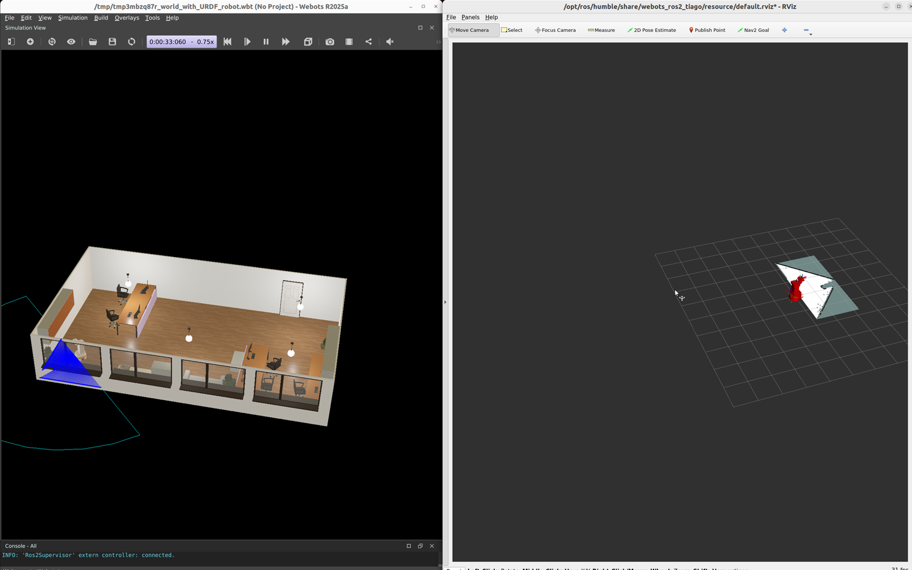
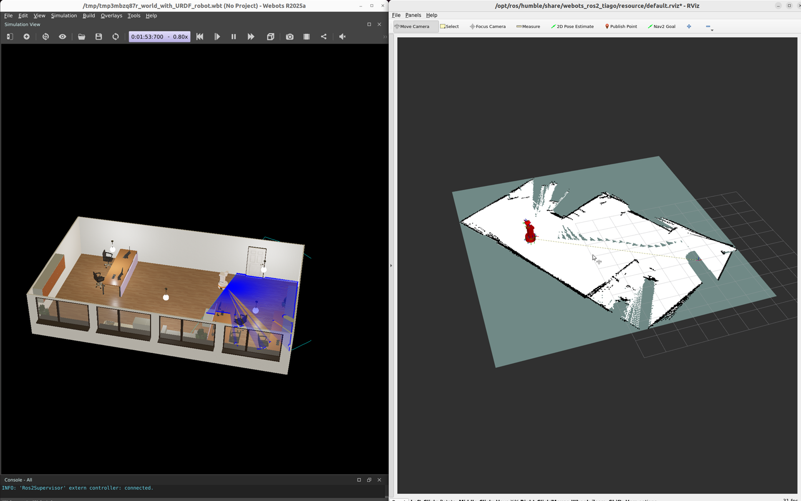

# LiDAR, SLAM Mapping, and Navigation with Dora

## Version Information

| Component | Version / Environment |
| --- | --- |
| Operating system | Ubuntu 22.04.5 LTS, x86_64 |
| GPU | NVIDIA GeForce RTX 5090 Laptop GPU, 24 GB VRAM |
| NVIDIA driver | 580.159.03 |
| Webots | R2025a |
| ROS 2 | Humble |
| `webots_ros2_tiago` | 2025.0.0 |
| Navigation2 | 1.1.20 |
| SLAM Toolbox | 2.6.10 |
| Dora CLI and Python API | 0.5.0 |

## Downloads

- [Complete LiDAR, SLAM, Nav2, and Dora reference project](../assets/lidar-slam-navigation/lidar-slam-navigation-reference.zip)
- [Official TIAGo office world](../assets/lidar-slam-navigation/source/worlds/default.wbt)
- [Saved occupancy map](../assets/lidar-slam-navigation/source/maps/office.pgm)
- [Saved map metadata](../assets/lidar-slam-navigation/source/maps/office.yaml)
- [Official TIAGo Lite model source, Webots R2025a](https://github.com/cyberbotics/webots/tree/R2025a/projects/robots/pal_robotics/tiago_lite)

The archive contains the fixed world, Docker environment, exploration
controller, saved map, Dora nodes, tests, and launch scripts used in this
chapter.

## Goal

You will use an AI coding assistant to build and verify a complete mobile
navigation workflow:

1. Launch the official Webots TIAGo office scene.
2. Read 2D LiDAR, wheel odometry, sonar, TF, and occupancy-map data.
3. Move the robot with a small LiDAR-only exploration controller.
4. Build and save a map with SLAM Toolbox.
5. Let Dora wait for the sensor and localization streams.
6. Ask Nav2 to navigate the wheeled mobile manipulator to a map coordinate.
7. Report a structured success or failure result.

The TIAGo Lite model has a mobile base, a mounted arm and gripper, and a 2D
LiDAR. This chapter controls only the mobile base; the arm remains available
for a later navigation-and-manipulation task.

## Before You Begin

The commands target Ubuntu 22.04 with ROS 2 Humble. Run the simulator either
natively or in a GPU-enabled Docker container with access to the desktop
display. Keep generated maps, recordings, logs, and temporary worlds outside
the book source until they have been reviewed.

The validated environment used about 6.6 GB for the derived container image.
Allow at least 15 GB of free disk space, 8 GB of system memory, and enough GPU
headroom to render Webots and record the desktop at the same time. Webots can
run without an NVIDIA GPU, but rendering and recording may be slower.

## Why This Stack

[Webots](https://cyberbotics.com/) is an open-source 3D robot simulator with an
official [ROS 2 interface](https://github.com/cyberbotics/webots_ros2). Its
TIAGo package includes a furnished office world, the mobile manipulator model,
controllers, RViz configuration, and navigation parameters.

[SLAM Toolbox](https://github.com/SteveMacenski/slam_toolbox) is the supported
2D SLAM implementation used by the
[Nav2 mapping workflow](https://docs.nav2.org/tutorials/docs/navigation2_with_slam.html).
It consumes laser scans and odometry, publishes `/map`, and provides the
`map -> odom` transform.

[Navigation2](https://docs.nav2.org/) plans a collision-aware path on the
occupancy map and controls the differential-drive base. Dora owns the mission
state: it checks that the required data exists, sends the goal, receives
feedback, and publishes a structured result.

## Implementation Flow

1. Inspect the computer and confirm compatible versions.
2. Launch Webots, TIAGo, RViz, and SLAM Toolbox.
3. Verify the sensor topics and transforms.
4. Generate a small LiDAR-only exploration controller.
5. Record the map as it grows and save it.
6. Start Nav2 against the live SLAM map.
7. Define the Dora sensor and mission nodes.
8. Run a navigation goal and inspect the result.

## Inspect the Computer

Ask the assistant to check the environment before it installs anything:

```text
Inspect this Ubuntu computer for a Webots LiDAR SLAM and navigation tutorial.

Report the OS version and architecture, free memory and disk space, GPU model,
GPU memory, NVIDIA driver, Docker GPU support, ROS 2 distribution, Webots,
webots_ros2_tiago, Navigation2, SLAM Toolbox, Dora CLI, and Dora Python API.

Check the current official installation documentation. Recommend native
installation or an isolated GPU-enabled Docker environment. Do not install or
remove anything yet. Do not print usernames, home paths, private hostnames, IP
addresses, tokens, serial numbers, or unrelated process information.
```

The verified machine had enough resources to run Webots, RViz, SLAM Toolbox,
Nav2, Dora, and 12 FPS screen capture together.

## Use the Provided TIAGo Office Scene

Use the supplied copy of the official world instead of generating a custom
scene. It already contains
walls, doors, desks, chairs, cabinets, plants, and glass partitions that
produce useful LiDAR occlusion and navigation constraints.

```text
Inspect and run the supplied Webots R2025a and ROS 2 Humble reference project
for LiDAR SLAM and navigation.

Treat worlds/default.wbt and the installed webots_ros2_tiago 2025.0.0 package
as the pinned scene and model source. Do not regenerate or rearrange the world.
Launch TIAGo Lite with RViz and async SLAM Toolbox. Verify that the robot publishes
/scan, /odom, /tf, /tf_static, and three base sonar topics, and it must accept
geometry_msgs/Twist commands on /cmd_vel.

Review the supplied Dockerfile and launch-baseline.sh before running them.
Give the container access only to the GPU, X11 display, host ROS 2 network,
and this project workspace. Stop if the robot controller, LiDAR, TF tree, or
SLAM node does not start. Do not modify the supplied world.
```

The validated launch command was:

```bash
ros2 launch webots_ros2_tiago robot_launch.py \
  world:=default.wbt \
  mode:=realtime \
  rviz:=true \
  slam_toolbox:=true \
  slam_cartographer:=false \
  nav:=false \
  use_sim_time:=true
```

The left side below is the Webots office scene. The right side is RViz at the
beginning of mapping, when only the area immediately visible to the LiDAR is
known.



## Inspect the Sensor Streams

Check names, message types, rates, and QoS before writing application code.

```text
Inspect the running TIAGo ROS 2 graph without changing it.

Identify the 2D LiDAR, odometry, sonar, velocity command, occupancy map, and TF
topics. For each required topic, report its message type, publishers,
subscribers, QoS, and observed rate. Confirm that map -> odom -> base_link is
connected and that the timestamps use simulation time.

Show concise commands that print one sanitized sample from /scan, /odom, and
/map. Do not dump complete laser arrays, images, local paths, or unrelated
topics. Stop if TF is disconnected or /scan is not updating.
```

Useful inspection commands are:

```bash
ros2 topic list
ros2 topic info -v /scan
ros2 topic hz /scan
ros2 topic echo /odom --once
ros2 topic echo /map --once --field info
ros2 run tf2_ros tf2_echo map base_link
```

The validated graph provided:

- `/scan`: `sensor_msgs/msg/LaserScan`, approximately 5 Hz.
- `/odom`: `nav_msgs/msg/Odometry`.
- `/map`: `nav_msgs/msg/OccupancyGrid`.
- `/Tiago_Lite/base_sonar_01_link`, `02`, and `03`:
  `sensor_msgs/msg/Range`.
- `/tf` and `/tf_static`: localization and robot transforms.
- `/cmd_vel`: velocity commands consumed by the differential-drive controller.

This TIAGo launch did not publish `/imu`, so the verified workflow does not
claim IMU fusion.

## Build the SLAM Map

The exploration controller below is intentionally small. It uses only the
current LiDAR scan: drive forward while the front sector is clear, and rotate
toward the more open side when an obstacle is close. It does not read Webots
ground-truth coordinates.

```text
Create a focused ROS 2 Python exploration node for this tutorial.

Subscribe only to sensor_msgs/LaserScan on /scan and publish
geometry_msgs/Twist on /cmd_vel. Split the scan into front, left, and right
sectors. Move forward slowly while the front clearance is at least 0.8 m.
Otherwise rotate toward the side with more free distance.

Accept a duration argument, stop after 75 seconds, and publish a zero Twist on
normal exit, Ctrl+C, or error. Reject NaN and infinite ranges. Add unit tests
for sector extraction, direction choice, timeout, and the final stop command.
Do not use simulator coordinates, teleportation, a prerecorded path, or a
camera.
```

The core obstacle response is:

```python
front = self.sector_min(-22, 22)
left = self.sector_min(25, 95)
right = self.sector_min(-95, -25)

command = Twist()
if front < 0.8:
    command.angular.z = 0.5 if left >= right else -0.5
else:
    command.linear.x = 0.24
    openness_error = max(-2.0, min(2.0, left - right))
    command.angular.z = 0.10 * openness_error

self.publisher.publish(command)
```

### Complete LiDAR exploration controller


```python
{{#include ../assets/lidar-slam-navigation/source/explore_with_lidar.py}}
```


Run the controller while SLAM Toolbox remains active:

```bash
python3 explore_with_lidar.py 75
```

During the run, Webots shows the robot and laser rays while RViz expands the
white free-space region and adds black occupied boundaries.


The recording is accelerated three times. The control loop and SLAM node ran
in real simulation time; only the tutorial playback is shortened.

<video class="standard-demo-video" controls muted playsinline preload="metadata" width="1920" height="1200" poster="../assets/lidar-slam-navigation/slam-mapping-poster.png">
  <source src="../assets/lidar-slam-navigation/slam-mapping.mp4" type="video/mp4">
</video>

### Save and Inspect the Map

Save the occupancy image and metadata after exploration:

```bash
mkdir -p maps
ros2 run nav2_map_server map_saver_cli -f maps/office
```

The archive includes the map from the verified run. The same occupancy image
and metadata are listed in **Downloads** at the top of this chapter.

Check only the relevant metadata:

```bash
ros2 topic echo /map --once --field info
sed -n '1,12p' maps/office.yaml
```

The recorded mapping pass produced a `267 x 278` grid at `0.05 m/pixel`,
covering approximately `13.35 x 13.9 m`. Exact dimensions vary with the
exploration path and where SLAM Toolbox expands the map.



## Start Nav2 on the Live Map

This example deliberately navigates while mapping. Do not launch AMCL or a
static map server: SLAM Toolbox already publishes `/map` and `map -> odom`.

```bash
ros2 launch nav2_bringup navigation_launch.py \
  use_sim_time:=true \
  autostart:=true \
  params_file:=/opt/ros/humble/share/webots_ros2_tiago/resource/nav2_params.yaml
```

Confirm the action server and managed nodes before Dora sends a goal:

```bash
ros2 action info /navigate_to_pose
ros2 lifecycle get /planner_server
ros2 lifecycle get /controller_server
ros2 lifecycle get /bt_navigator
```

All three lifecycle nodes should report `active`.

## Define the Dora Navigation Dataflow

Use three narrow nodes:

- `sensor-bridge`: reads LiDAR, odometry, map, sonar, and TF, then publishes
  structured JSON.
- `mission-controller`: waits for required fields and calls Nav2.
- `result-reporter`: prints mission-state changes.

```text
Implement a Dora 0.5.0 dataflow for the running Webots and Nav2 system.

Create sensor-bridge, mission-controller, and result-reporter Python nodes.
The sensor node must subscribe to /scan, /odom, /map, the three TIAGo sonar
topics, and map -> base_link TF. Every 500 ms, publish compact JSON containing
sample counters, map width and height, known-cell count, sonar ranges, and the
current map pose.

The mission node may send one NavigateToPose goal only after LiDAR, odometry,
a non-empty map with at least 500 known cells, and map pose are available.
Record WAITING_FOR_SENSORS, READY, GOAL_SENT, NAVIGATING, SUCCEEDED, and FAILED
states. Save a final JSON result. Reject duplicate goals and report Nav2
rejection, timeout, cancellation, or non-success action status.

Dora 0.5.0's Python API in this environment does not expose the ROS 2 Action
client, so use rclpy ActionClient inside the Dora mission node. Keep all
readiness and result messages on the Dora dataflow. Add focused tests for the
readiness gate and terminal states.
```

### Reference Dataflow

```yaml
{{#include ../assets/lidar-slam-navigation/source/dora/dataflow.yml}}
```

### Reference: Readiness Gate

The mission does not infer readiness from a fixed sleep:

```python
@property
def ready(self):
    return (
        self.sensors.scan_samples > 0
        and self.sensors.odom_samples > 0
        and self.sensors.map_width > 0
        and self.sensors.map_height > 0
        and self.sensors.known_cells >= 500
        and self.sensors.pose_available
    )
```

### Reference: Send the Nav2 Goal

The goal is expressed in the `map` frame. A zero timestamp requests the latest
available transform:

```python
goal = NavigateToPose.Goal()
goal.pose.header.frame_id = "map"
goal.pose.header.stamp = rclpy.time.Time().to_msg()
goal.pose.pose.position.x = target_x
goal.pose.pose.position.y = target_y
goal.pose.pose.orientation.z = math.sin(target_yaw / 2.0)
goal.pose.pose.orientation.w = math.cos(target_yaw / 2.0)

future = action_client.send_goal_async(
    goal,
    feedback_callback=on_feedback,
)
future.add_done_callback(on_goal_response)
```

Current Dora documentation also describes native and YAML
[ROS 2 topic, service, and action bridges](https://dora-rs.ai/dora/advanced/ros2-bridge).
When using a newer Dora version, ask the assistant to compare that API with the
validated `rclpy` integration before changing the dataflow.

### Complete Dora Source

#### Sensor bridge


```python
{{#include ../assets/lidar-slam-navigation/source/dora/sensor_bridge_node.py}}
```


#### Mission state and readiness gate


```python
{{#include ../assets/lidar-slam-navigation/source/dora/mission_state.py}}
```


#### Nav2 mission controller


```python
{{#include ../assets/lidar-slam-navigation/source/dora/mission_controller_node.py}}
```


#### Result reporter


```python
{{#include ../assets/lidar-slam-navigation/source/dora/result_reporter_node.py}}
```


### Environment and Test Source

#### Container environment and entrypoint


```dockerfile
{{#include ../assets/lidar-slam-navigation/source/Dockerfile}}
```

```bash
{{#include ../assets/lidar-slam-navigation/source/ros-entrypoint.sh}}
```

```bash
{{#include ../assets/lidar-slam-navigation/source/run-container.sh}}
```


#### Webots, SLAM, and Nav2 launch scripts


```bash
{{#include ../assets/lidar-slam-navigation/source/launch-baseline.sh}}
```

```bash
{{#include ../assets/lidar-slam-navigation/source/launch-nav2-live.sh}}
```


#### Mission-state tests


```python
{{#include ../assets/lidar-slam-navigation/source/dora/test_mission_state.py}}
```


## Run the Navigation Task

Select a goal inside known free space and keep it away from inflated obstacle
boundaries. The recorded mission moved from approximately `(-2.82, 2.45)` back
to map coordinate `(0.0, 0.0)` with a target yaw of about `-45 degrees`.

```text
Run and verify the complete Dora navigation application.

Confirm SLAM Toolbox and all Nav2 lifecycle nodes are active. Choose a target
inside known free space and print the start pose, target pose, and planned
distance without exposing machine information.

Run the focused tests, start the Dora dataflow, and record Webots and RViz from
two seconds before GOAL_SENT until three seconds after the terminal state.
The result must show that the goal was sent once, accepted, and completed with
Nav2 action status SUCCEEDED. Also report LiDAR and odometry sample counts,
map size, known-cell count, final remaining distance, and a sanitized log
excerpt. Stop all processes started for the test.
```

Run the generated project:

```bash
cd lidar-slam-navigation
pytest -q
dora run dataflow.yml
```

The validated state sequence was:

```text
WAITING_FOR_SENSORS
READY
GOAL_SENT
NAVIGATING
SUCCEEDED
```

The final structured result was:

```json
{
  "state": "SUCCEEDED",
  "detail": "Nav2 reached the Dora-provided target",
  "goal_sent": true,
  "goal_accepted": true,
  "distance_remaining": 0.2466,
  "sensors": {
    "scan_samples": 151,
    "odom_samples": 833,
    "map_width": 219,
    "map_height": 220,
    "known_cells": 27552,
    "pose_available": true
  },
  "target": {
    "frame": "map",
    "x": 0.0,
    "y": 0.0,
    "yaw": -0.785398
  }
}
```

Map dimensions differ from the mapping recording because this navigation
evidence came from a separate run of the same exploration workflow.

The video shows the mobile manipulator and LiDAR in Webots on the left and the
live occupancy map, robot pose, and Nav2 path in RViz on the right.

<video class="standard-demo-video" controls muted playsinline preload="metadata" width="1920" height="1200" poster="../assets/lidar-slam-navigation/dora-nav2-navigation-poster.png">
  <source src="../assets/lidar-slam-navigation/dora-nav2-navigation.mp4" type="video/mp4">
</video>

## Troubleshooting

```text
Diagnose this Webots, SLAM Toolbox, Nav2, and Dora navigation run from the
attached sanitized topic summary, TF output, lifecycle states, Dora result,
and short log excerpt.

Check layers in this order: Webots controller connection, /scan frequency,
/odom updates, simulation clock, map -> odom -> base_link TF, /map growth,
Nav2 lifecycle state, costmap sensor QoS, goal coordinate, action acceptance,
cmd_vel output, and Dora terminal state.

Identify the first failing layer, make the smallest change, run its focused
check, and only then repeat the complete mission. Do not reinstall working
components, disable collision checking, enlarge goal tolerance to hide an
error, or print credentials and machine identity.
```

Common checks:

- A stationary map with valid scans usually means the robot is not moving or
  odometry/TF is disconnected.
- An RViz message-filter warning at startup may disappear once the complete TF
  tree is available; verify the tree instead of immediately changing QoS.
- A Nav2 goal in unknown or inflated space may be rejected or have no path.
  Choose a clearly free cell, not a wall edge.
- If `/cmd_vel` exists but the robot does not move, inspect the differential
  drive controller and competing velocity publishers.
- If Dora remains in `WAITING_FOR_SENSORS`, inspect the structured status and
  the exact readiness field that is still false.

## Example Boundaries

This is a controlled simulation, not a production exploration system. The
reactive LiDAR controller demonstrates data acquisition and map growth; it is
not a frontier planner and does not guarantee complete coverage.

The navigation recording uses live SLAM, not a saved map with AMCL
localization. A deployment-oriented extension should stop mapping, load
`office.yaml` through `nav2_map_server`, start AMCL, set an initial pose, and
then run the same Dora mission contract.

A physical mobile manipulator additionally needs calibrated transforms,
verified wheel and LiDAR models, dynamic-obstacle handling, velocity limits,
independent emergency stopping, and a collision-aware arm configuration.

## Next Step

The same structured sensor bridge can supply a later planner with map pose,
LiDAR clearance, and navigation status. The next chapter can combine that
scene state with task context to generate and validate higher-level action
plans without giving a language model direct motor control.
