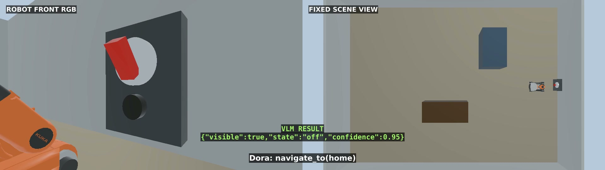

# Plan Action Paths with Large Language Models

## Version Information

| Component | Validated version / environment |
| --- | --- |
| Operating system | Ubuntu 22.04.5 LTS, x86_64 |
| GPU | NVIDIA GeForce RTX 5090 Laptop GPU, 24 GB VRAM |
| NVIDIA driver | 580.159.03 |
| Webots | R2025a |
| ROS 2 | Humble |
| Dora CLI and Python API | 1.0.0-rc.4 |
| Local model engine | Ollama 0.32.1 |
| Planning and vision model | `qwen3-vl:8b-instruct` |
| Dora runtime Python | 3.11.14 |
| ROS 2 worker Python | 3.10.12 |

## Downloads

- [Complete reference project](../assets/llm-action-planning/llm-action-planning-reference.zip)
- [Webots switch world](../assets/llm-action-planning/source/worlds/youbot_switch_office.wbt)
- [Official youBot model source, Webots R2025a](https://github.com/cyberbotics/webots/tree/R2025a/projects/robots/kuka/youbot)

The archive contains the scene, controllers, Dora dataflow, skill runtime,
model client, validators, tests, and container files.

This chapter turns a natural-language request into a validated sequence of
robot skills. In the example, Dora coordinates planning, vision, navigation,
and a preset arm action so a mobile manipulator can turn off a switch and
return home.

## LLM, Tool Calls, JSON, and Skills

A large language model (LLM) maps the request *“Turn off the main switch, then
return home”* to a high-level plan. It never produces wheel speeds, joint
angles, coordinates, shell commands, or executable code.

A **tool call** selects a named capability and supplies its typed arguments.
This project exposes three capabilities through a skill manifest:
`navigate_to`, `observe_switch`, and `set_switch_state`.

The complete plan is returned as **JSON** so the application can validate it
before anything moves. A **skill** is the tested implementation behind one
tool: Dora dispatches it, waits for a structured result, evaluates conditions,
and records the state transition.

## Scene and Task

The supplied Webots world contains an official KUKA youBot mobile manipulator,
a fixed scene camera, a base-mounted RGB camera, a wall switch, and simple
obstacles. The switch starts **on**, and the robot starts at the named
`home` location with its arm settled.


The mission is:

1. Navigate from `home` to `main_switch`.
2. Capture an RGB image and classify the switch.
3. If it is visible and on, run the validated arm trajectory to turn it off.
4. Capture another image and verify that it is off.
5. Return to `home`.
6. Report `SUCCEEDED`; any rejected or failed skill ends the mission.

Named routes and a preset arm trajectory keep the physical actions simple and
repeatable. The LLM decides the semantic sequence and branch; it does not
control the robot at motor level.

## Inspect the Reference Project

Use the provided scene instead of asking an assistant to invent geometry or
robot dimensions. Extract the archive into a new directory, then ask the
assistant to inspect rather than regenerate it:

```text
Inspect this supplied Webots R2025a and Dora 1.0.0-rc.4 reference project.

Treat worlds/youbot_switch_office.wbt and the pinned official youBot R2025a
model as the reproducible scene source. Do not replace the robot, rebuild the
scene, move the switch, or change camera poses.

Summarize the ROS topics, named skills, JSON contracts, Dora nodes, local model
endpoint, tests, and launch order. Check for missing dependencies and
machine-specific paths. Do not install or edit anything yet, and do not print
usernames, hostnames, IP addresses, tokens, or unrelated system information.
```

## Prepare the Environment

Ask the assistant to install only what the supplied project needs:

```text
Prepare this Ubuntu 22.04 computer to run the supplied reference project.

Use Webots R2025a, ROS 2 Humble, Dora CLI 1.0.0-rc.4,
dora-rs 1.0.0rc4, and Ollama.
Pull qwen3-vl:8b-instruct for both structured action planning and RGB switch
classification. Prefer the supplied Dockerfile for Webots and ROS dependencies,
while Ollama runs on the host.

Before changing anything, report free disk space, memory, GPU and driver
compatibility, existing versions, and the exact proposed commands. Preserve
working installations. Never expose account names, private paths, network
addresses, API keys, or unrelated environment variables.
```

The validated commands were:

```bash
ollama pull qwen3-vl:8b-instruct
docker build -t dora-llm-action:humble .
chmod +x run-container.sh launch-webots.sh
./run-container.sh
```

The container uses host networking, so its default Ollama endpoint is
`http://127.0.0.1:11434`. Keep the service local; do not bind it to an
untrusted network.

The container isolates the runtime requirements: Dora and the JSONL sidecar
nodes use Python 3.11, while the ROS 2 and application workers use the system
Python 3.10 environment supplied by ROS 2 Humble.

## Define the Skill API

First give the LLM a small, explicit action space. The manifest describes
allowed names, arguments, and result fields:

```json
{{#include ../assets/llm-action-planning/source/config/skill_manifest.json}}
```

Use this prompt to create the contract and its validation rules:

```text
Implement the high-level skill contract for this supplied project.

Expose only:
- navigate_to(location), where location is home or main_switch;
- observe_switch(switch_id), where switch_id is main_switch;
- set_switch_state(switch_id, state), where state is on or off.

Require a versioned JSON plan with goal and steps. Steps may contain id, skill,
arguments, save_as, and a small eq/ne condition tree. Reject coordinates,
velocities, wheel commands, joint values, motor commands, shell commands, code,
unknown fields, duplicate IDs, forward references, and plans that do not end
at home. Add tests for valid, invalid, conditional, and already-off plans.
Do not modify the supplied Webots scene.
```

The validator treats the LLM output as untrusted input. A plan is executable
only after `validate_plan(plan).require_valid()` succeeds.

### Complete plan validator


```python
{{#include ../assets/llm-action-planning/source/action_planning/plan_validator.py}}
```


## Generate a Structured Action Plan

The local model receives the user request, skill manifest, strict output
schema, and planning constraints. Temperature is zero, and the response is
parsed as JSON before validation.

```text
Implement the planner client with Ollama /api/chat.

Read config/skill_manifest.json and ask qwen3-vl:8b-instruct to translate
"Turn off the main switch, then return home" into one versioned JSON plan.
Require exactly this semantic order: navigate, observe, conditionally turn off,
conditionally verify, return home. The arm step may run only when the first
observation says visible=true and state=on.

Use Ollama structured output with a JSON Schema, temperature 0, a finite
timeout, and no streaming. Parse JSON, call the local plan validator, and fail
closed on HTTP, parsing, schema, or validation errors. The model must never
emit low-level motion values or executable commands.
```

A validated model response looks like this:

```json
{
  "schema": "action-planning.plan.v1",
  "goal": "Turn off the main switch, then return home.",
  "steps": [
    {
      "id": "go_to_switch",
      "skill": "navigate_to",
      "arguments": {"location": "main_switch"}
    },
    {
      "id": "observe_before",
      "skill": "observe_switch",
      "arguments": {"switch_id": "main_switch"},
      "save_as": "before"
    },
    {
      "id": "turn_off",
      "skill": "set_switch_state",
      "arguments": {"switch_id": "main_switch", "state": "off"},
      "when": {
        "all": [
          {"ref": "before.visible", "op": "eq", "value": true},
          {"ref": "before.state", "op": "eq", "value": "on"}
        ]
      }
    },
    {
      "id": "verify_off",
      "skill": "observe_switch",
      "arguments": {"switch_id": "main_switch"},
      "when": {
        "all": [
          {"ref": "turn_off.status", "op": "eq", "value": "succeeded"}
        ]
      }
    },
    {
      "id": "return_home",
      "skill": "navigate_to",
      "arguments": {"location": "home"}
    }
  ]
}
```

### Complete Ollama planning and vision client


```python
{{#include ../assets/llm-action-planning/source/action_planning/model_clients.py}}
```


## Execute the Plan with Dora

The Dora graph separates planning, execution, and reporting:

```yaml
{{#include ../assets/llm-action-planning/source/dora/dataflow.yml}}
```

Each dataflow entry starts the same small Python 3.11 sidecar and names its
Python 3.10 worker through environment variables. The sidecar forwards Dora
events and outputs as JSONL, so planning and mission state still travel through
the Dora graph.

```python
{{#include ../assets/llm-action-planning/source/dora/runtime_bridge/sidecar_node.py}}
```

```python
{{#include ../assets/llm-action-planning/source/dora/runtime_bridge/sidecar_bridge.py}}
```

Ask the assistant to build the orchestration layer around the validated plan:

```text
Implement the Dora 1.0.0-rc.4 application for the supplied scene.

Create three nodes:
1. planner reads the skill manifest, requests one structured plan, validates it,
   and publishes it once;
2. executor runs a deterministic mission state machine, dispatches one skill at
   a time, evaluates conditions against previous structured results, and stops
   on failure;
3. reporter writes sanitized JSONL events.

Run the Dora sidecars with Python 3.11 and the supplied planner, executor, and
reporter workers with Python 3.10. Use rclpy inside the executor worker to
communicate with the Webots controller. Keep planning and mission state on
Dora outputs. Correlate
commands and results with request IDs, enforce timeouts, save the final JSON
result, and add tests for the on, already-off, failure, and post-action visual
verification branches.
```

The mission state machine, rather than the model, evaluates `when` conditions.
If the first observation reports `off`, both the arm action and second
observation are skipped, and the robot returns home.

### Complete mission state machine


```python
{{#include ../assets/llm-action-planning/source/action_planning/mission.py}}
```


### Complete Dora planner node


```python
{{#include ../assets/llm-action-planning/source/dora/planner_node.py}}
```


### Complete Dora executor node


```python
{{#include ../assets/llm-action-planning/source/dora/executor_node.py}}
```


### Complete Dora reporter node


```python
{{#include ../assets/llm-action-planning/source/dora/reporter_node.py}}
```


## Connect Vision and Robot Skills

`observe_switch` saves the latest base-camera frame and asks the same local
multimodal model for four fields: `switch_id`, `visible`, `state`, and
`confidence`. An ambiguous or hidden switch returns `unknown` and fails the
mission instead of guessing.

```text
Implement the ROS skill runtime for the supplied controllers.

Subscribe to odometry, the base RGB camera, navigation status, arm status, and
switch status. For observe_switch, save one current RGB frame and request
strict structured output from qwen3-vl:8b-instruct. Accept only visible=true
and state=on/off.

For navigate_to, publish only the named location and wait for the matching
request ID. For set_switch_state, require the robot to be inside the switch
workspace and invoke the supplied preset trajectory. Enforce timeouts and
always return a structured succeeded/failed result. Never send LLM-generated
coordinates, velocities, or joint values.
```

Before the action, the model observed:

```json
{
  "switch_id": "main_switch",
  "visible": true,
  "state": "on",
  "confidence": 0.95
}
```


After the arm action, it observed `state: "off"` with confidence `0.95`:



### Complete ROS skill runtime


```python
{{#include ../assets/llm-action-planning/source/action_planning/ros_skills.py}}
```


## Run the Complete Application

Start the supplied Webots world in the first container terminal:

```bash
cd /workspace
./launch-webots.sh
```

In a second terminal connected to the same container:

```bash
cd /workspace
/usr/bin/python3 -m pytest -q
cd dora
dora run dataflow.yml
```

Ask the assistant to verify the complete run:

```text
Run the supplied action-planning project end to end.

First run all focused tests. Confirm Ollama has qwen3-vl:8b-instruct, Webots
publishes odometry and RGB frames, the arm is at home, and the switch starts on.
Then start the Dora dataflow.

Record the validated plan, every skill request and result, the two structured
vision observations, final robot location, and terminal mission state. Fail if
the plan is invalid, the switch is not visible, the requested result is not
visually confirmed, or the robot does not return home. Sanitize logs and stop
only the processes started for this run.
```

The video places the base-mounted RGB camera on the left and the fixed Webots
scene camera on the right. Its event labels come from the recorded Dora and VLM
results.

<video class="wide-demo-video" controls muted playsinline preload="metadata" width="1920" height="540" poster="../assets/llm-action-planning/media/switch-mission-poster.jpg">
  <source src="../assets/llm-action-planning/media/switch-mission.mp4" type="video/mp4">
</video>

The validated run completed all five skill steps, visually confirmed
`on -> off`, returned to `home`, and finished with:

```json
{
  "event": "MISSION_FINISHED",
  "state": "SUCCEEDED",
  "context": {
    "turn_off": {
      "status": "succeeded",
      "state": "off",
      "detail": "preset switch action completed"
    },
    "verify_off": {
      "status": "succeeded",
      "visible": true,
      "state": "off",
      "confidence": 0.95
    },
    "return_home": {
      "status": "succeeded",
      "location": "home"
    }
  }
}
```


## Complete Controller Source

The archive is the easiest way to use these files. They are also shown here so
the robot behavior can be reviewed without downloading anything.

### Navigation control and mecanum wheel conversion


```python
{{#include ../assets/llm-action-planning/source/controllers/action_controller/navigation_control.py}}
```


### Webots robot, sensor, navigation, and arm controller


```python
{{#include ../assets/llm-action-planning/source/controllers/action_controller/action_controller.py}}
```


### Fixed scene-camera controller


```python
{{#include ../assets/llm-action-planning/source/controllers/scene_camera_controller/scene_camera_controller.py}}
```


## Environment and Test Source

These remaining text files are included for inspection. The Webots world and
model assets stay as downloads because they are consumed as scene assets.

### Container environment


```dockerfile
{{#include ../assets/llm-action-planning/source/Dockerfile}}
```


### Container and Webots launch scripts


```bash
{{#include ../assets/llm-action-planning/source/run-container.sh}}
```

```bash
{{#include ../assets/llm-action-planning/source/ros-entrypoint.sh}}
```

```bash
{{#include ../assets/llm-action-planning/source/launch-webots.sh}}
```


### Structured data contracts


```python
{{#include ../assets/llm-action-planning/source/action_planning/contracts.py}}
```


### Plan and mission tests


```python
{{#include ../assets/llm-action-planning/source/tests/test_plan_validator.py}}
```

```python
{{#include ../assets/llm-action-planning/source/tests/test_mission.py}}
```


### Vision and navigation tests


```python
{{#include ../assets/llm-action-planning/source/tests/test_observation.py}}
```

```python
{{#include ../assets/llm-action-planning/source/tests/test_navigation_control.py}}
```


## Troubleshooting

```text
Diagnose this supplied Webots, Dora, Ollama, and ROS 2 project from the focused
test output, sanitized Dora events, Webots controller log, ROS topic summary,
and one current RGB frame.

Check in this order: pinned files and dependencies, Webots controller startup,
camera and odometry updates, Ollama health and model availability, plan JSON
validation, request-ID matching, named navigation result, switch visibility,
arm workspace check, post-action visual verification, and return-home result.
Identify the first failing layer and make the smallest change. Do not regenerate
the scene, bypass validation, remove timeouts, hard-code a successful result,
or print machine identity and credentials.
```

Typical failure boundaries:

- A model response is not a command until it passes the plan validator.
- `unknown` vision state is a failure, not permission to run the arm.
- A route name is accepted only if the supplied controller has a validated
  route for the current and target locations.
- The preset arm trajectory is valid only at `main_switch` and for this pinned
  scene.
- A successful arm status is not enough; the second RGB observation must
  confirm the requested state.

## Next Step

This chapter uses one model-generated plan inside a deterministic executor.
The next chapter can add an agent loop that chooses when to gather more
information, repair a rejected plan, or select another tool while preserving
the same validation and skill boundaries.
