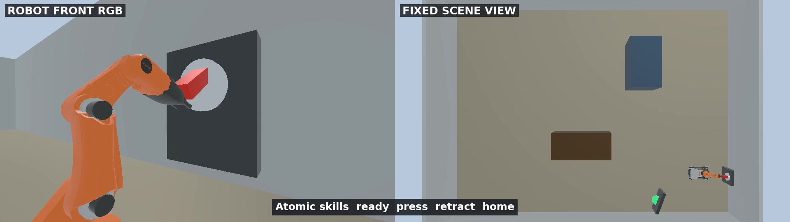
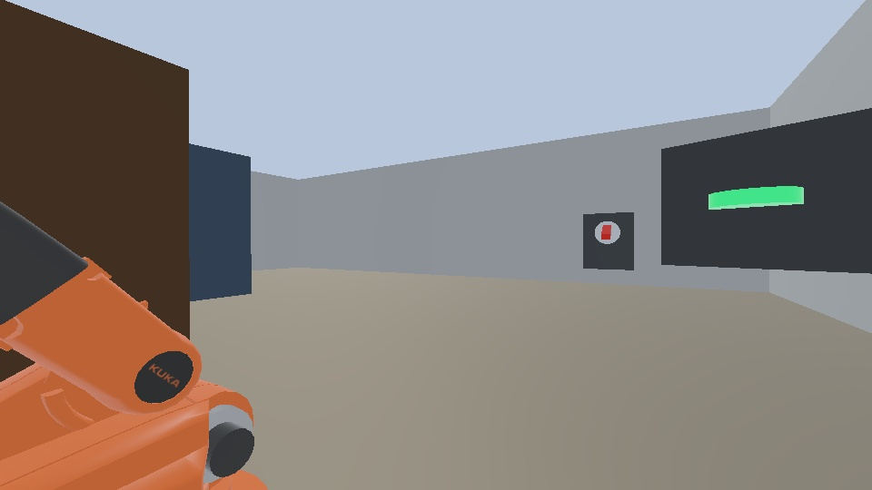

# Integrate the Agents SDK for Automated Task Planning

## Version Information

| Component | Validated Version / Environment |
| --- | --- |
| Operating system | Ubuntu 22.04.5 LTS, x86_64, X11 desktop |
| GPU | NVIDIA GeForce RTX 5090 Laptop GPU with 24 GB VRAM |
| NVIDIA driver | 580.159.03 |
| Webots | R2025a |
| ROS 2 | Humble |
| Dora CLI and Python API | 1.0.0-rc.4 |
| OpenAI Agents SDK | `openai-agents==0.19.0` |
| Robot API | FastAPI 0.140.13, Pydantic 2.13.4 |
| Local model runtime | Ollama 0.32.1 |
| Local model | `qwen3-vl:8b-instruct` |
| Dora runtime Python | 3.11.14 |
| ROS 2 / application worker Python | 3.10.12 |

## Downloads

- [Complete reference project](../assets/agent-sdk-task-planning/agent-sdk-task-planning-reference.zip)
- [SHA-256 checksum](../assets/agent-sdk-task-planning/SHA256SUMS.txt)
- [Webots scene](../assets/agent-sdk-task-planning/source/worlds/youbot_switch_office.wbt)
- [Dora dataflow](../assets/agent-sdk-task-planning/source/dora/dataflow.yml)
- [Agents SDK entry point](../assets/agent-sdk-task-planning/source/agent_cli.py)

The archive contains the Webots world, controllers, Dora nodes, local Robot
API, agent tools, vision classifier, Docker files, and tests. It does not
contain a virtual environment, caches, logs, credentials, or machine-specific
paths. After downloading the ZIP and checksum file, verify and extract them:

```bash
sha256sum -c SHA256SUMS.txt
unzip agent-sdk-task-planning-reference.zip -d agent-sdk-task-planning
cd agent-sdk-task-planning
```

## Goal

This chapter gives a local agent the task: "Inspect the indicator; if it is
lit, turn off the switch, confirm that the indicator is off, and return home."
The agent does not generate one fixed action plan. It decides what to do after
each tool returns:

1. Read the robot state.
2. Navigate to `indicator_station`, capture an image, and classify the light.
3. Navigate to `main_switch` only when the indicator is visible and lit.
4. Press the switch with the validated
   `ready -> press -> retract -> home` pose sequence.
5. Return to the indicator and confirm that it is off.
6. Return to `home`, verify the base and arm state, and finish.


## Choose a Build Route

<div class="prompt-route prompt-route--create">
  <span class="prompt-route__label">Create route</span>
  <strong>Build an Agent that chooses one robot tool at a time</strong>
  <p>Use this to replace one-shot planning with an observe-act-observe loop.</p>
</div>

```text
Create a Webots R2025a and Dora 1.0.0-rc.4 project for the task: inspect the
indicator; if lit, turn off its switch, verify it is off, and return home. Use
the official youBot, a readable indicator, named locations, stable camera
views, and validated arm poses. Put navigation, arm, vision, stop, and state in
separate Dora nodes behind a FastAPI/Pydantic Robot API.

Integrate OpenAI Agents SDK 0.19.0 with an Ollama-compatible
qwen3-vl:8b-instruct model. Expose only atomic named tools and fresh structured
results; never expose coordinates, wheel speeds, or joints. Add idempotency,
timeouts, stale-state rejection, one run entry, contract tests, before/after
images, tool-call logs, final home-state evidence, and an application recording.
The Agent must choose the next tool from the previous result.
```

<div class="prompt-route prompt-route--reproduce">
  <span class="prompt-route__label">Reproduce route</span>
  <strong>Run the verified Agents SDK project</strong>
  <p>Use this to inspect a working agent loop and its safety boundary.</p>
</div>

```text
Extract the supplied Agents SDK project and read VERSIONS.md,
TUTORIAL_CONTRACT.md, ASSET_GUIDE.md, and READER_PROMPT.md. Preserve all source,
locks, models, poses, and contracts. Run only bash tutorial.sh run and allow at
most one unchanged retry for a clearly transient simulation timeout. Verify 44
tests, lit=true then lit=false, the actual tool-call sequence, [DONE], two
evidence images, final location and arm pose home, PASS, and clean git status.
Never edit the project to make a failed run pass.
```

## An Agent Is More Than Chat

A chat model receives text and returns text. Even when its answer contains
reasonable steps, it does not automatically read simulator state, invoke robot
capabilities, or continue from execution results.

An agent combines a **model, instructions, tools, and a run loop**. The OpenAI
Agents SDK `Runner` calls the model. When the model selects a tool, the SDK runs
that tool, sends its result back to the model, and starts another turn. The loop
ends when the model produces final output or reaches the turn limit. Type
annotations and docstrings on a function tool also become a model-visible
schema.

This chapter uses one agent. Its purpose is not multi-agent coordination, but a
minimal complete observe-act-observe loop. Continue with the official guides:

- [OpenAI Agents SDK overview](https://openai.github.io/openai-agents-python/)
- [Quickstart](https://openai.github.io/openai-agents-python/quickstart/)
- [Function tools](https://openai.github.io/openai-agents-python/tools/#function-tools)
- [Running agents and the agent loop](https://openai.github.io/openai-agents-python/running_agents/)

## Technology Choices

| Layer | Choice | Relationship to the Example |
| --- | --- | --- |
| Agent orchestration | OpenAI Agents SDK | Provides `Agent`, `Runner`, function tools, and a turn limit |
| Agent model | Ollama + Qwen3-VL 8B | Selects tools locally and also classifies the RGB indicator |
| Robot interface | FastAPI + Pydantic | Exposes strict, validated atomic actions to the agent |
| Dataflow | Dora 1.0.0-rc.4 | Separates state, navigation, arm, vision, and stop nodes |
| Simulation | Webots R2025a + ROS 2 Humble | Runs the KUKA youBot, cameras, switch, and validated trajectories |

The Agents SDK can connect to OpenAI models by default. This project uses
`OpenAIChatCompletionsModel` with Ollama's OpenAI-compatible local endpoint, so
the example does not require a real OpenAI API key. The
`api_key="ollama"` value in the code is only the non-empty placeholder required
by the local compatibility client.

## System Architecture

The previous chapter and this chapter use the same named skills and safety
boundaries, but the model participates in execution differently.

<div class="architecture-comparison">
  <section class="architecture-variant architecture-variant--plan">
    <div class="architecture-variant-heading">
      <span class="architecture-kicker">Previous chapter</span>
      <strong>Generate the complete plan once</strong>
    </div>
    <div class="architecture-flow" role="img" aria-label="The previous chapter generates and validates one complete JSON plan before a deterministic Dora executor runs it">
      <div class="architecture-node"><strong>Natural-language task</strong><small>Goal and completion conditions</small></div>
      <div class="architecture-arrow" aria-hidden="true">&rarr;</div>
      <div class="architecture-node"><strong>LLM Planner</strong><small>Call the model once before execution</small></div>
      <div class="architecture-arrow" aria-hidden="true">&rarr;</div>
      <div class="architecture-node"><strong>Complete JSON Plan</strong><small>All steps and when conditions</small></div>
      <div class="architecture-arrow" aria-hidden="true">&rarr;</div>
      <div class="architecture-node"><strong>Validator / Dora Executor</strong><small>Validate, then execute deterministically</small></div>
      <div class="architecture-arrow" aria-hidden="true">&rarr;</div>
      <div class="architecture-node"><strong>Robot Skills / Webots</strong><small>Named capabilities and simulation</small></div>
    </div>
    <p class="architecture-caption">At runtime, the mission state machine uses results to evaluate <code>when</code> conditions; they do not return to the LLM Planner for replanning.</p>
  </section>

  <div class="architecture-shift">
    <strong>Key change</strong>
    <span>The model moves from planning once before execution to selecting the next step after each result.</span>
  </div>

  <section class="architecture-variant architecture-variant--agent">
    <div class="architecture-variant-heading">
      <span class="architecture-kicker">This chapter</span>
      <strong>Decide in a loop from execution results</strong>
    </div>
    <div class="architecture-flow" role="img" aria-label="In this chapter the agent selects one tool, executes it through the Robot API and Dora, reads the structured result, and then chooses the next step">
      <div class="architecture-node"><strong>Natural-language task</strong><small>Goal and completion conditions</small></div>
      <div class="architecture-arrow" aria-hidden="true">&rarr;</div>
      <div class="architecture-node"><strong>Agents SDK</strong><small>Select one named tool</small></div>
      <div class="architecture-arrow" aria-hidden="true">&rarr;</div>
      <div class="architecture-node"><strong>Robot API</strong><small>Validate arguments and fresh state</small></div>
      <div class="architecture-arrow" aria-hidden="true">&rarr;</div>
      <div class="architecture-node"><strong>Dora Dataflow</strong><small>Dispatch and correlate action results</small></div>
      <div class="architecture-arrow" aria-hidden="true">&rarr;</div>
      <div class="architecture-node"><strong>Webots / Ollama</strong><small>Motion, camera, and vision classification</small></div>
    </div>
    <div class="architecture-feedback" role="note">
      <span class="architecture-feedback-arrow" aria-hidden="true">&larr;</span>
      <span><strong>Structured result returns to the agent</strong><small>Read fresh state, then select the next tool</small></span>
    </div>
  </section>
</div>

| Comparison | Previous chapter: complete plan | This chapter: agent loop |
| --- | --- | --- |
| Planning time | Generate once before the robot moves | Continue after each tool result |
| Model output | One JSON plan containing every step | One typed tool call at a time |
| Execution feedback | The mission state machine evaluates predefined conditions | Structured results return to the agent |
| Adaptation | Follow branches already encoded in the plan | Select a tool from the latest observable state |
| Safety boundary | JSON Schema, plan validator, and named skills | Typed tools, Robot API, and Dora nodes |

The Webots controller publishes robot state to Dora. When the Robot API accepts
an action, the gateway node sends it to the navigation, arm, or vision node.
The structured node result returns along the same path to the agent. The agent
continues only from these observable results; it never reads hidden simulator
variables.

## Why Use an Atomic Robot API

Giving a model raw coordinates, wheel speeds, joint angles, or arbitrary code
execution would let one incorrect tool call bypass the scene constraints. This
project exposes a small set of bounded atomic operations instead:

| Method | Path | Allowed Arguments |
| --- | --- | --- |
| `GET` | `/v1/robot/state` | None; returns fresh authoritative state |
| `POST` | `/v1/actions/navigate` | `home`, `indicator_station`, or `main_switch` |
| `POST` | `/v1/actions/observe` | `status_indicator` only |
| `POST` | `/v1/actions/arm` | `home`, `ready`, `press`, or `retract` |
| `GET` | `/v1/actions/{action_id}` | An existing action ID |
| `POST` | `/v1/stop` | A short stop reason |

Every action returns the same `ActionResponse`: request ID, action ID, status,
retryability, error code, message, latest robot state, and result data. A
uniform response lets the agent handle a failure instead of mistaking it for
success. The independent stop endpoint also does not share an execution path
with the navigation node.

## Implementation Flow

### Inspect the Reference Project

First ask your coding assistant to understand the supplied project. Do not
regenerate the scene or replace the robot:

```text
Inspect this provided Webots R2025a, ROS 2 Humble, Dora 1.0.0-rc.4, and
OpenAI Agents SDK reference project.

Explain the responsibilities of worlds, controllers, dora, robot_api,
agent_runtime, config, agent_tools.py, agent_cli.py, and tests. Diagram the
path from an agent tool call to a Dora node, a Webots controller, and the
structured result returning to the agent.

Confirm that the agent can use only named locations and named arm poses. It
must not emit coordinates, velocities, wheel speeds, joint angles, shell
commands, or arbitrary code. Do not install or modify anything yet. Do not
print a user name, host name, private path, network address, token, or
unrelated environment variable.
```

The assistant should find three positions in `config/locations.json`, but those
coordinates do not appear in the tool schemas. `config/skill_manifest.json`
summarizes the capability boundary visible to the model:

```json
{{#include ../assets/agent-sdk-task-planning/source/config/skill_manifest.json}}
```

### Prepare the Local Model and Container

On an Ubuntu 22.04 desktop with an NVIDIA GPU, ask the assistant to inspect
resources and existing versions before changing the machine:

```text
Prepare this computer to run the provided reference project.

Check the operating system, CPU architecture, free memory and disk space, GPU,
VRAM, NVIDIA driver, Docker, NVIDIA Container Toolkit, Dora, Ollama, and the
X11 DISPLAY. Treat pyproject.toml, requirements.txt, and the Dockerfile as the
target versions.

Preserve working installations. Before an install or upgrade, list the exact
commands and affected components. Keep Ollama on a loopback address, pull
qwen3-vl:8b-instruct, and use the supplied container for Webots and ROS
dependencies. Run the tests when preparation finishes. Do not print API keys,
complete environment variables, user names, host names, or private addresses.
```

The validated preparation commands are:

```bash
ollama pull qwen3-vl:8b-instruct
docker build -t dora-agent-sdk:humble .
chmod +x run-container.sh launch-webots.sh
/usr/bin/python3 -m pytest -q
```

The validated machine can run Webots, Qwen3-VL, and screen recording within
24 GB of VRAM. On a smaller GPU, stop recording first and watch `nvidia-smi`;
do not weaken the output contract merely to fit a smaller model.

The container keeps Dora in a Python 3.11 virtual environment. ROS 2,
FastAPI, the Agents SDK, and the application workers use the system Python
3.10 environment. A generic JSONL sidecar connects each worker to its Dora
inputs and outputs without mixing the two dependency sets.

### Load the Provided Scene

Start the interactive container:

```bash
./run-container.sh
```

Load the fixed world inside the container:

```bash
./launch-webots.sh
```

The scene should contain a KUKA youBot, a forward RGB camera, a separate green
status indicator, a red mechanical switch, and three unobstructed corridor
segments. The robot and arm both start at `home`.

<div class="media-pair">
  <figure>
    
    <figcaption><strong>Inspect the indicator:</strong> the horizontal bar is green, so the device is on</figcaption>
  </figure>
  <figure>
    
    <figcaption><strong>Press the switch:</strong> the end effector contacts and pushes the red switch</figcaption>
  </figure>
</div>

### Define the Dora Dataflow

Ask the assistant to check that every capability has an independent node and
clear inputs and outputs:

```text
Inspect dora/dataflow.yml and its Python nodes.

The gateway must handle only the Robot API, request correlation, and dispatch.
State must publish authoritative state periodically. Navigation, arm, vision,
and stop must each handle one capability. Every action carries request_id and
action_id, and its result must return to the gateway. Stop must have its own
node.

Check that every input and output matches. Find disconnected paths, cyclic
dependencies, shared mutable state, or a path that can leave a request waiting
forever. Fix only defects that a test can demonstrate.
```

The complete dataflow is:

```yaml
{{#include ../assets/agent-sdk-task-planning/source/dora/dataflow.yml}}
```

The common sidecar is the Python 3.11 Dora-facing process:

```python
{{#include ../assets/agent-sdk-task-planning/source/dora/runtime_bridge/sidecar_node.py}}
```

```python
{{#include ../assets/agent-sdk-task-planning/source/dora/runtime_bridge/sidecar_bridge.py}}
```

The `gateway_node.py` worker also starts the Robot API on `127.0.0.1:8000`. It does not
expose the API to an external network.

### Define a Strict Robot API

Use this prompt to create or review the contracts:

```text
Implement strict Robot API contracts between the agent and Dora.

Use Pydantic to forbid unknown fields. Locations are limited to home,
indicator_station, and main_switch. Arm poses are limited to home, ready,
press, and retract. Every action returns one ActionResponse containing
request_id, action_id, status, retryable, error_code, message, robot_state,
and result.

Reject raw coordinates, velocities, wheel speeds, joint angles, and unknown
names. Reject stale state before starting an action. A failed, rejected, or
cancelled action must have an error code. Add tests for illegal fields, stale
state, duplicate requests, timeouts, and the stop path.
```

The key contract definitions are:

```python
{{#include ../assets/agent-sdk-task-planning/source/robot_api/contracts.py:9:82}}
```

A named API does not prevent the low-level implementation from using
coordinates and joint control. It keeps those details inside tested navigation
and arm modules. The agent operates stable semantics instead of fragile motor
parameters.

### Expose Agents SDK Tools

Ask the assistant to wrap the Robot API client as function tools:

```text
Wrap the local Robot API with the OpenAI Agents SDK @function_tool decorator.

Expose only get_robot_state, navigate_to_named_pose, capture_observation,
move_arm_to_named_pose, get_action_status, and stop_robot. Use Literal
allowlists for arguments and accurate docstrings. Return compact JSON. Log
only tool names, arguments, and observable results; never print or fabricate
hidden model reasoning.

Use an HTTP timeout long enough for simulator actions. Return HTTP errors,
rejections, non-retryable failures, and unknown observations to the agent so
that it can stop or perform a bounded retry according to policy.
```

The core tool wrappers are:

```python
{{#include ../assets/agent-sdk-task-planning/source/agent_tools.py:112:184}}
```

The `Literal` types constrain the generated schema directly. The model can
select `main_switch`, but it cannot supply an arbitrary `x` or `y`. This is
more reliable than only writing "do not generate coordinates" in a prompt.

### Create the Agent Loop

Agent instructions define task boundaries rather than hard-coding one action
list:

```python
{{#include ../assets/agent-sdk-task-planning/source/agent_tools.py:11:32}}
```

Ask the assistant to finish the agent entry point:

```text
Create a single-agent terminal entry point.

Use the OpenAI Agents SDK Agent and Runner. Connect qwen3-vl:8b-instruct
through Ollama's OpenAI-compatible endpoint. Set temperature=0,
parallel_tool_calls=False, and max_turns=30.

The agent reads fresh state before decisions, observes the indicator first,
presses the switch only when visible=true and lit=true, observes again after
the press, returns the arm home before navigation, and verifies that both the
location and arm pose are home before finishing. Retry an unknown or
low-confidence observation at most once. Never press blindly.

Print INPUT, STATE, TOOL, RESULT, and DONE events in the terminal. Do not
display hidden reasoning.
```

The core Agent and Runner configuration is:

```python
{{#include ../assets/agent-sdk-task-planning/source/agent_cli.py:27:72}}
```

`max_turns` prevents an invalid state from producing an infinite loop.
`parallel_tool_calls=False` keeps robot actions sequential; motion workflows
must not issue dependent navigation and arm commands in parallel.

### Start the Complete Application

Keep the Webots window open. In a second terminal, enter the container and
start Dora:

```bash
docker exec -it dora-agent-sdk bash
cd /workspace/dora
dora run dataflow.yml
```

In a third terminal, check that the API has received fresh state:

```bash
docker exec -it dora-agent-sdk bash
curl -s http://127.0.0.1:8000/v1/robot/state
```

The returned `location` and `arm_pose` should not be `unknown`, and
`captured_at` should continue updating. Run the task:

```bash
docker exec -it dora-agent-sdk bash
cd /workspace
/usr/bin/python3 agent_cli.py --task \
  "Inspect the indicator; if it is lit, turn off the switch, confirm that the indicator is off, and return home."
```

The following is an abridged observable event log. Actual `request_id`,
`action_id`, and confidence values vary:

```text
[INPUT] Inspect the indicator; if it is lit, turn off the switch, confirm that the indicator is off, and return home.
[STATE] robot state location="home" arm_pose="home"
[TOOL] navigate_to_named_pose location="indicator_station"
[RESULT] navigation status="succeeded"
[TOOL] capture_observation target="status_indicator"
[RESULT] observation status="succeeded" observation={"visible":true,"lit":true}
[TOOL] navigate_to_named_pose location="main_switch"
[TOOL] move_arm_to_named_pose pose="ready"
[TOOL] move_arm_to_named_pose pose="press"
[TOOL] move_arm_to_named_pose pose="retract"
[TOOL] move_arm_to_named_pose pose="home"
[TOOL] navigate_to_named_pose location="indicator_station"
[RESULT] observation status="succeeded" observation={"visible":true,"lit":false}
[TOOL] navigate_to_named_pose location="home"
[STATE] robot state location="home" arm_pose="home"
[DONE] The indicator is off and the robot returned home.
```

### Inspect Vision Feedback and the Result

The vision node sends an RGB frame to local Qwen3-VL and requests strict
structured output:

```python
{{#include ../assets/agent-sdk-task-planning/source/agent_runtime/indicator_vision.py:13:40}}
```

The model must return `visible`, `lit`, and `confidence`. When the indicator is
occluded, it returns `visible=false` and `lit=null`; the program never
misinterprets "not visible" as "already off."

Keep the two objects distinct: the red lever near the middle of the image is
the mechanical switch; the horizontal bar on the black panel to its right is
the status indicator. These are the complete camera frames received by the VLM.

<div class="media-pair">
  <figure>
    
    <figcaption><strong>Before:</strong> the right-hand bar is green, so the indicator is lit</figcaption>
  </figure>
  <figure>
    
    <figcaption><strong>After:</strong> the same bar is dark, so the indicator is off</figcaption>
  </figure>
</div>

The video shows the robot's fixed forward camera on the left and the Webots
third-person view on the right. The agent observes the lit indicator, moves to
the switch, presses it, returns to verify that the light is off, and finally
returns home.

<video class="wide-demo-video" controls muted playsinline preload="metadata" width="1920" height="540" poster="../assets/agent-sdk-task-planning/media/agent-mission-poster.jpg">
  <source src="../assets/agent-sdk-task-planning/media/agent-mission.mp4" type="video/mp4">
</video>

The final state satisfies `location=home`, `arm_pose=home`, and the verified
observation `lit=false`:


## Tests and Failure Boundaries

Run the tests that do not require Webots first:

```bash
/usr/bin/python3 -m pytest -q
```

The reference project contains 44 tests covering tool allowlists, API
contracts, stale state, duplicate requests, timeouts, Dora wiring, named
routes, the arm state machine, and vision output validation.

Common problems:

- **The API returns `STATE_STALE`**: confirm that Webots is running, the Dora
  `state` node is publishing continuously, and the container clock is correct.
- **The agent cannot reach Ollama**: check that `OLLAMA_OPENAI_BASE_URL` is
  `http://127.0.0.1:11434/v1` and that host Ollama responds only on the local
  interface.
- **The vision result is unknown**: do not loosen the schema. Check that the
  camera faces the separate indicator and the whole lamp is visible, then
  retry once.
- **An arm action is rejected**: confirm that the robot is at `main_switch` and
  preserve the `ready -> press -> retract -> home` order.
- **The task does not finish**: inspect tool `status`, `retryable`, and
  `error_code`, not only the agent's final text.

## Extend the Pattern

When adding a capability, first implement and test it deterministically in the
simulator, then expose one small named tool to the agent. For example, add
`inspect_object(object_id)` or `place_at(named_zone)`, but do not make arbitrary
coordinates, arbitrary joint trajectories, or shell execution into a
"general" tool. The task space can grow while its boundary remains explicit,
testable, and stoppable.
