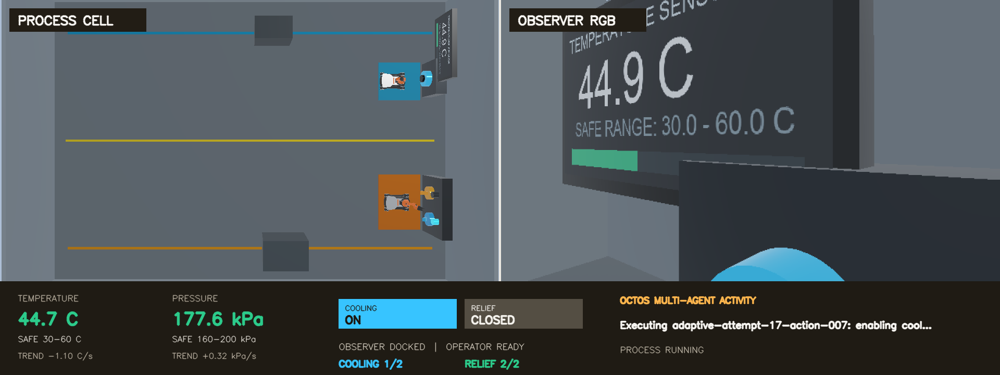
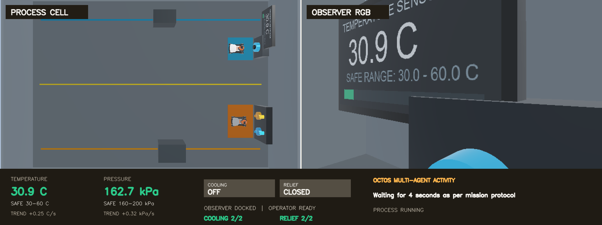

# Build Multi-Agent Continuous Process Supervision with Octos

## Version Information

| Component | Version / Environment Used in This Chapter |
| --- | --- |
| Operating system | Ubuntu 22.04 |
| GPU | NVIDIA GPU with 16 GB or more VRAM recommended; validated with 24 GB |
| NVIDIA driver | 580.159.03 |
| Webots | R2025a |
| ROS | ROS 2 Humble |
| Dora CLI / Python | 1.0.0-rc.4 |
| Dora runtime Python | 3.11.14 |
| ROS 2 / application worker Python | 3.10.12 |
| Octos | 2.0.2 |
| Ollama | 0.32.1 |
| Observer / Operator model | `qwen3-vl:8b-instruct` |
| Supervisor model | `qwen2.5-coder:7b` |

## Downloads

- [Complete reference project ZIP](../assets/octos-multi-agent-supervision/octos-multi-agent-supervision-reference.zip)
- [SHA-256 checksums](../assets/octos-multi-agent-supervision/SHA256SUMS.txt)
- <a href="../assets/octos-multi-agent-supervision/README.txt" download>English README</a>
- <a href="../assets/octos-multi-agent-supervision/README.zh-CN.txt" download>Chinese README</a>

After downloading the ZIP and checksum file, verify them from the asset
directory:

```bash
sha256sum --ignore-missing -c SHA256SUMS.txt
unzip octos-multi-agent-supervision-reference.zip \
  -d octos-multi-agent-supervision
cd octos-multi-agent-supervision
```

## Goal

This chapter builds a simulated process cell that continuously heats and
pressurizes. The observation and control stations are far apart, so the scene
uses two KUKA youBots:

- the **Observer** travels to the sensor station, docks with the pressure
  sensor, and reads the temperature display through an RGB camera;
- the **Operator** travels to the control station and operates the cooling and
  relief switches;
- the **Supervisor** uses temperature, pressure, rates, data freshness, and
  switch state to decide when to observe and whether to change a control.

The normal temperature range is 30–60 °C and the normal pressure range is
160–200 kPa. Both values start rising as soon as the simulation starts.
Cooling lowers temperature, and relief lowers pressure. The system should act
before a trend reaches its upper boundary and turn a control off before the
value falls below its lower boundary.

The task has no natural endpoint. The tutorial recording stops after cooling
and relief each complete two useful control cycles followed by a short safe,
controls-off period. The supervision loop itself can continue running.

<div class="media-pair media-pair--ultrawide">
  <figure>
    
    <figcaption><strong>Process start:</strong> the values begin changing while both robots travel concurrently</figcaption>
  </figure>
  <figure>
    
    <figcaption><strong>Roles ready:</strong> the Observer acquires evidence while the Operator waits for requests</figcaption>
  </figure>
</div>

## Why Octos

[Octos](https://octos-org.github.io/octos/) is an open-source Agent platform
that organizes models, Profiles, Skills, tool policies, sessions, sandboxes,
and model Providers in one runtime. This chapter uses
`octos chat --message` for repeatable Agent invocations and gives the three
roles different models, role instructions, and orchestration responsibilities.

`adora` was an experimental environment for Dora's agentic-workflow design.
That work has been consolidated into [Dora](https://github.com/dora-rs/dora),
so this chapter uses the Dora CLI and dataflow directly and does not require a
separate adora runtime. See the
[adora repository note](https://github.com/dora-rs/adora) for the historical
context.

### Agent, Agents SDK, and Octos

| Concept | Main Problem It Solves | Use in These Examples |
| --- | --- | --- |
| Agent | Let a model observe results and select tools in a loop | The basic observe, act, and reobserve pattern |
| Agents SDK | Define an Agent, tools, and a run loop inside application code | One Agent completes a switch task sequentially |
| Octos | Manage Profiles, Skills, models, tool policies, sandboxes, and independent Agent roles | Observer, Operator, and Supervisor share a continuous task |

Octos is useful here for more than adding another loop:

- **Role separation:** the runner assigns sensing work to Observer and switch
  operations to Operator, while Supervisor has no robot tools. Observer and
  Operator still share one Skill, so their separation is enforced by
  orchestration and instructions rather than distinct tool allowlists.
- **Different models per role:** vision roles use Qwen3-VL, while strategy
  authoring uses a smaller coding model.
- **Reusable Skills:** named tools, parameter schemas, safety rules, and task
  semantics are installed together.
- **Separate records and failure localization:** each role has its own result,
  making perception, policy, and execution failures easier to distinguish.
- **Explicit resource scheduling:** the vision and coding models load in
  phases instead of occupying VRAM at the same time.
- **Coding to action:** Supervisor authors restricted policy code, which is
  validated before it can drive continuous decisions.

This chapter does not use the Octos swarm to create roles automatically. A
thin Python runner explicitly starts three Octos Agents, transfers structured
results, and manages policy lifecycle. That makes role responsibilities and
failure paths easier to read and test.

## How the Three Architectures Differ

All three examples use named skills, structured results, and a Dora execution
layer. What changes is how the model participates in the task.

<div class="architecture-comparison">
  <section class="architecture-variant architecture-variant--plan">
    <div class="architecture-variant-heading">
      <span class="architecture-kicker">Example one</span>
      <strong>Generate the complete action plan once</strong>
    </div>
    <div class="architecture-flow" role="img" aria-label="A natural-language task becomes a complete JSON plan, which is validated and then executed deterministically by Dora and Webots">
      <div class="architecture-node"><strong>Natural-language task</strong><small>Goal and completion conditions</small></div>
      <div class="architecture-arrow" aria-hidden="true">&rarr;</div>
      <div class="architecture-node"><strong>LLM Planner</strong><small>Called once before execution</small></div>
      <div class="architecture-arrow" aria-hidden="true">&rarr;</div>
      <div class="architecture-node"><strong>Complete JSON Plan</strong><small>Steps and condition branches</small></div>
      <div class="architecture-arrow" aria-hidden="true">&rarr;</div>
      <div class="architecture-node"><strong>Plan validator</strong><small>Reject invalid sequences</small></div>
      <div class="architecture-arrow" aria-hidden="true">&rarr;</div>
      <div class="architecture-node"><strong>Dora / Webots</strong><small>Execute the plan</small></div>
    </div>
    <p class="architecture-caption">Best for bounded tasks whose steps can be enumerated before execution.</p>
  </section>

  <div class="architecture-shift">
    <strong>First change</strong>
    <span>The model moves from planning once to selecting the next step after every tool result.</span>
  </div>

  <section class="architecture-variant architecture-variant--agent">
    <div class="architecture-variant-heading">
      <span class="architecture-kicker">Example two</span>
      <strong>One Agent decides in a feedback loop</strong>
    </div>
    <div class="architecture-flow" role="img" aria-label="One Agents SDK Agent selects a named tool, reads the structured result returned through Robot API and Dora, and then decides the next action">
      <div class="architecture-node"><strong>Natural-language task</strong><small>One bounded mission</small></div>
      <div class="architecture-arrow" aria-hidden="true">&rarr;</div>
      <div class="architecture-node"><strong>Agents SDK</strong><small>Single-Agent tool loop</small></div>
      <div class="architecture-arrow" aria-hidden="true">&rarr;</div>
      <div class="architecture-node"><strong>Robot API</strong><small>Typed atomic tools</small></div>
      <div class="architecture-arrow" aria-hidden="true">&rarr;</div>
      <div class="architecture-node"><strong>Dora Dataflow</strong><small>Dispatch and receipts</small></div>
      <div class="architecture-arrow" aria-hidden="true">&rarr;</div>
      <div class="architecture-node"><strong>Webots / VLM</strong><small>Motion and visual feedback</small></div>
    </div>
    <div class="architecture-feedback" role="note">
      <span class="architecture-feedback-arrow" aria-hidden="true">&larr;</span>
      <span><strong>Structured results return to the same Agent</strong><small>It selects another tool until the bounded mission is complete</small></span>
    </div>
  </section>

  <div class="architecture-shift">
    <strong>Second change</strong>
    <span>The task expands from one robot and bounded steps to multiple roles, heterogeneous models, and continuous supervision.</span>
  </div>

  <section class="architecture-variant architecture-variant--multi">
    <div class="architecture-variant-heading">
      <span class="architecture-kicker">This chapter</span>
      <strong>Octos multi-Agent continuous supervision</strong>
    </div>
    <div class="architecture-flow" role="img" aria-label="The Octos Supervisor authors an adaptive policy, Observer and Operator use a restricted Skill through Dora, and observable Webots state returns as continuous feedback">
      <div class="architecture-node"><strong>Continuous process goal</strong><small>Ranges, trends, and safety conditions</small></div>
      <div class="architecture-arrow" aria-hidden="true">&rarr;</div>
      <div class="architecture-node"><strong>Octos Supervisor</strong><small>Author and review policy</small></div>
      <div class="architecture-arrow" aria-hidden="true">&rarr;</div>
      <div class="architecture-node"><strong>Observer / Operator</strong><small>Separated sensing and control</small></div>
      <div class="architecture-arrow" aria-hidden="true">&rarr;</div>
      <div class="architecture-node"><strong>Octos Skill / API</strong><small>Named tools and receipts</small></div>
      <div class="architecture-arrow" aria-hidden="true">&rarr;</div>
      <div class="architecture-node"><strong>Dora / Webots</strong><small>Dataflow, action, and simulation</small></div>
    </div>
    <div class="architecture-feedback architecture-feedback--multi" role="note">
      <span class="architecture-feedback-arrow" aria-hidden="true">&larr;</span>
      <span><strong>Values, trends, freshness, and switch state keep returning</strong><small>The policy selects sensors, timing, and the next independent controls</small></span>
    </div>
  </section>
</div>

| Comparison | One-Shot LLM Plan | Single Agent / Agents SDK | Octos Multi-Agent |
| --- | --- | --- | --- |
| Planning time | Once before execution | After each tool result | Continuously, with periodic policy review |
| Roles | One Planner | One execution Agent | Observer, Operator, and Supervisor |
| Model output | Complete JSON sequence | Next tool call | Restricted policy code, observations, and actions |
| State | One mission state | One robot task context | Time series, rates, freshness, and multiple robots |
| Failure isolation | Plan or execution | One loop handles everything | Perception, policy, and execution can be located separately |
| Best fit | Bounded and enumerable | Feedback-driven bounded task | Long-running, multi-role, changing process |

## Adaptive Decisions and Reliable Execution

Octos and the LLM **drive the policy**, but the application is not free of
program logic. A clear responsibility boundary matters more than handing every
behavior to a model.

| Octos and the Models Decide | Deterministic Code Guarantees |
| --- | --- |
| Read pressure, RGB temperature, or both | Dora transports state and requests at fixed rates |
| Select the next observation interval from trends | JSON Schema, Pydantic, and tool allowlists validate inputs |
| Open or close cooling and relief | Named navigation and arm motions perform the physical actions |
| Author and revise `decide(context)` | AST restrictions, isolated execution, and boundary replays validate policy |
| Adapt after receiving new evidence | `action_id` receipts prevent retries from pressing twice |
| Decide when to observe again | Simulator interlocks close controls at hard lower boundaries |

The models cannot read hidden temperature or pressure truth and cannot emit
coordinates, wheel speeds, joint angles, or arbitrary shell commands.
Pressure is available only after Observer docks through a Dora node.
Temperature must come from a fresh RGB image and a structured local-VLM result.

## Implementation Flow

### Inspect the Reference Project

Ask a coding assistant to understand the boundaries before changing the scene:

```text
Inspect this provided Webots R2025a, ROS 2 Humble, Dora 1.0.0-rc.4,
Octos 2.0.2, and Ollama reference project.

Explain the responsibilities of worlds, controllers, dora, process_api,
process_runtime, octos-skills, tools, config, and tests. Trace Observer,
Operator, and Supervisor from an Octos Skill through a Dora node to Webots
and back through a structured result.

Mark which decisions belong to the models and which validation, execution,
and safety behavior is deterministic. Do not install or modify anything.
Do not print user names, host names, private addresses, tokens, complete
environment dumps, or local absolute paths.
```

The assistant should identify `worlds/process_supervision.wbt` as the
scene entry, `dora/process_dataflow.yml` as the runtime topology,
`octos-skills/` as the model-visible capability boundary, and
`tools/run_octos_multi_agent.py` as a thin role and policy-lifecycle runner.

### Prepare the Environment

Have the assistant inspect hardware and existing installations before running
versioned commands:

```text
Prepare an Ubuntu 22.04 environment for this reference project.

Check CPU architecture, memory, disk, NVIDIA GPU and VRAM, driver, Docker,
NVIDIA Container Toolkit, X11 DISPLAY, Dora, Octos, and Ollama. Use
README.md, Dockerfile, and pyproject.toml as the version source.

Keep installations that already satisfy the requirements. List each command
and its impact before changing anything. Octos and Ollama run on the host;
Webots, ROS 2 workers, and Python 3.11 Dora sidecars run in the provided container.
Do not reveal tokens, complete environment variables, or private paths.
```

Validated installation and model-preparation commands:

```bash
npm install -g @octos-org/octos@2.0.2
octos --version

ollama pull qwen3-vl:8b-instruct
ollama pull qwen2.5-coder:7b

docker build -t octos-process-supervision:humble .
chmod +x run-container.sh launch-webots.sh
```

The validation machine had 24 GB of VRAM. The runner unloads Qwen3-VL after
the visual phase before loading the Supervisor coding model, and reverses the
switch after strategy generation. The two models therefore do not need to
remain in VRAM together. Smaller models require fresh validation of visual
JSON and policy replays.

The container keeps Dora in a Python 3.11 virtual environment and runs ROS 2,
the process API, and application workers with system Python 3.10. A generic
JSONL sidecar connects every worker to Dora while preserving that dependency
boundary.

### Load the Simulation Scene

Start the interactive container and launch Webots inside it:

```bash
./run-container.sh
./launch-webots.sh
```

Use the following prompt to inspect the supplied scene instead of replacing it:

```text
Inspect the loaded continuous process-supervision scene.

Confirm that Observer and Operator start from separate positions; the sensor
station has a pressure interface and a fully visible temperature display;
the control station has separate cooling and relief switches; the fixed scene
camera sees both routes and both stations; and the Observer RGB camera sees
the complete temperature value when docked.

Confirm that temperature and pressure rise from simulation start and that the
normal ranges are 30-60 C and 160-200 kPa. Report the result only. Do not
modify the world file.
```

At first, the bottom panel has not received Agent sensor readings, but the
simulated process is already changing. Both robots travel concurrently,
avoiding an idle sequence where one role waits for the other to start.

### Define the Dora Dataflow

Ask the assistant to verify that data flows through Dora instead of allowing
the runner to read hidden simulation state:

```text
Inspect dora/process_dataflow.yml and its nodes.

gateway owns only the local API, request correlation, and dispatch; state
publishes sanitized state periodically; command handles only named navigation
and switch actions; observation handles only pressure and RGB temperature;
activity displays a short Agent action in the scene UI.

Confirm that every request_id receives its matching result, temperature and
pressure truth are absent from GET /v1/status, and every HTTP port binds only
to 127.0.0.1. Find disconnected inputs, incorrect topics, infinite waits, or
paths that bypass Dora.
```

The complete dataflow is:

```yaml
{{#include ../assets/octos-multi-agent-supervision/source/dora/process_dataflow.yml}}
```

```python
{{#include ../assets/octos-multi-agent-supervision/source/dora/runtime_bridge/sidecar_node.py}}
```

```python
{{#include ../assets/octos-multi-agent-supervision/source/dora/runtime_bridge/sidecar_bridge.py}}
```

The `gateway` worker exposes a local interface on `127.0.0.1:8111`. Dora's `state`,
`command`, `observation`, and `activity` nodes retain single responsibilities.

### Define the Octos Skill

The Skill gives the Agents both robot capabilities and their safety semantics:

```text
Inspect octos-skills/process-supervision.

Observer and Operator share this Skill. Confirm that SKILL.md assigns sensor
ownership to Observer and switch ownership to Operator, and that the runner's
role prompts preserve that separation. Supervisor uses a no-tools
configuration and must not receive robot tools.

Tool parameters are limited to role, home/station, cooling/relief, enabled,
action_id, message, and a wait from 1 to 120 seconds. Reject coordinates,
speeds, wheel commands, joint angles, hidden simulation truth, shell, and
arbitrary code execution.

Check that manifest schemas, SKILL.md rules, and the main adapter agree, and
confirm that retrying one action_id returns its original receipt.
```

In this reference project, Observer and Operator are separated at the
orchestration and instruction layers, not by different tool allowlists.
Production systems that require hard access control should add role-specific
Profiles or tool-policy configurations and revalidate every role.

The complete tool manifest is:

```json
{{#include ../assets/octos-multi-agent-supervision/source/octos-skills/process-supervision/manifest.json}}
```

The key adapter maps Octos tools to the local Dora API:

```python
{{#include ../assets/octos-multi-agent-supervision/source/octos-skills/process-supervision/main:42:87}}
```

At startup, the runner synchronizes these three Skill files into
`.octos/skills/process-supervision/` inside the project. This directory
is runtime output and is not included in the download.

### Configure Three Agents

Ask the assistant to implement role-specific orchestration and model switching:

```text
Configure three independent roles with the Octos CLI.

Observer uses qwen3-vl:8b-instruct; its instructions limit its work to
navigation, pressure acquisition, and RGB temperature acquisition. Operator
uses qwen3-vl:8b-instruct; its instructions limit its work to navigation and
named switch actions. Supervisor uses qwen2.5-coder:7b, a coding profile, and
a no-tools policy, returning only one JSON object with complete strategy_source
and reason.

All roles use the local Ollama OpenAI-compatible endpoint, read-only sandbox,
never approval, and JSON output. Prepare Observer and Operator concurrently.
Do not log hidden reasoning; log role, tool, structured result, duration, and
error only.
```

The runner invokes the same Octos binary for every role while keeping separate
outputs and model configurations:

```python
{{#include ../assets/octos-multi-agent-supervision/source/tools/run_octos_multi_agent.py:129:214}}
```

The Supervisor configuration exposes no tools:

```json
{{#include ../assets/octos-multi-agent-supervision/source/config/octos-supervisor.json}}
```

### Generate and Validate the Adaptive Policy

Supervisor does not emit a fixed action sequence. It authors
`decide(context)`, which is called after every observation:

```text
You are the Supervisor Agent for a continuous process cell. Author a small
Python strategy with this exact signature:

def decide(context):

Keep temperature inside 30-60 C and pressure inside 160-200 kPa.
context contains timestamped history, per-second rates, switch_state,
normal_ranges, freshness_seconds, and completed_cycles.

From current values, trends, data freshness, and switch state:
1. select pressure, temperature_rgb, or both for the next observation;
2. decide whether to open or close cooling and relief independently;
3. select the next observation interval from 1 to 120 seconds;
4. reobserve soon after an action and close a control before its lower bound;
5. continue supervising because the process has no natural endpoint.

Define only decide(context). Do not use imports, files, network, shell,
classes, exceptions, while loops, dynamic execution, or private names.
Return observe, actions, observe_after_seconds, and reason. Return only a JSON
object containing strategy_source and reason.
```

One actual run generated and activated this initial strategy:

```python
{{#include ../assets/octos-multi-agent-supervision/source/examples/generated_strategy.py}}
```

It is not executed without inspection. `validate_strategy_source` permits only
one `decide(context)` and rejects imports, files, network access, `while`,
exceptions, classes, and dynamic execution. The strategy runs in an isolated
Python process and must pass bootstrap, upper-bound, and lower-bound replays:

```python
{{#include ../assets/octos-multi-agent-supervision/source/process_runtime/adaptive_policy.py:35:88}}
```

If a candidate is invalid, Supervisor receives a bounded number of structured
correction attempts. If those still fail, the runner activates a
replay-verified baseline. After every three complete control cycles,
Supervisor may retain or revise the strategy using newly measured rates.

### Start the Complete Application

Keep Webots running. In a second terminal, enter the container and start Dora:

```bash
docker exec -it octos-process-supervision bash
cd /workspace/dora
dora run process_dataflow.yml
```

In a third host terminal, inspect the local API:

```bash
curl -s http://127.0.0.1:8111/health
curl -s http://127.0.0.1:8111/v1/status
```

`status` should contain robot locations, switch state, normal ranges, and
process phase, but no current temperature or pressure truth. Start the three
Octos Agents:

```bash
/usr/bin/python3 tools/run_octos_multi_agent.py
```

The binaries and models can also be explicit:

```bash
/usr/bin/python3 tools/run_octos_multi_agent.py \
  --octos "$(command -v octos)" \
  --ollama "$(command -v ollama)" \
  --vision-model qwen3-vl:8b-instruct \
  --supervisor-model qwen2.5-coder:7b
```

The following is a condensed observable event stream. Values and `action_id`
fields vary between runs:

```text
[Observer] navigating to station and acquiring pressure + RGB temperature
[Operator] navigating to control station
[Supervisor] strategy-v001 accepted by AST and replay validation
[Strategy] observe=["pressure"] actions=[relief=true] next=3s
[Operator] action receipt status=succeeded relief_open=true
[Observer] pressure=167.3 kPa
[Strategy] observe=["temperature_rgb"] actions=[] next=10s
[Observer] temperature=51.8 C visible=true confidence=0.99
[Strategy] actions=[cooling=true] next=3s
[Operator] action receipt status=succeeded cooling_on=true
[Strategy] actions=[cooling=true, relief=true] next=3s
```

When you press `Ctrl+C`, the runner requests that any active controls turn off
and records the final state. Do not close the Webots window as a substitute
for controlled shutdown.

### Inspect the Control Evidence

The two frames below show the second cooling and second relief engagements.
The left side is the fixed third-person camera, and the right side is Observer
RGB. The lower panel shows readings, trends, valve state, robot state,
independent cycle counts, and current Octos activity.

<div class="media-pair media-pair--ultrawide">
  <figure>
    
    <figcaption><strong>Cooling:</strong> temperature trend changes to −1.10 °C/s while relief stays closed</figcaption>
  </figure>
  <figure>
    
    <figcaption><strong>Relief:</strong> pressure trend changes to −3.18 kPa/s while cooling stays off</figcaption>
  </figure>
</div>

The video shows the complete process at 2.5x speed. Both robots prepare
concurrently, the VLM reads temperature, Supervisor activates a policy,
Operator changes both controls multiple times, and every action is followed by
new observations. The poster and video are both 1920×720, so playback does not
move the surrounding page.

<video class="process-demo-video" controls muted playsinline preload="metadata" width="1920" height="720" poster="../assets/octos-multi-agent-supervision/media/process-complete.png">
  <source src="../assets/octos-multi-agent-supervision/media/octos-process-supervision.mp4" type="video/mp4">
</video>

When the tutorial recording stops, both controls are off, temperature is
30.9 °C, and pressure is 162.7 kPa. The visible `2/2` counters are recording
targets, not Agent completion conditions.



## Tests and Failure Boundaries

Run the complete suite inside the container:

```bash
cd /workspace
/usr/bin/python3 -m pytest -q
```

The reference run contains 145 tests covering Dora wiring, the local API,
role behavior contracts, Skill schemas, idempotent actions, the RGB-temperature
contract, rate calculations, strategy AST checks, isolated execution, boundary
replays, scene contracts, layout, and recording completion.

Common problems:

- **Octos cannot find the Skill:** run the runner from the project root and
  check `.octos/skills/process-supervision/manifest.json`.
- **An Agent cannot connect to Ollama:** confirm `ollama list` works and inspect
  local `127.0.0.1:11434/v1`. Do not expose the service externally to work
  around a local configuration problem.
- **Pressure returns `OBSERVER_NOT_DOCKED`:** wait for Observer to reach
  `station`; do not read hidden truth.
- **Temperature is not visible or has low confidence:** keep the full display
  inside Observer RGB and request a fresh frame. Do not reuse an old result as
  a new observation.
- **A strategy is rejected:** identify whether syntax, AST, output schema, or a
  boundary replay failed, and ask Supervisor to correct that specific issue.
- **An action appears duplicated:** inspect `action_id` and its receipt. The
  same ID must not cause another physical action.
- **A value falls below its normal minimum:** the deterministic safety layer
  closes the matching control. The next decision must use the observed switch
  state instead of stale Agent memory.
- **VRAM is exhausted:** verify that vision and coding models unload between
  phases. Revalidate structured outputs after choosing smaller models; do not
  remove schemas, replays, or safety interlocks.

## Extend the Pattern

When adding a third process variable, preserve the same boundary: first
implement an observable sensor, named control, and deterministic protection in
Dora, then add one small tool to the Octos Skill. A new Agent may have its own
Profile and model, but it should not gain “general capability” through shared
arbitrary code execution, hidden state, or low-level motor parameters.

The thin Python runner can later be replaced with a persistent Octos service,
pipeline, or native multi-Agent topology. Regardless of orchestration,
sensor evidence, action receipts, policy validation, and shutdown must remain
structured, testable, and auditable.

## Course Conclusion

This example already has the outline of a modern system for long-running robot
task management and robot fleet governance. Multiple roles work toward one
continuous goal, adapt their strategy from observable data, and use Dora to
execute actions that remain structured, verifiable, and auditable.

It is still some distance from mature embodied intelligence. Real robots must
also learn or acquire concrete manipulation skills, control arms precisely,
coordinate two hands, adapt to complex physical environments, and remain safe
over long periods of operation. What we have built is a clear, reproducible
starting point rather than the final destination.

This concludes the tutorial. Thank you for reading, and I hope these examples
help you build your own Dora robotics applications and systems.
