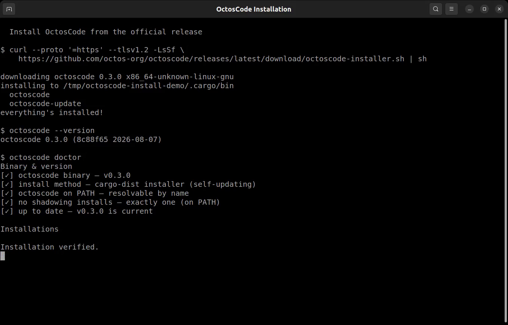
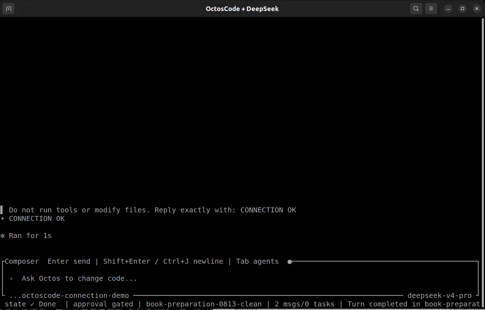

# 准备工作：LLM、Agent 与编程助手

## 版本信息

| 组件 | 本章使用的版本或接口 |
| --- | --- |
| OctosCode | 0.3.0 |
| DeepSeek | 通过 `deepseek-v4-pro` API 别名使用 DeepSeek V4 Pro 0813 |
| API 形式 | OpenAI 兼容的 Chat Completions |
| 已验证桌面环境 | Ubuntu 24.04 LTS，x86_64 |

模型目录、价格和编程助手版本变化很快。下文排序是面向本教程的实用起点，不是永久的
全球排行榜。注册付费服务前，请重新检查对应文档。

## 什么是 LLM

大语言模型（LLM）根据输入上下文预测并生成文本、代码和结构化数据。它可以解释
错误或提出实现方案，但模型本身不会打开文件、运行仿真或验证程序；这些动作来自
包裹模型的应用和工具。

LLM 常见的使用方式有两种：

| 入口 | 适合的任务 | 需要自己管理的部分 |
| --- | --- | --- |
| Chat | 问答、探索、编写提示词和人工审阅 | 手动提供上下文，并自行应用回答 |
| API | 可重复的程序逻辑、结构化输出、工具调用和自动化 | 密钥、请求、重试、成本和结果校验 |

Chat 最适合快速学习；当 Dora node 或其他程序需要调用模型并消费稳定结果时，API
才是正确的系统边界。

## 五个主流 LLM 选项

这个顺序综合考虑通用能力、编程与工具调用、文档质量，以及本书项目中的可用性。

| 顺序 | 提供方 | 选择理由 | 官方文档 |
| --- | --- | --- | --- |
| 1 | OpenAI | 通用、编程、多模态、结构化输出与工具生态全面 | [模型文档](https://developers.openai.com/api/docs/models) |
| 2 | Anthropic Claude | 适合编程工作流、长上下文和面向 Agent 的开发 | [Claude Platform 文档](https://platform.claude.com/docs/en/intro) |
| 3 | DeepSeek | 编程和推理能力有竞争力，API 成本有吸引力，是本书推荐的性价比选项 | [API 快速开始](https://api-docs.deepseek.com/) |
| 4 | Google Gemini | 多模态、长上下文和 Google 开发者生态成熟 | [Gemini API 文档](https://ai.google.dev/gemini-api/docs) |
| 5 | xAI Grok | 支持推理、工具与实时能力的主流 API 备选 | [xAI 文档](https://docs.x.ai/overview) |

DeepSeek 排在第三而不是第一，是因为成本只是可靠开发流程的一部分。NIST CAISI
独立评测发现，DeepSeek V4 Pro 在七项对比基准中的五项比能力相近的参考模型更具
成本效率，但与最前沿模型仍有能力差距。因此这里推荐的是“性价比”，而不是无条件的
“最佳模型”。选择前可对照 [NIST CAISI 评测](https://www.nist.gov/news-events/news/2026/05/caisi-evaluation-deepseek-v4-pro)、
[Artificial Analysis 实时模型页](https://artificialanalysis.ai/models/deepseek-v4-pro)
和 [DeepSeek 当前价格](https://api-docs.deepseek.com/quick_start/pricing/)。

## Agent 与编程助手类应用

**Agent** 在 LLM 外增加一个循环：理解目标、选择工具、观察结果、更新状态，再决定
下一步。**编程助手**是你直接使用的应用，它把 Agent runtime 包装成终端、IDE、
桌面或 Web 界面，并提供文件访问、命令执行、diff、权限、会话与审阅控制。

<div class="architecture-flow" role="img" aria-label="用户任务进入编程助手，编程助手管理 Agent 循环，调用 LLM，并在工作区中使用经过授权的工具">
  <div class="architecture-node"><strong>你的任务</strong><small>目标与验收条件</small></div>
  <div class="architecture-arrow" aria-hidden="true">&rarr;</div>
  <div class="architecture-node"><strong>编程助手应用</strong><small>终端、IDE、App 或 Web</small></div>
  <div class="architecture-arrow" aria-hidden="true">&rarr;</div>
  <div class="architecture-node"><strong>Agent 循环</strong><small>规划、行动、观察、验证</small></div>
  <div class="architecture-arrow" aria-hidden="true">&rarr;</div>
  <div class="architecture-node"><strong>LLM</strong><small>推理与生成</small></div>
  <div class="architecture-arrow" aria-hidden="true">&rarr;</div>
  <div class="architecture-node"><strong>工具</strong><small>文件、终端、测试与网络</small></div>
</div>

模型提供主要推理能力；编程助手决定如何组织上下文、开放哪些工具、怎样控制权限，以及
如何把执行结果送回模型。替换其中任何一层，都可能改变任务结果。

## 五个主流编程助手

这里同样是面向本教程的推荐顺序，不是独立基准排行榜。

| 顺序 | 编程助手 | 实用优势 | 官方文档 |
| --- | --- | --- | --- |
| 1 | Codex CLI | 仓库工作流成熟，可配置模型、思考强度、审批、沙箱和多种工具 | [Codex CLI 文档](https://learn.chatgpt.com/docs/codex/cli) |
| 2 | Claude Code | 适合代码库探索、实现、测试和长时间运行任务的终端工作流 | [Claude Code 文档](https://code.claude.com/docs/en/overview) |
| 3 | OctosCode | 终端原生且响应直接，支持多 Provider、模型与思考控制、权限、diff、任务、会话、循环和多 Agent 视图 | [OctosCode 仓库与指南](https://github.com/octos-org/octoscode) |
| 4 | Gemini CLI | 集成 Gemini 与 Google 开发工具的开源终端 Agent | [Gemini CLI 仓库](https://github.com/google-gemini/gemini-cli) |
| 5 | OpenCode | 支持多种模型 Provider 的开源终端与桌面编程 Agent | [OpenCode 文档](https://opencode.ai/docs/) |

OctosCode 排在第三，是因为它用轻量终端工作流提供了完整控制面：Provider 与模型
选择、思考强度、只读/工作区/完整访问、工具审批、后台任务、会话恢复与回退、循环、
目标、审阅和 Agent 视图。它不绑定单一模型，因此本教程可以直接使用 DeepSeek。
这里的“性能”指工作流响应和接入所选高性能模型的能力，不代表 OctosCode 能让较弱
模型本身变得更聪明。

## 首先确认三个控制项

无论使用哪个编程助手，在允许它修改仓库之前都应检查：

- **模型**：多文件实现使用能力更强的编程模型；短问题可以使用更快的模型。
  OctosCode 中使用 `/model`；
- **思考强度**：普通任务从默认值或 `medium` 开始；架构、困难调试或完整构建验证
  使用 `high`。OctosCode 中使用 `/thinking`；
- **权限**：只检查时使用只读，普通实现使用工作区写入。完整主机访问只应在隔离且
  可信的环境中使用。OctosCode 中使用 `/permissions`。

Codex 也通过 `/model`、`/permissions`、命令行参数和配置文件暴露这些概念。
其他编程助手的名称不同，应查看各自安全文档，不要直接跨产品复制参数。

## 安装 OctosCode

先注册 [DeepSeek 开放平台](https://platform.deepseek.com/)，按需充值，然后在
[API Keys 页面](https://platform.deepseek.com/api_keys)创建密钥。不要把密钥写入
提示词、源文件、截图、shell history 或 git commit。

macOS 或 Linux 使用官方预编译安装器：

```bash
curl --proto '=https' --tlsv1.2 -LsSf \
  https://github.com/octos-org/octoscode/releases/latest/download/octoscode-installer.sh | sh
source "$HOME/.cargo/env"
octoscode --version
```

Windows 在 PowerShell 中运行官方安装器：

```powershell
powershell -ExecutionPolicy Bypass -c "irm https://github.com/octos-org/octoscode/releases/latest/download/octoscode-installer.ps1 | iex"
octoscode --version
```

已经安装 Node.js 时，也可以使用官方 npm 包：

```bash
npm install -g @octos-org/octoscode
```

第一次直接运行 `octoscode` 时，如果没有 Octos server，它会自动准备匹配的运行时。
下面是在隔离 Linux 环境中的实际安装过程，画面只包含终端应用窗口。

<video class="terminal-demo-video" controls preload="metadata" poster="../assets/ai-assistant-preparation/octoscode-install.png">
  <source src="../assets/ai-assistant-preparation/octoscode-install.mp4" type="video/mp4">
  当前浏览器不支持嵌入视频。
</video>



## 连接 DeepSeek V4 Pro 0813

进入工程目录并启动编程助手：

```bash
cd <your-project>
octoscode
```

在 onboarding 向导中创建本地 Profile，并配置：

| 字段 | 值 |
| --- | --- |
| Provider family | DeepSeek |
| Model | `deepseek-v4-pro` |
| Route label | DeepSeek Official |
| Base URL | `https://api.deepseek.com` |
| API type | OpenAI compatible |
| API key environment name | `DEEPSEEK_API_KEY` |

在受保护的 Provider 字段中输入密钥，运行 **Test provider**，然后保存 Profile。
OctosCode 会在界面和快照中遮蔽密钥。API 别名保持为 `deepseek-v4-pro`；本教程验证
时，该别名返回的后端修订版为 0813。

先运行一个不能修改工作区的最小测试：

```text
Do not run tools or modify files. Reply exactly with: CONNECTION OK
```

然后查看 `/status`。模型应为 `deepseek-v4-pro`，本轮没有工具调用，并返回
`CONNECTION OK`。

<video class="terminal-demo-video" controls preload="metadata" poster="../assets/ai-assistant-preparation/octoscode-deepseek-connection.png">
  <source src="../assets/ai-assistant-preparation/octoscode-deepseek-connection.mp4" type="video/mp4">
  当前浏览器不支持嵌入视频。
</video>



## 配合本教程使用编程助手

选择成功率更高的复现路线时，下载章节资产后先输入：

```text
Inspect VERSIONS.md, TUTORIAL_CONTRACT.md, ASSET_GUIDE.md, and READER_PROMPT.md.
Do not regenerate the project or change pinned versions. Run only the documented
entry command first, compare its acceptance markers with the contract, and do
not claim success until the command, tests, and final status all pass. Keep API
keys, usernames, hostnames, and absolute paths out of files and output.
```

选择创造路线时，编程助手还要根据规格搭建更多场景和工程内容。应使用能力更强的模型，
预留迭代时间，并坚持使用相同的验收证据判断是否完成。

## 故障排查

| 现象 | 检查项 |
| --- | --- |
| 安装后找不到 `octoscode` | 打开新终端，或加载 `$HOME/.cargo/env` |
| 远程 TUI 颜色异常或无法启动 | 启动前设置 `TERM=xterm-256color` |
| Provider 测试返回 `401` | 重新创建 DeepSeek 密钥，并确认复制时没有空格 |
| Provider 测试返回 `402` 或额度错误 | 在 DeepSeek 平台检查余额和账号限制 |
| `/status` 显示了错误模型 | 用 `/model` 选择 `deepseek-v4-pro`，保存并重启本地 server |
| 编程助手请求过宽权限 | 从只读开始，确实需要修改时再授予工作区写入 |

## 来源

- OctosCode 仓库与安装指南：<https://github.com/octos-org/octoscode>
- Octos runtime 仓库：<https://github.com/octos-org/octos>
- DeepSeek API 快速开始：<https://api-docs.deepseek.com/>
- DeepSeek 模型与价格：<https://api-docs.deepseek.com/quick_start/pricing/>
- DeepSeek API 更新记录：<https://api-docs.deepseek.com/updates/>
- NIST CAISI DeepSeek V4 Pro 评测：<https://www.nist.gov/news-events/news/2026/05/caisi-evaluation-deepseek-v4-pro>
- Artificial Analysis DeepSeek V4 Pro 页面：<https://artificialanalysis.ai/models/deepseek-v4-pro>

## 下一步

下一章会介绍 Dora、安装固定版本的工具链，并使用本章准备好的编程助手工作流运行第一个
Hello World dataflow。
