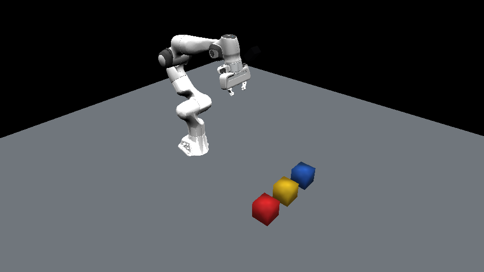
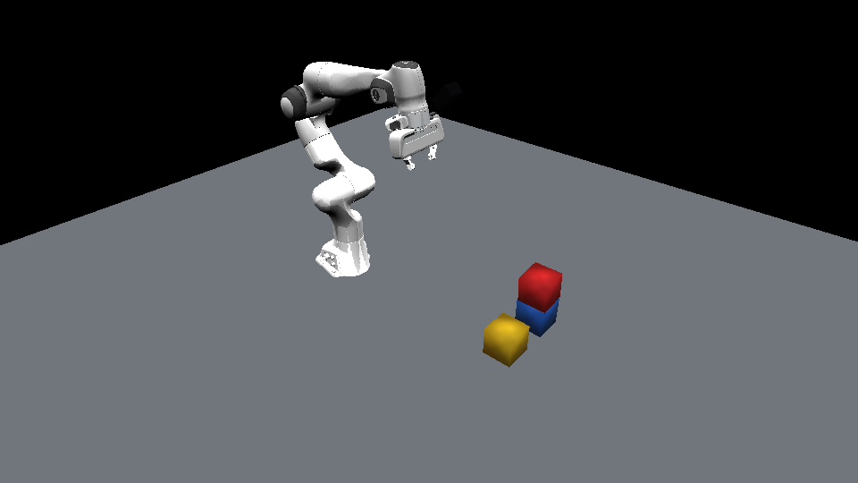
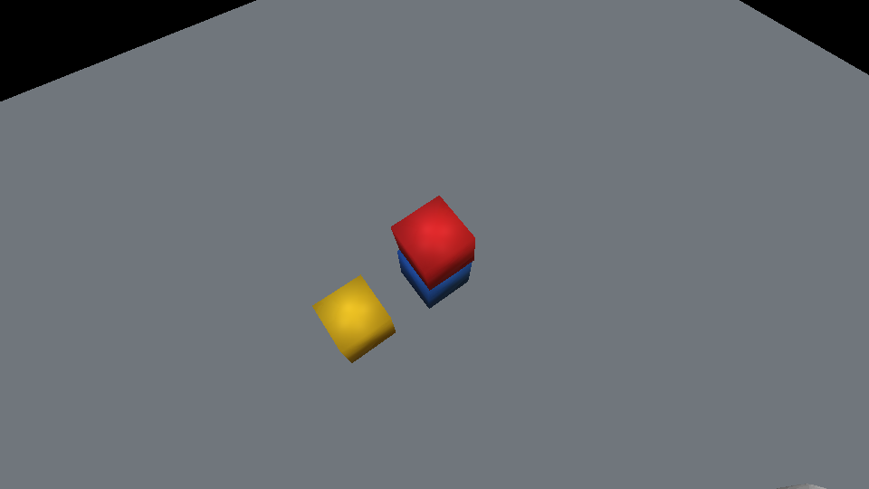

# 用多模态模型分析视觉信息

## 版本信息

| 组件 | 版本 / 环境 |
| --- | --- |
| 操作系统 | Ubuntu 22.04.5 LTS，x86_64 |
| GPU | NVIDIA GeForce RTX 5090 Laptop GPU，24 GB VRAM |
| NVIDIA driver | 580.159.03 |
| Dora CLI 和 Python API | 1.0.0-rc.4 |
| Dora 运行时 Python | 3.11.14 |
| Habitat-Sim | 0.3.3 |
| Habitat-Sim worker Python | 3.9.23 |
| Ollama | 0.32.1 |
| 本地模型 | `qwen3-vl:8b-instruct`，Q4_K_M |
| 模型 digest | `0533d74300e4f9bc367d675d4e64ffd073d50ff16a2b4096cc2e8a1cf8c96319` |

## 下载

- [完整多模态抓取与放置参考工程](../assets/multimodal-pick-and-place/multimodal-pick-and-place-reference.zip)
- [Franka Panda 腕部摄像机 URDF](../assets/multimodal-pick-and-place/source/assets/franka_panda_with_wrist_camera.urdf)
- [已验证的关节轨迹](../assets/multimodal-pick-and-place/source/validated-trajectory.json)
- [Mesh 来源和许可证说明](../assets/multimodal-pick-and-place/source/assets/franka_description/SOURCE.txt)

压缩包包含完整 Habitat-Sim 场景、全部引用 meshes、已验证轨迹、Dora 节点、模型
client、测试和录制脚本。继续之前先把它解压到一个新目录。

## 目标

本章会使用 AI 编程助手检查、配置并运行一个由视觉结果控制的抓取与放置应用。
提供的 Habitat-Sim 场景中包含 Franka Panda 机械臂、RGB 腕部摄像机，以及水平
分开放置的红、黄、蓝三个方块。

Dora 把完整任务连接起来：

1. 捕获初始腕部图像。
2. 让视觉语言模型判断红、蓝方块是否可见，以及红方块是否已经位于蓝方块上。
3. 仅当两个方块可见并且尚未堆叠时，执行确定性轨迹。
4. 抓起红方块，把它放到蓝方块上，然后让机械臂回到 home。
5. 再次捕获腕部图像，并让模型验证结果。
6. 只有第二次结构化结果确认红方块位于蓝方块上时，任务才成功。

仿真动作被特意设计为确定性过程。本实验验证的是视觉判断和 Dora 编排，而不是抓取
策略本身的不确定性。

## 开始之前

本章命令面向 Ubuntu/Linux，并假设终端位于下载后解压的参考工程目录。继续使用
上一章已经可用的 Dora、Python 和 Habitat-Sim 环境。Ollama 会在下文安装；
FFmpeg 和 FFprobe 只用于准备和检查教程素材。生成文件统一保存在解压工程的
`outputs/` 目录下。

## 硬件需求

本地推理建议使用至少 12 GB VRAM 的 NVIDIA GPU、24 GB 系统内存，以及约 15 GB
可用磁盘空间。24 GB GPU 可以使用 8B Q4 模型，规格较低时应选择更小的视觉模型。
显存峰值应控制在 70% 以下，为仿真渲染和录屏预留空间。

本次完整运行使用 11,789 MiB / 24,463 MiB 显存，约为 48.2%。推理瞬间 GPU
计算利用率短暂达到 87%，但这属于短时计算峰值，并不是持续的显存压力。

如果设备无法运行本地模型，可以保持 Dora contract 不变，只替换本章后面的云端
推理节点。

## 为什么选择这套组合

[Habitat-Sim](https://aihabitat.org/docs/habitat-sim/) 提供 GPU 渲染、articulated
object 关节控制和 RGB sensor，并且可以复用上一章的 Panda 场景和真实视觉模型。

[Dora](https://dora-rs.ai/docs/) 把 controller、simulator 和 model 表达为输入输出
明确的节点。视觉模型只负责提出观测，普通程序逻辑决定任务是否继续。

[Ollama](https://ollama.com/) 为本地运行
[Qwen3-VL](https://github.com/QwenLM/Qwen3-VL) 提供简单 API。图像可以留在本机，
JSON Schema 也能约束返回结构。

## 实现流程

1. 检查设备并选择本地或云端推理。
2. 安装模型运行时并准备视觉语言模型。
3. 检查并测试提供的机械臂、摄像机、方块和确定性轨迹。
4. 定义结构化视觉 contract 和 Dora 控制流程。
5. 接入模型并独立测试两张门控图像。
6. 运行完整任务并收集视觉与数值证据。

## 检查设备

先进行只读检查。要求助手对报告脱敏，不要输出无关的进程和身份信息。

```text
检查这台计算机是否适合运行 Dora 视觉门控抓取与放置示例。

报告操作系统、CPU 架构、Python 版本、系统内存、可用磁盘空间、GPU 型号、GPU
显存、NVIDIA driver、CUDA 可用性和已安装的 Dora 版本。检查 Dora 最新的官方
release 和安装文档。

与以下建议配置比较：至少 12 GB VRAM 的 NVIDIA GPU、24 GB 系统内存和 15 GB
可用磁盘空间。建议使用本地 4B/8B 视觉语言模型，或者云端 API。此时不要安装或
删除任何内容。不要输出用户名、home 路径、私有主机名、token、序列号或无关进程。
```

验证设备可以运行 8B Q4 模型，同时为 Habitat-Sim 和视频编码保留足够显存。

### 检查已安装版本

在终端执行以下命令，并使用输出填写版本报告。命令不存在表示对应组件仍需安装。

```bash
python --version
dora --version
nvidia-smi --query-gpu=name,driver_version,memory.total \
  --format=csv,noheader
```

## 准备本地模型

单独准备模型运行时，并在接入 Dora 和 simulator 之前完成测试。

```text
为本教程准备本地多模态运行环境。

遵循最新的 Ollama 官方指引。把 binary、模型 cache 和生成文件保存在 book source
之外。选择当前可用、显存峰值低于 70% 的 Qwen3-VL instruct 模型。这台 24 GB
GPU 优先使用 8B Q4 模型。

只在 localhost 启动 Ollama。使用一张 RGB 图像测试 JSON Schema 输出。报告准确的
Ollama 版本、模型名称、模型 digest、耗时、有效 JSON 结果和显存占用。响应被截断
或 JSON 无效时不要继续。不要暴露本地路径或无关进程。
```

验证选型是 `qwen3-vl:8b-instruct`，digest 已在版本信息中固定。首次 smoke test
中的两次 warm 图像请求总计用时 11.36 秒。

### 启动 Ollama 并确认模型

如果 `ollama --version` 不可用，使用当前的
[Linux 官方命令](https://docs.ollama.com/linux)安装或更新 Ollama：

```bash
curl -fsSL https://ollama.com/install.sh | sh
ollama -v
```

在第一个终端启动本地服务，并保持它继续运行：

```bash
export OLLAMA_HOST=127.0.0.1:11434
ollama serve
```

在第二个终端确认运行时、下载选定模型并检查本地 API：

```bash
ollama --version
ollama pull qwen3-vl:8b-instruct
ollama list
curl -fsS http://127.0.0.1:11434/api/tags
```

如果完整 API 响应包含其他本地模型名称，不要公开这部分内容。在 Dora 运行完成前，
保持 Ollama 服务终端开启。

## 检查场景和动作

机械臂位于 home 时，腕部摄像机必须看到三个方块。动作期间，摄像机光心跟随腕部，
画面保持对红色任务对象的关注。另一个摄像机记录供读者观察的完整场景。

```text
检查已经提供的多模态抓取与放置参考工程。

把 scene.py、assets/ 和 validated-trajectory.json 视为固定教程输入。不要替换
Panda、重新构建或排列方块、修改摄像机位姿，或求解不同的轨迹。

解释真实 Franka meshes 如何加载、RGB 腕部摄像机如何跟随机械臂、红方块如何附着
和释放，以及第三方与腕部录制如何保持同步。录制前运行 focused tests。确认 home
状态能看到三种颜色、机械臂最终回到 home，并且红方块最终位于蓝方块中心正上方
一个方块边长。报告帧数、时长、home error、stack error 和脱敏后的输出列表。
```

### 测试并生成仿真

解压压缩包，并按以下顺序执行已经验证的脚本：

```bash
mkdir multimodal-pick-and-place-reference
unzip multimodal-pick-and-place-reference.zip \
  -d multimodal-pick-and-place-reference
cd multimodal-pick-and-place-reference

python -m unittest discover -s tests
python prepare_trajectory.py --output outputs/trajectory
python record_demo.py \
  --trajectory outputs/trajectory/trajectory.json \
  --output outputs/demo
```

第一条命令应报告所有测试为 `OK`。后续命令应在 `outputs/` 下生成
`trajectory.json`、四张截图、三段视频和 `run-result.json`。

初始第三方视角完整展示机械臂和工作区：

<div class="media-pair">
  <figure>
    
    <figcaption>初始第三方视角</figcaption>
  </figure>
  <figure>
    
    <figcaption>初始腕部 RGB 输入</figcaption>
  </figure>
</div>

验证轨迹包含 185 帧，时长 15.42 秒。最大 home 关节误差约为 `6.7e-8 rad`，
堆叠位置误差约为 `5.2e-9 m`。

### 参考实现：确定性动作

下面的核心执行循环来自提供的 `simulation_runtime.py`。
程序只在到达 `grasp` waypoint 后附着方块，并且只在到达 `place` waypoint 后释放。

```python
for (source_name, source), (destination_name, destination) in zip(
    self.waypoints, self.waypoints[1:]
):
    path = interpolate_segment(
        source, destination, self.frames_per_segment
    )
    for joints in path[1:]:
        self.scene.set_joints(joints)
        if attached_transform is not None:
            self.scene.update_attached_red(attached_transform)
        record_frame()

    action = carry_action_after_waypoint(destination_name)
    if action == "attach":
        attached_transform = self.scene.attach_red_to_hand()
    elif action == "release":
        self.scene.place_red_on_blue()
        attached_transform = None
```

## 定义视觉 Contract

不要让模型返回一段自然语言，只定义 controller 实际需要的观测。

```text
为腕部摄像机的判断定义并测试封闭的 JSON contract。

模型必须只返回以下字段：
- red_visible: boolean
- blue_visible: boolean
- red_on_blue: boolean
- confidence: 0 到 1 的 number

只有红方块在蓝方块垂直上方、两者水平投影重叠，并且蓝方块明显支撑红方块时，
red_on_blue 才是 true。拒绝额外字段、错误类型、无效 JSON，以及超出范围的
confidence。为有效的初始和最终观测，以及所有拒绝情况添加测试。
```

预期的初始观测如下：

```json
{
  "red_visible": true,
  "blue_visible": true,
  "red_on_blue": false,
  "confidence": 0.98
}
```

### 参考实现：严格校验结果

提供的 `contracts.py` 中经过验证的 parser 会拒绝额外字段、非 boolean 标志和
无效的 confidence：

```python
OBSERVATION_FIELDS = {
    "red_visible",
    "blue_visible",
    "red_on_blue",
    "confidence",
}


def parse_observation(payload: str) -> ObservationResult:
    value = json.loads(payload)
    if not isinstance(value, dict) or set(value) != OBSERVATION_FIELDS:
        raise ValueError("observation result has unexpected fields")

    for field in ("red_visible", "blue_visible", "red_on_blue"):
        if type(value[field]) is not bool:
            raise TypeError(f"{field} must be a boolean")

    confidence = value["confidence"]
    if isinstance(confidence, bool) or not isinstance(confidence, (int, float)):
        raise TypeError("confidence must be a number")
    if not 0.0 <= float(confidence) <= 1.0:
        raise ValueError("confidence must be between 0 and 1")

    return ObservationResult(
        red_visible=value["red_visible"],
        blue_visible=value["blue_visible"],
        red_on_blue=value["red_on_blue"],
        confidence=float(confidence),
    )
```

## 定义 Dora 控制流程

使用三个节点，每个节点只承担一类职责：

- `controller`：管理任务状态机和置信度阈值。
- `simulation`：运行在 Dora Python 3.11 中的 bridge，把渲染和轨迹执行委托给
  Habitat-Sim Python 3.9 worker。
- `vision`：调用 Ollama 并校验响应。

Habitat-Sim 0.3.3 与 Dora 1.0 支持的 Python 运行时不同。参考工程将两者隔离：Dora
nodes 使用 Python 3.11，Habitat-Sim worker 使用 Python 3.9；JSONL bridge 只转发
结构化命令、观测和错误，不形成第二条控制路径。

这个同机示例通过 Dora 发布只包含 `phase` 和 `wrist_path` 的小型 JSON observation，
`vision` node 从本地存储读取对应 PNG。模型只调用两次，分别发生在动作前和动作后；
两路摄像机录屏用于向读者展示过程，不会作为连续视频流发送给模型。如果 nodes 分布在
不同计算机上，应把本地路径替换为编码后的图像 bytes 或共享 object-storage URI。

```text
把当前示例实现为 Dora 1.0.0-rc.4 dataflow。

创建 controller、simulation 和 vision Python nodes，使用明确的 inputs 和 outputs。
controller 先请求初始截图。只有红蓝方块可见、red_on_blue 为 false，并且
confidence 至少为 0.8 时才能执行动作；动作完成后再请求最终截图。只有最终结果中
两个方块可见、red_on_blue 为 true，并且 confidence 至少为 0.8 时才能报告成功。

simulation bridge 启动并管理提供的 Habitat-Sim worker；worker 管理 Habitat-Sim
和验证轨迹。vision node 管理模型请求和 schema
validation。timeout、服务错误、无效 JSON 或 schema failure 时，发布脱敏错误，不要
编造观测。成功或失败后，所有节点都应正常退出。为 contract、状态转换、插值、
关节限制和 attach/release 事件添加单元测试。
```

### 参考实现：Dora Dataflow

完整的 `dataflow.yml` 清楚表达了循环控制关系：

```yaml
nodes:
  - id: controller
    path: controller_node.py
    inputs:
      analysis: vision/analysis
      motion_complete: simulation/motion_complete
    outputs:
      - command

  - id: simulation
    path: simulation_bridge_node.py
    inputs:
      command: controller/command
    outputs:
      - observation
      - motion_complete

  - id: vision
    path: vision_node.py
    inputs:
      observation: simulation/observation
    outputs:
      - analysis
```

### 参考实现：置信度门控状态转换

判断逻辑来自提供的 `controller.py`，是可以独立测试的普通 Python 代码：

```python
def on_analysis(
    self, phase: str, result: ObservationResult
) -> list[Command]:
    expected_state = {
        "before": State.INSPECTING_BEFORE,
        "after": State.INSPECTING_AFTER,
    }.get(phase)
    if expected_state is None or self.state is not expected_state:
        raise RuntimeError("analysis phase does not match controller state")

    visible = result.red_visible and result.blue_visible
    confident = result.confidence >= self.min_confidence

    if phase == "before":
        if visible and confident and not result.red_on_blue:
            self.state = State.MOVING
            return [Command("run_pick_place")]
        self.state = State.FAILED
        return [Command("task_failed", "precondition")]

    if visible and confident and result.red_on_blue:
        self.state = State.SUCCEEDED
        return [Command("task_success")]
    self.state = State.FAILED
    return [Command("task_failed", "postcondition")]
```

这形成了清晰的边界：模型不能直接输出关节命令，无效或低置信度结果会停止任务。

## 接入 Qwen3-VL

使用简洁的图像提示词，并把相同 schema 传给本地 API。

```text
把 Dora vision node 接入已验证的 Ollama Qwen3-VL 模型。

通过 Ollama 官方 chat API 发送腕部 PNG。要求返回现有 JSON Schema，temperature
设为 0，并配置有界的输出长度、可配置的模型名称、localhost 服务地址和 request
timeout。使用下面的视觉指令：

检查这张机器人腕部摄像机的 RGB 图像。返回红方块和蓝方块是否可见，以及红方块
是否放置在蓝方块上。只有红方块位于蓝方块垂直上方、两者水平投影重叠，并且蓝方块
明显支撑红方块时，red_on_blue 才能为 true。只返回 JSON。

发布前再次使用 Python 校验响应。运行完整 Dora 应用前，先分别测试初始和最终截图。
```

两张图像都返回有效 JSON，confidence 均为 `0.98`，并且正确区分了未堆叠和已堆叠
场景。

### 参考实现：Ollama 视觉请求

提供的 `vision_client.py` 中经过验证的代码把 PNG 编码为 base64，要求 Ollama 按
`SCHEMA` 生成响应，并再次使用 Python 校验返回文本：

```python
def analyze_image(image_path: Path, timeout: float = 120.0) -> ObservationResult:
    encoded = base64.b64encode(image_path.read_bytes()).decode("ascii")
    body = json.dumps(
        {
            "model": MODEL,
            "messages": [
                {"role": "user", "content": PROMPT, "images": [encoded]}
            ],
            "format": SCHEMA,
            "stream": False,
            "options": {"temperature": 0, "num_predict": 128},
        }
    ).encode("utf-8")
    request = urllib.request.Request(
        f"{OLLAMA_URL}/api/chat",
        data=body,
        headers={"Content-Type": "application/json"},
        method="POST",
    )
    with urllib.request.urlopen(request, timeout=timeout) as response:
        payload = json.load(response)
    content = payload.get("message", {}).get("content")
    if not isinstance(content, str):
        raise ValueError("model response does not contain message content")
    return parse_observation(content)
```

### 独立测试门控图像

保持 Ollama 运行，并使用前面生成的图像。在启动完整 dataflow 前先脱离 Dora 测试两次
输入：

```bash
cd multimodal-pick-and-place-reference

python - <<'PY'
import json
from pathlib import Path

from vision_client import analyze_image, result_dict

for phase in ("before", "after"):
    image = Path("outputs/demo") / f"{phase}-wrist.png"
    result = result_dict(analyze_image(image))
    print(phase, json.dumps(result, sort_keys=True))
PY
```

`before` 结果应包含 `red_on_blue: false`，`after` 结果应包含
`red_on_blue: true`。两次结果中的 `red_visible` 和 `blue_visible` 都必须为 true，
并且通过本地 schema validator 后，controller 才能使用它们。

## 运行完整应用

```text
运行并验证完整的 Dora 抓取与放置应用。

启动隔离的 Ollama 服务，运行 Dora dataflow，并收集脱敏日志。确认事件顺序严格为：
初始视觉结果、执行动作、最终视觉结果、任务成功。从第一帧 home 状态开始录制两路
摄像机，直到最终回到 home。测量帧数、视频时长、home error、stack error、显存
峰值和 GPU 利用率。显存必须低于 70%。验证结束后停止本次启动的全部服务。
```

### 运行 Dora Dataflow

保持另一个终端中的 Ollama 服务运行，然后使用提供的脚本。它会创建或复用固定版本的
Dora 与 Habitat 环境，下载并校验 Dora CLI，在 Habitat 环境中运行单元测试，使用
Python 3.11 启动 Dora dataflow，并要求日志中出现 `TASK_SUCCESS`：

```bash
cd multimodal-pick-and-place-reference

export OLLAMA_MODEL=qwen3-vl:8b-instruct
export OLLAMA_URL=http://127.0.0.1:11434
bash run.sh
```

在另一个终端采样 GPU 使用情况，并且不列出无关进程名称：

```bash
nvidia-smi \
  --query-gpu=utilization.gpu,memory.used,memory.total \
  --format=csv,noheader,nounits
```

出现 `TASK_SUCCESS` 且所有 Dora nodes 都退出后，回到 Ollama 终端并按 `Ctrl+C`
停止本地服务。

完整验证日志可以缩减为以下关键事件：

```text
VISION_RESULT phase=before red_visible=true blue_visible=true red_on_blue=false confidence=0.98
MOTION_RESULT success=true frames=185 duration_seconds=15.4167 home_error=6.7e-8 stack_error=5.2e-9
VISION_RESULT phase=after red_visible=true blue_visible=true red_on_blue=true confidence=0.98
TASK_SUCCESS
```

视频左侧是第三方视角，右侧是腕部 RGB 摄像机产生的图像。

<video class="wide-demo-video" controls muted playsinline preload="metadata" width="1280" height="360" poster="../assets/multimodal-pick-and-place/pick-place-side-by-side-poster.png">
  <source src="../assets/multimodal-pick-and-place/pick-place-side-by-side.mp4" type="video/mp4">
</video>

也可以分别查看[第三方视角录屏](../assets/multimodal-pick-and-place/pick-place-overview.mp4)和
[腕部 RGB 录屏](../assets/multimodal-pick-and-place/pick-place-wrist.mp4)。

### 编码并检查录屏

OpenCV 默认生成的 MP4 codec 不一定能在所有浏览器中播放。把并排录屏转换为 H.264，
并在加入 Book 前检查媒体信息：

```bash
ffmpeg -y \
  -i outputs/dora-run/pick-place-side-by-side.mp4 \
  -an -c:v libx264 -preset medium -crf 23 \
  -pix_fmt yuv420p -movflags +faststart \
  outputs/dora-run/pick-place-side-by-side-h264.mp4

ffprobe -v error \
  -show_entries stream=codec_name,pix_fmt,width,height,r_frame_rate,nb_frames \
  -show_entries format=duration,size \
  outputs/dora-run/pick-place-side-by-side-h264.mp4
```

放置完成并回到 home 后，两路视角都能提供清晰证据：

<div class="media-pair">
  <figure>
    
    <figcaption>最终第三方视角</figcaption>
  </figure>
  <figure>
    
    <figcaption>最终腕部 RGB 验证输入</figcaption>
  </figure>
</div>

## 完整工程源码

下载压缩包是获取 meshes 和 URDF 最方便的方式。教程使用的完整文本源码也直接展示
在这里。

### `scene.py`

```python
{{#include ../assets/multimodal-pick-and-place/source/scene.py}}
```

### `trajectory.py`

```python
{{#include ../assets/multimodal-pick-and-place/source/trajectory.py}}
```

### `simulation_runtime.py`

```python
{{#include ../assets/multimodal-pick-and-place/source/simulation_runtime.py}}
```

### `contracts.py`

```python
{{#include ../assets/multimodal-pick-and-place/source/contracts.py}}
```

### `controller.py`

```python
{{#include ../assets/multimodal-pick-and-place/source/controller.py}}
```

### `vision_client.py`

```python
{{#include ../assets/multimodal-pick-and-place/source/vision_client.py}}
```

### `dataflow.yml`

```yaml
{{#include ../assets/multimodal-pick-and-place/source/dataflow.yml}}
```

### Dora Nodes 与 Habitat Worker

```python
{{#include ../assets/multimodal-pick-and-place/source/controller_node.py}}
```

```python
{{#include ../assets/multimodal-pick-and-place/source/simulation_bridge_node.py}}
```

```python
{{#include ../assets/multimodal-pick-and-place/source/simulation_worker.py}}
```

```python
{{#include ../assets/multimodal-pick-and-place/source/vision_node.py}}
```

### 轨迹准备和录制脚本

```python
{{#include ../assets/multimodal-pick-and-place/source/prepare_trajectory.py}}
```

```python
{{#include ../assets/multimodal-pick-and-place/source/record_demo.py}}
```

### 运行环境

```yaml
{{#include ../assets/multimodal-pick-and-place/source/environment.yml}}
```

```yaml
{{#include ../assets/multimodal-pick-and-place/source/environment-dora.yml}}
```

### `run.sh`

```bash
{{#include ../assets/multimodal-pick-and-place/source/run.sh}}
```

## 排查问题

```text
根据附带的脱敏日志和素材，诊断 Dora 视觉门控抓取与放置流程。

按以下顺序逐层检查：初始摄像机可见性、Dora input/output IDs、模型服务连通性、
模型可用性、JSON parsing、schema validation、controller state、轨迹端点、方块
attach/release、最终摄像机可见性和进程退出。找到第一个失败层，进行最小修改，运行
对应 focused test，然后才重新运行完整应用。不要重装正常组件，也不要暴露路径和密钥。
```

这个场景中常见问题都有明确检查方式：

- home 状态有方块被裁切时，先修正摄像机位置或视场角，不要先改模型 prompt。
- 腕部视频在动作中变成空白时，检查 grasp、transfer 和 place 时的相机光心与目标。
- JSON 有效但置信度低时，应先改善视角，不要直接降低阈值。
- 动作成功但视觉验收失败时，单独测试最终图像，并确认红蓝两个表面都仍然可见。

## 本地模型无法运行时

只需要替换 `vision` node，保持相同的四字段 contract 和 controller 行为。按照当前
官方指引注册账号、开通账单或可用免费额度，并获取 API key：

- **OpenAI API：**[快速入门](https://developers.openai.com/api/docs/quickstart)、
  [视觉输入](https://developers.openai.com/api/docs/guides/images-vision)和
  [API keys](https://platform.openai.com/api-keys)
- **Anthropic Claude API：**[快速入门](https://platform.claude.com/docs/en/get-started)、
  [视觉能力](https://platform.claude.com/docs/en/build-with-claude/vision)和
  [API keys](https://platform.claude.com/settings/keys)
- **Google Gemini API：**[API key 指南](https://ai.google.dev/gemini-api/docs/api-key)、
  [AI Studio keys](https://aistudio.google.com/apikey)和
  [价格](https://ai.google.dev/gemini-api/docs/pricing)
- **Alibaba Cloud Model Studio / Qwen：**[服务介绍](https://www.alibabacloud.com/help/en/model-studio/what-is-model-studio)、
  [API key 指南](https://www.alibabacloud.com/help/en/model-studio/get-api-key)和
  [价格](https://www.alibabacloud.com/help/en/model-studio/model-pricing)

不要把真实密钥放进 AI 对话、源代码、截图、日志或 commit。使用厂商规定的标准环境
变量保存它。

```text
只把这个 Dora 项目中的 Ollama backend 替换为 [厂商名称]。

先阅读厂商当前官方的视觉输入、structured output、API key、模型、地区可用性和价格
文档。选择适合的视觉模型，并在修改代码前给出官方链接。

保持 Habitat-Sim node、controller、Dora IDs、四字段 JSON contract 和 0.8 置信度
策略不变。只从厂商标准环境变量读取 credential，不得打印或保存密钥。通过官方 SDK
发送腕部 PNG，要求只返回 JSON，并在本地校验。加入 timeout、有限次数 retry、
rate-limit 处理和脱敏错误。增加单图 smoke test，并运行已有单元测试。先展示设置环境
变量的命令，不要让我粘贴密钥。
```

## 示例边界

JSON validation 只能证明响应结构正确，不能证明观测一定真实。单张 RGB 图像可能发生
遮挡或误判。应保留置信度门控并使用受控场景测试，不要把本教程 controller 直接用于
安全关键型机器人。实体机器人还需要 collision checking、标定后的 transforms、抓取
传感、运动限制，以及独立于模型的 emergency stop。

## 下一步

下一章可以在保留相同结构化 contract 和置信度门控 controller 边界的前提下，为这个
事件驱动 dataflow 加入更多传感器观测和场景交互。
