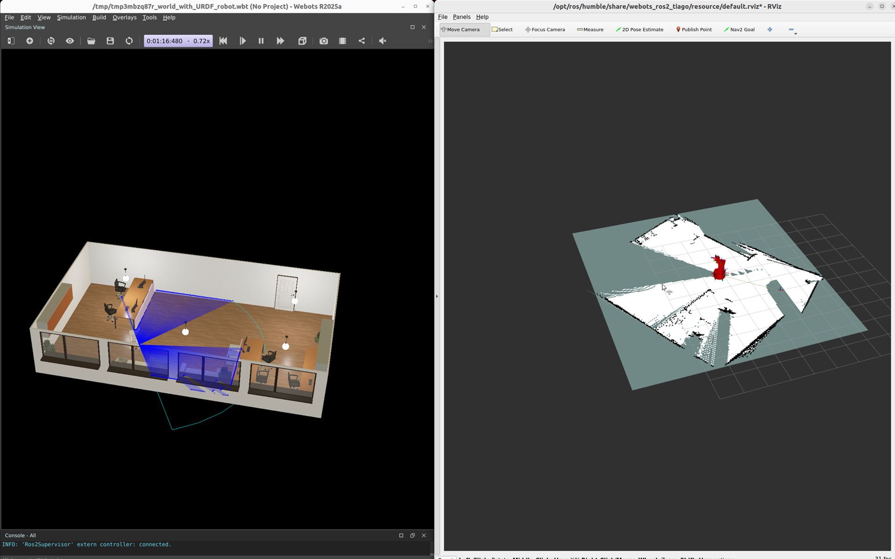

# 激光雷达、SLAM 建图与 Dora 导航

## 版本信息

| 组件 | 版本 / 环境 |
| --- | --- |
| 操作系统 | Ubuntu 22.04.5 LTS，x86_64 |
| GPU | NVIDIA GeForce RTX 5090 Laptop GPU，24 GB 显存 |
| NVIDIA 驱动 | 580.159.03 |
| Webots | R2025a |
| ROS 2 | Humble |
| `webots_ros2_tiago` | 2025.0.0 |
| Navigation2 | 1.1.20 |
| SLAM Toolbox | 2.6.10 |
| Dora CLI 和 Python API | 1.0.0-rc.4 |
| Dora 运行时 Python | 3.11.14 |
| ROS 2 worker Python | 3.10.12 |

## 下载

- [完整激光雷达、SLAM、Nav2 与 Dora 参考工程](../assets/lidar-slam-navigation/lidar-slam-navigation-reference.zip)
- [官方 TIAGo 办公室场景](../assets/lidar-slam-navigation/source/worlds/default.wbt)
- [保存的占据地图](../assets/lidar-slam-navigation/source/maps/office.pgm)
- [保存的地图 metadata](../assets/lidar-slam-navigation/source/maps/office.yaml)
- [Webots R2025a 官方 TIAGo Lite 模型源文件](https://github.com/cyberbotics/webots/tree/R2025a/projects/robots/pal_robotics/tiago_lite)

压缩包包含本章使用的固定 world、Docker 环境、探索 controller、保存的地图、Dora
nodes、测试和启动脚本。

## 目标

你将使用 AI 编程助手搭建并验证一套完整的移动导航流程：

1. 启动 Webots 官方 TIAGo 办公室场景。
2. 读取二维激光雷达、轮式里程计、声呐、TF 和占据地图数据。
3. 使用一个小型的纯激光探索控制器移动机器人。
4. 使用 SLAM Toolbox 构建并保存地图。
5. 让 Dora 等待传感器和定位数据准备就绪。
6. 让 Nav2 控制轮式移动机械臂前往地图坐标。
7. 输出结构化的成功或失败结果。

TIAGo Lite 模型具有移动底盘、机械臂和夹爪，以及二维激光雷达。本章只控制移动底盘，
机械臂会保留给后续的导航与操作任务。

## 选择实现路线

<div class="prompt-route prompt-route--create">
  <span class="prompt-route__label">创造路线</span>
  <strong>组合 LiDAR、SLAM、Nav2 与 Dora</strong>
  <p>适合理解导航技术栈中的每一个 readiness 边界。</p>
</div>

```text
创建 Ubuntu 22.04 工程，使用 Webots R2025a、ROS 2 Humble、官方 TIAGo office
world、SLAM Toolbox、Nav2 和 Dora 1.0.0-rc.4。使用移动底盘和 2D LiDAR，机械臂
保持不动。创建简单且可避障的探索 controller，保存非空 occupancy map，再在实时
地图上启动 Nav2。

创建 Dora 节点，桥接 scan、odometry、map、localization、goal feedback 和结构化
mission result。发送 named goal 前，必须等待相关 topic、transform、
navigate_to_pose action，以及 bt_navigator lifecycle 进入 active。提供唯一容器入口、
测试、地图、截图、建图/导航录屏，并明确检查 map、sensor count、goal acceptance 和
SUCCEEDED 状态。
```

<div class="prompt-route prompt-route--reproduce">
  <span class="prompt-route__label">复现路线</span>
  <strong>运行已验证的导航技术栈</strong>
  <p>适合先获得可靠的 SLAM 与导航闭环，再学习 ROS launch 细节。</p>
</div>

```text
解压提供的 LiDAR/SLAM/Nav2/Dora 工程，读取 VERSIONS.md、TUTORIAL_CONTRACT.md、
ASSET_GUIDE.md 和 READER_PROMPT.md。保留官方 world、容器镜像、Python runtime
分层、goal 和脚本。只运行 bash tutorial.sh run，并等待该进程真正结束。检查地图文件、
mission-result.json、正数的 scan/odometry/known-cell count、goal_sent、
goal_accepted、SUCCEEDED、最终 PASS 和干净的 git status。不得单独运行 ROS/Dora
组件，也不得绕过 lifecycle 检查。
```

## 开始之前

本章命令面向 Ubuntu 22.04 和 ROS 2 Humble。仿真可以直接安装在系统中，也可以运行在
能够访问桌面显示的 GPU Docker 容器中。生成的地图、录屏、日志和临时 world 在审核前
应保存在 book source 之外。

验证环境中，派生后的容器镜像约占 6.6 GB。建议准备至少 15 GB 可用磁盘空间、8 GB
系统内存，以及足以同时渲染 Webots 和录制桌面的 GPU 余量。Webots 可以不使用
NVIDIA GPU 运行，但渲染和录屏可能会更慢。

## 为什么选择这套组合

[Webots](https://cyberbotics.com/) 是开源三维机器人仿真器，并提供官方
[ROS 2 接口](https://github.com/cyberbotics/webots_ros2)。TIAGo package 已经包含
带家具的办公室 world、移动机械臂模型、controllers、RViz 配置和导航参数。

[SLAM Toolbox](https://github.com/SteveMacenski/slam_toolbox) 是
[Nav2 建图流程](https://docs.nav2.org/tutorials/docs/navigation2_with_slam.html)
使用的二维 SLAM 实现。它消费 laser scan 和 odometry，发布 `/map`，并提供
`map -> odom` transform。

[Navigation2](https://docs.nav2.org/) 在占据地图上规划避障路径，并控制差速移动底盘。
Dora 管理任务状态：检查所需数据、发送目标、接收反馈，并发布结构化结果。

## 实现流程

1. 检查计算机并确认兼容版本。
2. 启动 Webots、TIAGo、RViz 和 SLAM Toolbox。
3. 验证传感器 topics 和 transforms。
4. 生成一个纯激光探索控制器。
5. 录制地图增长过程并保存地图。
6. 在实时 SLAM 地图上启动 Nav2。
7. 定义 Dora 传感器和任务节点。
8. 执行导航目标并检查结果。

## 检查计算机

让助手先检查环境，不要立即安装软件：

```text
检查这台 Ubuntu 计算机是否适合运行 Webots 激光 SLAM 与导航教程。

报告操作系统版本和架构、可用内存和磁盘空间、GPU 型号、GPU 显存、NVIDIA 驱动、
Docker GPU 支持、ROS 2 distribution、Webots、webots_ros2_tiago、Navigation2、
SLAM Toolbox、Dora CLI 和 Dora Python API。

检查当前官方安装文档，推荐原生安装或隔离的 GPU Docker 环境。暂时不要安装或
删除任何内容。不要输出用户名、home 路径、私有 hostname、IP 地址、token、序列号或
无关进程信息。
```

验证机器可以同时运行 Webots、RViz、SLAM Toolbox、Nav2、Dora 和 12 FPS 桌面录制。

## 使用提供的 TIAGo 办公室场景

使用提供的官方 world 副本，不要生成自定义场景。它已经包含墙、门、桌椅、柜子、
植物和玻璃隔断，可以形成有意义的激光遮挡和导航约束。

```text
检查并运行提供的 Webots R2025a 与 ROS 2 Humble 激光 SLAM 和导航参考工程。

把 worlds/default.wbt 和安装的 webots_ros2_tiago 2025.0.0 package 作为固定
版本的场景与模型源文件。不要重新生成或调整 world。启动 TIAGo Lite、RViz 和
async SLAM Toolbox，验证机器人发布 /scan、/odom、/tf、/tf_static 和三个底盘
sonar topics，并在 /cmd_vel 接收 geometry_msgs/Twist。

运行前检查提供的 Dockerfile 和 launch-baseline.sh。容器只能访问 GPU、X11
display、host ROS 2 network 和当前项目 workspace。机器人 controller、LiDAR、
TF tree 或 SLAM node 任意一个无法启动时都要停止。不要修改提供的 world。
```

验证使用的启动命令如下：

```bash
ros2 launch webots_ros2_tiago robot_launch.py \
  world:=default.wbt \
  mode:=realtime \
  rviz:=true \
  slam_toolbox:=true \
  slam_cartographer:=false \
  nav:=false \
  use_sim_time:=true
```

下图左侧是 Webots 办公室场景；右侧是建图刚开始时的 RViz，此时地图只包含激光雷达
当前位置周围的可见区域。


## 检查传感器数据流

编写应用代码前，先检查名称、消息类型、频率和 QoS。

```text
只读检查当前运行的 TIAGo ROS 2 graph。

找出二维激光雷达、里程计、声呐、速度命令、占据地图和 TF topics。报告每个必需
topic 的消息类型、publishers、subscribers、QoS 和实际频率。确认
map -> odom -> base_link 连通，并且 timestamps 使用 simulation time。

给出精简命令，分别从 /scan、/odom 和 /map 输出一个脱敏样本。不要转储完整 laser
数组、图像、本地路径或无关 topics。TF 不连通或 /scan 不更新时立即停止。
```

可使用以下检查命令：

```bash
ros2 topic list
ros2 topic info -v /scan
ros2 topic hz /scan
ros2 topic echo /odom --once
ros2 topic echo /map --once --field info
ros2 run tf2_ros tf2_echo map base_link
```

验证得到的数据包括：

- `/scan`：`sensor_msgs/msg/LaserScan`，约 5 Hz。
- `/odom`：`nav_msgs/msg/Odometry`。
- `/map`：`nav_msgs/msg/OccupancyGrid`。
- `/Tiago_Lite/base_sonar_01_link`、`02` 和 `03`：
  `sensor_msgs/msg/Range`。
- `/tf` 和 `/tf_static`：定位和机器人 transforms。
- `/cmd_vel`：差速底盘 controller 消费的速度命令。

当前 TIAGo launch 没有发布 `/imu`，因此验证流程不声称使用了 IMU fusion。

## 构建 SLAM 地图

下面的探索 controller 有意保持简单。它只使用当前激光扫描：前方没有障碍时向前移动；
接近障碍时，转向距离更开阔的一侧。它不会读取 Webots ground-truth coordinates。

```text
为本教程创建一个职责单一的 ROS 2 Python 探索节点。

只订阅 /scan 上的 sensor_msgs/LaserScan，并在 /cmd_vel 发布
geometry_msgs/Twist。把扫描划分为前、左、右三个 sector。当前方净空至少为 0.8 m
时低速前进，否则转向距离更开阔的一侧。

接受 duration 参数，75 秒后停止，并在正常退出、Ctrl+C 或异常时发布 zero Twist。
过滤 NaN 和 infinite ranges。为 sector 提取、转向选择、timeout 和最终 stop command
添加单元测试。不得使用仿真器坐标、teleport、预录路径或 camera。
```

核心避障逻辑如下：

```python
front = self.sector_min(-22, 22)
left = self.sector_min(25, 95)
right = self.sector_min(-95, -25)

command = Twist()
if front < 0.8:
    command.angular.z = 0.5 if left >= right else -0.5
else:
    command.linear.x = 0.24
    openness_error = max(-2.0, min(2.0, left - right))
    command.angular.z = 0.10 * openness_error

self.publisher.publish(command)
```

### 完整激光探索 controller


```python
{{#include ../assets/lidar-slam-navigation/source/explore_with_lidar.py}}
```


保持 SLAM Toolbox 运行，并启动 controller：

```bash
python3 explore_with_lidar.py 75
```

运行期间，Webots 显示机器人和激光 rays；RViz 不断扩大白色 free-space 区域，并增加
黑色 occupied boundaries。



下面的录屏加速了三倍。控制循环和 SLAM node 仍然按真实 simulation time 运行，只有
教程中的播放时长被缩短。

<video class="standard-demo-video" controls muted playsinline preload="metadata" width="1920" height="1200" poster="../assets/lidar-slam-navigation/slam-mapping-poster.png">
  <source src="../assets/lidar-slam-navigation/slam-mapping.mp4" type="video/mp4">
</video>

### 保存并检查地图

探索结束后保存 occupancy image 和 metadata：

```bash
mkdir -p maps
ros2 run nav2_map_server map_saver_cli -f maps/office
```

压缩包中包含验证流程生成的地图；同一份占据地图图像和 metadata 也列在本章顶部的
**下载**区域中。

只检查相关 metadata：

```bash
ros2 topic echo /map --once --field info
sed -n '1,12p' maps/office.yaml
```

录制的建图过程生成了 `267 x 278`、`0.05 m/pixel` 的地图，覆盖范围约为
`13.35 x 13.9 m`。具体尺寸会随探索路径和 SLAM Toolbox 扩展地图的位置变化。


## 在实时地图上启动 Nav2

本示例有意采用边建图边导航的方式。不要启动 AMCL 或静态 map server：SLAM Toolbox
已经发布 `/map` 和 `map -> odom`。

```bash
ros2 launch nav2_bringup navigation_launch.py \
  use_sim_time:=true \
  autostart:=true \
  params_file:=/opt/ros/humble/share/webots_ros2_tiago/resource/nav2_params.yaml
```

Dora 发送目标前，检查 action server 和 managed nodes：

```bash
ros2 action info /navigate_to_pose
ros2 lifecycle get /planner_server
ros2 lifecycle get /controller_server
ros2 lifecycle get /bt_navigator
```

三个 lifecycle nodes 都应该返回 `active`。

## 定义 Dora 导航 Dataflow

使用三个职责清晰的 nodes：

- `sensor-bridge`：读取激光、里程计、地图、声呐和 TF，再发布结构化 JSON。
- `mission-controller`：等待必需字段准备就绪，并调用 Nav2。
- `result-reporter`：打印任务状态变化。

Dora nodes 使用 Python 3.11；ROS 2 Humble 的 `rclpy` workers 保持使用系统
Python 3.10。两个运行时通过小型 JSONL bridge 传递命令和结果，应用主数据流仍由
Dora 管理。

```text
为当前运行的 Webots 和 Nav2 系统实现一个 Dora 1.0.0-rc.4 dataflow。

创建 sensor-bridge、mission-controller 和 result-reporter Python nodes。
sensor node 订阅 /scan、/odom、/map、三个 TIAGo sonar topics 和
map -> base_link TF。每 500 ms 发布紧凑 JSON，其中包含 sample counters、地图宽高、
known-cell count、sonar ranges 和当前 map pose。

只有 LiDAR、odometry、至少包含 500 个已知 cells 的非空地图，以及 map pose 都可用
时，mission node 才能发送一次 NavigateToPose goal。记录
WAITING_FOR_SENSORS、READY、GOAL_SENT、NAVIGATING、SUCCEEDED 和 FAILED 状态，
并保存最终 JSON 结果。拒绝重复目标；报告 Nav2 拒绝、timeout、cancel 或非成功
action status。

Dora-facing nodes 使用 Python 3.11，ROS subscribers 与 rclpy ActionClient 运行在
提供的 Python 3.10 workers 中；bridge 只交换结构化 JSONL 消息。所有 readiness 和
result messages 仍通过 Dora dataflow 传递。为 readiness gate、worker protocol 和
terminal states 添加 focused tests。
```

### 参考 Dataflow

```yaml
{{#include ../assets/lidar-slam-navigation/source/dora/dataflow.yml}}
```

### 参考实现：准备状态 Gate

任务不会依靠固定 sleep 推测数据是否就绪：

```python
@property
def ready(self):
    return (
        self.sensors.scan_samples > 0
        and self.sensors.odom_samples > 0
        and self.sensors.map_width > 0
        and self.sensors.map_height > 0
        and self.sensors.known_cells >= 500
        and self.sensors.pose_available
    )
```

### 参考实现：发送 Nav2 目标

目标使用 `map` frame。zero timestamp 表示使用最新可用 transform：

```python
goal = NavigateToPose.Goal()
goal.pose.header.frame_id = "map"
goal.pose.header.stamp = rclpy.time.Time().to_msg()
goal.pose.pose.position.x = target_x
goal.pose.pose.position.y = target_y
goal.pose.pose.orientation.z = math.sin(target_yaw / 2.0)
goal.pose.pose.orientation.w = math.cos(target_yaw / 2.0)

future = action_client.send_goal_async(
    goal,
    feedback_callback=on_feedback,
)
future.add_done_callback(on_goal_response)
```

当前 Dora 文档还介绍了原生和 YAML
[ROS 2 topic、service 与 action bridges](https://dora-rs.ai/dora/advanced/ros2-bridge)。
本工程使用显式 worker 边界，让固定版本的 ROS 2 Humble 与 Dora Python 运行时可以
分别复现。

### 完整 Dora 源码

#### 传感器 bridge


```python
{{#include ../assets/lidar-slam-navigation/source/dora/sensor_bridge_node.py}}
```

```python
{{#include ../assets/lidar-slam-navigation/source/dora/sensor_ros_worker.py}}
```


#### 任务状态与 readiness gate


```python
{{#include ../assets/lidar-slam-navigation/source/dora/mission_state.py}}
```


#### Nav2 任务 controller


```python
{{#include ../assets/lidar-slam-navigation/source/dora/mission_controller_node.py}}
```

```python
{{#include ../assets/lidar-slam-navigation/source/dora/navigation_ros_worker.py}}
```

#### 运行时 bridge protocol

```python
{{#include ../assets/lidar-slam-navigation/source/dora/bridge_protocol.py}}
```


#### 结果 reporter


```python
{{#include ../assets/lidar-slam-navigation/source/dora/result_reporter_node.py}}
```


### 环境与测试源码

#### 容器环境与 entrypoint


```dockerfile
{{#include ../assets/lidar-slam-navigation/source/Dockerfile}}
```

```bash
{{#include ../assets/lidar-slam-navigation/source/ros-entrypoint.sh}}
```

```bash
{{#include ../assets/lidar-slam-navigation/source/run-container.sh}}
```


#### Webots、SLAM 与 Nav2 启动脚本


```bash
{{#include ../assets/lidar-slam-navigation/source/launch-baseline.sh}}
```

```bash
{{#include ../assets/lidar-slam-navigation/source/launch-nav2-live.sh}}
```


#### 任务状态测试


```python
{{#include ../assets/lidar-slam-navigation/source/dora/test_mission_state.py}}
```


## 执行导航任务

在已知 free space 中选择目标，并避开 inflation 后的障碍边界。录制的任务从约
`(-2.82, 2.45)` 返回地图坐标 `(0.0, 0.0)`，目标 yaw 约为 `-45 degrees`。

```text
运行并验证完整的 Dora 导航应用。

确认 SLAM Toolbox 和所有 Nav2 lifecycle nodes 都是 active。在已知 free space 中
选择目标；输出起点 pose、目标 pose 和规划距离，但不要暴露机器信息。

运行 focused tests，启动 Dora dataflow，并从 GOAL_SENT 前两秒开始录制 Webots 和
RViz，直到 terminal state 后三秒。结果必须证明目标只发送一次、被 Nav2 接受，并以
Nav2 action status SUCCEEDED 完成。同时报告 LiDAR 和 odometry sample counts、
地图尺寸、known-cell count、最终 remaining distance 和脱敏日志片段。验证后停止
本次启动的所有进程。
```

运行生成的项目：

```bash
cd lidar-slam-navigation
pytest -q
dora run dataflow.yml
```

验证状态顺序如下：

```text
WAITING_FOR_SENSORS
READY
GOAL_SENT
NAVIGATING
SUCCEEDED
```

最终结构化结果如下：

```json
{
  "state": "SUCCEEDED",
  "detail": "Nav2 reached the Dora-provided target",
  "goal_sent": true,
  "goal_accepted": true,
  "distance_remaining": 0.2466,
  "sensors": {
    "scan_samples": 151,
    "odom_samples": 833,
    "map_width": 219,
    "map_height": 220,
    "known_cells": 27552,
    "pose_available": true
  },
  "target": {
    "frame": "map",
    "x": 0.0,
    "y": 0.0,
    "yaw": -0.785398
  }
}
```

这里的地图尺寸与建图录像不同，是因为导航证据来自同一探索流程的另一次独立运行。

视频左侧是 Webots 中的移动机械臂和激光雷达；右侧是 RViz 中的实时占据地图、机器人
位姿和 Nav2 路径。

<video class="standard-demo-video" controls muted playsinline preload="metadata" width="1920" height="1200" poster="../assets/lidar-slam-navigation/dora-nav2-navigation-poster.png">
  <source src="../assets/lidar-slam-navigation/dora-nav2-navigation.mp4" type="video/mp4">
</video>

## 排查问题

```text
根据附带的脱敏 topic summary、TF output、lifecycle states、Dora result 和简短日志，
诊断当前 Webots、SLAM Toolbox、Nav2 与 Dora 导航流程。

按以下顺序逐层检查：Webots controller connection、/scan frequency、/odom updates、
simulation clock、map -> odom -> base_link TF、/map growth、Nav2 lifecycle state、
costmap sensor QoS、goal coordinate、action acceptance、cmd_vel output 和 Dora
terminal state。

找到第一个失败层，进行最小修改，运行对应 focused check，然后才重新执行完整任务。
不要重装正常组件、关闭 collision checking、通过扩大 goal tolerance 隐藏错误，也
不要输出 credentials 和机器身份信息。
```

常见检查项：

- scans 正常但地图静止，通常表示机器人没有移动，或者 odometry/TF 不连通。
- 启动时的 RViz message-filter warning 可能会在完整 TF tree 出现后消失；先验证
  tree，不要立即修改 QoS。
- 位于 unknown 或 inflated space 的 Nav2 goal 可能被拒绝或无法规划路径。应选择
  明确的 free cell，而不是墙边。
- `/cmd_vel` 存在但机器人不移动时，检查 differential-drive controller 和其他速度
  publishers。
- Dora 一直停在 `WAITING_FOR_SENSORS` 时，查看结构化 status，找出仍为 false 的
  readiness 字段。

## 示例边界

这是受控仿真，不是生产级 exploration system。reactive LiDAR controller 用于演示
传感器数据获取和地图增长；它不是 frontier planner，也不保证完整覆盖。

导航录像使用实时 SLAM，而不是保存地图后的 AMCL localization。面向部署的扩展应该
停止建图，通过 `nav2_map_server` 加载 `office.yaml`，启动 AMCL，设置 initial
pose，然后复用相同的 Dora mission contract。

实体移动机械臂还需要经过标定的 transforms、验证过的轮子和激光模型、动态障碍处理、
速度限制、独立 emergency stop，以及考虑碰撞的机械臂姿态。

## 下一步

相同的结构化 sensor bridge 可以继续向后续 planner 提供 map pose、LiDAR clearance
和 navigation status。下一章可以把这些 scene state 与任务上下文结合起来，生成并
验证更高层动作计划，同时不允许语言模型直接控制电机。
