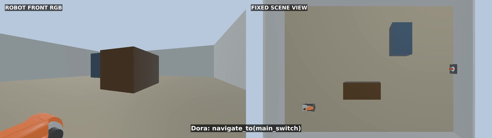
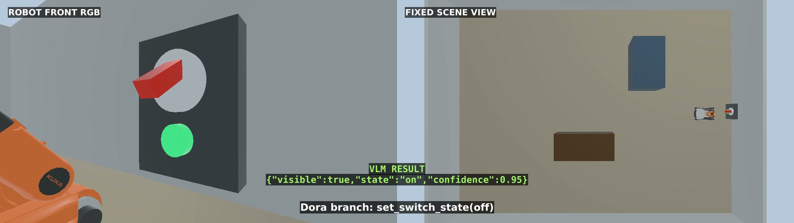
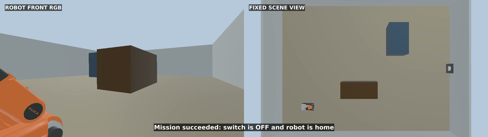

# 使用大语言模型规划动作路径

## 版本信息

| 组件 | 已验证版本 / 环境 |
| --- | --- |
| 操作系统 | Ubuntu 22.04.5 LTS，x86_64 |
| GPU | NVIDIA GeForce RTX 5090 Laptop GPU，24 GB 显存 |
| NVIDIA 驱动 | 580.159.03 |
| Webots | R2025a |
| ROS 2 | Humble |
| Dora CLI 和 Python API | 0.5.0 |
| 本地模型引擎 | Ollama 0.32.1 |
| 规划与视觉模型 | `qwen3-vl:8b-instruct` |
| Python | 3.10 |

## 下载

- [完整参考工程](../assets/llm-action-planning/llm-action-planning-reference.zip)
- [Webots 开关场景](../assets/llm-action-planning/source/worlds/youbot_switch_office.wbt)
- [Webots R2025a 官方 youBot 模型源文件](https://github.com/cyberbotics/webots/tree/R2025a/projects/robots/kuka/youbot)

压缩包包含场景、控制器、Dora dataflow、skill 运行时、模型客户端、校验器、测试和
容器文件。

本章把自然语言任务转换成一组经过校验的机器人 skill。在示例中，Dora
协调规划、视觉、导航和预设机械臂动作，让轮式移动机械臂关闭开关并返回
起点。

## LLM、工具调用、JSON 与 Skill

大语言模型（LLM）把“关闭主开关，然后返回起点”转换成高层动作计划。
它不会生成轮速、关节角度、坐标、shell 命令或可执行代码。

一次**工具调用**会选择一个具名能力并传入类型明确的参数。本工程通过
skill manifest 提供 `navigate_to`、`observe_switch` 和
`set_switch_state` 三个能力。

完整计划以 **JSON** 返回，因此程序可以在机器人运动之前校验它。
**Skill** 是工具背后经过测试的实现：Dora 负责分派 skill、等待结构化结果、
判断条件并记录状态变化。

## 场景与任务

提供的 Webots world 包含官方 KUKA youBot 轮式移动机械臂、固定场景相机、
机身 RGB 相机、墙面开关和简单障碍物。开关初始为**开启**状态，机器人从
具名位置 `home` 出发，机械臂已经回到 home 姿态。



任务流程如下：

1. 从 `home` 导航到 `main_switch`。
2. 采集 RGB 图像并判断开关状态。
3. 如果开关可见且处于开启状态，执行经过验证的机械臂轨迹将其关闭。
4. 再采集一张图像，验证开关已经关闭。
5. 返回 `home`。
6. 输出 `SUCCEEDED`；任意 skill 被拒绝或失败都会结束任务。

具名路线和预设机械臂轨迹让物理动作简单且可复现。LLM 决定语义层的动作
顺序与条件分支，但不会在电机层控制机器人。

## 检查参考工程

请使用提供的场景，不要让助手自行猜测场景几何或机器人尺寸。将压缩包解压到新目录
后，让助手检查工程，而不是重新生成：

```text
检查这个提供的 Webots R2025a 与 Dora 0.5.0 参考工程。

把 worlds/youbot_switch_office.wbt 和固定到 R2025a 的官方 youBot 模型
视为可复现的场景源文件。不要替换机器人、重建场景、移动开关或修改相机姿态。

概括 ROS topics、具名 skills、JSON contracts、Dora nodes、本地模型 endpoint、
测试和启动顺序。检查缺失依赖和机器相关路径。暂时不要安装或修改任何内容，
不要输出用户名、主机名、IP 地址、token 或无关的系统信息。
```

## 准备环境

让助手只安装提供的工程所需的内容：

```text
准备这台 Ubuntu 22.04 计算机，用于运行提供的参考工程。

使用 Webots R2025a、ROS 2 Humble、Dora CLI 与 Python API 0.5.0，以及
Ollama。下载 qwen3-vl:8b-instruct，同时用于结构化动作规划和 RGB 开关识别。
Webots 与 ROS 依赖优先使用提供的 Dockerfile，Ollama 在主机运行。

修改前先报告可用磁盘、内存、GPU 与驱动兼容性、现有版本和准备执行的准确命令。
保留能够工作的现有安装。不要暴露账户名、私有路径、网络地址、API key 或无关
的环境变量。
```

已经验证的命令为：

```bash
ollama pull qwen3-vl:8b-instruct
docker build -t week9-webots-llm:humble .
chmod +x run-container.sh launch-webots.sh
./run-container.sh
```

容器使用 host 网络，因此默认 Ollama endpoint 是
`http://127.0.0.1:11434`。请保持服务仅本机可访问，不要绑定到不受信任的
网络。

## 定义 Skill API

先为 LLM 提供一个小而明确的动作空间。manifest 描述允许的名称、参数和结果
字段：

```json
{{#include ../assets/llm-action-planning/source/config/skill_manifest.json}}
```

使用下面的提示词创建 contract 和校验规则：

```text
为这个提供的工程实现高层 skill contract。

只开放：
- navigate_to(location)，location 只能是 home 或 main_switch；
- observe_switch(switch_id)，switch_id 只能是 main_switch；
- set_switch_state(switch_id, state)，state 只能是 on 或 off。

要求带版本号的 JSON plan，包含 goal 和 steps。step 可以包含 id、skill、
arguments、save_as，以及只支持 eq/ne 的小型条件树。拒绝坐标、速度、轮速、
关节值、电机命令、shell 命令、代码、未知字段、重复 ID、前向引用，以及最后
不返回 home 的计划。为有效、无效、条件分支和开关已经关闭的计划添加测试。
不要修改提供的 Webots 场景。
```

校验器把 LLM 输出视为不可信输入。只有
`validate_plan(plan).require_valid()` 成功后，计划才能执行。

### 完整计划校验器


```python
{{#include ../assets/llm-action-planning/source/week9_validation/plan_validator.py}}
```


## 生成结构化动作计划

本地模型会收到用户任务、skill manifest、严格输出 schema 和规划约束。
温度设置为零，响应先解析为 JSON，再进入校验器。

```text
使用 Ollama /api/chat 实现 planner client。

读取 config/skill_manifest.json，让 qwen3-vl:8b-instruct 把“关闭主开关，
然后返回起点”转换成一份带版本号的 JSON plan。严格要求以下语义顺序：
导航、观察、按条件关闭、按条件复查、返回起点。只有第一次观察得到
visible=true 且 state=on 时，机械臂步骤才可以执行。

使用带 JSON Schema 的 Ollama structured output，temperature 设为 0，
设置有限 timeout，并关闭 streaming。解析 JSON，调用本地计划校验器；
HTTP、解析、schema 或校验出现错误时都必须停止。模型绝不能输出底层运动值
或可执行命令。
```

一份通过校验的模型响应如下：

```json
{
  "schema": "week9.action-plan.v1",
  "goal": "Turn off the main switch, then return home.",
  "steps": [
    {
      "id": "go_to_switch",
      "skill": "navigate_to",
      "arguments": {"location": "main_switch"}
    },
    {
      "id": "observe_before",
      "skill": "observe_switch",
      "arguments": {"switch_id": "main_switch"},
      "save_as": "before"
    },
    {
      "id": "turn_off",
      "skill": "set_switch_state",
      "arguments": {"switch_id": "main_switch", "state": "off"},
      "when": {
        "all": [
          {"ref": "before.visible", "op": "eq", "value": true},
          {"ref": "before.state", "op": "eq", "value": "on"}
        ]
      }
    },
    {
      "id": "verify_off",
      "skill": "observe_switch",
      "arguments": {"switch_id": "main_switch"},
      "when": {
        "all": [
          {"ref": "turn_off.status", "op": "eq", "value": "succeeded"}
        ]
      }
    },
    {
      "id": "return_home",
      "skill": "navigate_to",
      "arguments": {"location": "home"}
    }
  ]
}
```

### 完整 Ollama 规划与视觉客户端


```python
{{#include ../assets/llm-action-planning/source/week9_validation/model_clients.py}}
```


## 使用 Dora 执行计划

Dora graph 把规划、执行和结果记录分离：

```yaml
{{#include ../assets/llm-action-planning/source/dora/dataflow.yml}}
```

让助手围绕通过校验的计划构建编排层：

```text
为提供的场景实现 Dora 0.5.0 应用。

创建三个 nodes：
1. planner 读取 skill manifest，请求一份结构化计划，校验后只发布一次；
2. executor 运行确定性的任务状态机，每次只分派一个 skill，根据之前的结构化
   结果判断条件，并在失败时停止；
3. reporter 把脱敏后的事件写入 JSONL。

在 executor 的 skill runtime 内使用 rclpy 与提供的 Webots controller 通信。
规划与任务状态继续通过 Dora outputs 传递。使用 request ID 关联命令和结果，
设置 timeout，保存最终 JSON，并为开启、已经关闭、执行失败和动作后视觉验证
分支添加测试。
```

`when` 条件由任务状态机判断，而不是交给模型判断。如果第一次观察报告开关
已经是 `off`，机械臂动作和第二次观察都会跳过，机器人直接返回起点。

### 完整任务状态机


```python
{{#include ../assets/llm-action-planning/source/week9_validation/mission.py}}
```


### 完整 Dora planner node


```python
{{#include ../assets/llm-action-planning/source/dora/planner_node.py}}
```


### 完整 Dora executor node


```python
{{#include ../assets/llm-action-planning/source/dora/executor_node.py}}
```


### 完整 Dora reporter node


```python
{{#include ../assets/llm-action-planning/source/dora/reporter_node.py}}
```


## 接入视觉与机器人 Skill

`observe_switch` 保存最新的机身相机图像，并让同一个本地多模态模型输出四个
字段：`switch_id`、`visible`、`state` 和 `confidence`。开关被遮挡或无法
确定时返回 `unknown`，任务会停止，而不是让模型猜测。

```text
为提供的 controllers 实现 ROS skill runtime。

订阅 odometry、机身 RGB camera、navigation status、arm status 和 switch
status。observe_switch 保存一帧当前 RGB 图像，再向 qwen3-vl:8b-instruct
请求严格的 structured output。只接受 visible=true 且 state 为 on/off。

navigate_to 只发布具名位置，并等待 request ID 匹配的结果。
set_switch_state 要求机器人位于开关工作空间内，再调用提供的预设轨迹。
所有 skill 都要设置 timeout，并返回结构化的 succeeded/failed 结果。
绝不发送由 LLM 生成的坐标、速度或关节值。
```

动作前，模型得到：

```json
{
  "switch_id": "main_switch",
  "visible": true,
  "state": "on",
  "confidence": 0.95
}
```



机械臂动作后，模型以 `0.95` 置信度得到 `state: "off"`：


### 完整 ROS skill runtime


```python
{{#include ../assets/llm-action-planning/source/week9_validation/ros_skills.py}}
```


## 运行完整应用

在第一个容器终端中启动提供的 Webots world：

```bash
cd /workspace
./launch-webots.sh
```

在连接到同一容器的第二个终端中执行：

```bash
cd /workspace
pytest -q
cd dora
dora run dataflow.yml
```

让助手验证完整流程：

```text
端到端运行提供的动作规划工程。

先执行全部 focused tests。确认 Ollama 已有 qwen3-vl:8b-instruct，Webots
持续发布 odometry 与 RGB frames，机械臂位于 home，开关初始为 on。然后启动
Dora dataflow。

记录通过校验的 plan、每个 skill request 与 result、两次结构化视觉判断、
机器人最终位置和任务终态。如果计划无效、开关不可见、动作结果没有通过视觉
复查，或机器人没有回到 home，任务必须失败。对日志脱敏，并且只停止本次运行
启动的进程。
```

视频左侧是机身 RGB 相机，右侧是 Webots 固定场景相机。事件标签来自实际记录
的 Dora 与 VLM 结果。

<video class="wide-demo-video" controls muted playsinline preload="metadata" width="1920" height="540" poster="../assets/llm-action-planning/media/switch-mission-poster.jpg">
  <source src="../assets/llm-action-planning/media/switch-mission.mp4" type="video/mp4">
</video>

验证流程执行了全部五个 skill step，通过视觉确认 `on -> off`，返回 `home`，
并以以下结果结束：

```json
{
  "event": "MISSION_FINISHED",
  "state": "SUCCEEDED",
  "context": {
    "turn_off": {
      "status": "succeeded",
      "state": "off",
      "detail": "preset switch action completed"
    },
    "verify_off": {
      "status": "succeeded",
      "visible": true,
      "state": "off",
      "confidence": 0.95
    },
    "return_home": {
      "status": "succeeded",
      "location": "home"
    }
  }
}
```



## 完整控制器源码

使用压缩包最方便，也可以直接在这里查看这些文件，不下载工程也能审阅机器人
行为。

### 导航控制与麦克纳姆轮速转换


```python
{{#include ../assets/llm-action-planning/source/controllers/week9_controller/navigation_control.py}}
```


### Webots 机器人、传感器、导航与机械臂控制器


```python
{{#include ../assets/llm-action-planning/source/controllers/week9_controller/week9_controller.py}}
```


### 固定场景相机控制器


```python
{{#include ../assets/llm-action-planning/source/controllers/scene_camera_controller/scene_camera_controller.py}}
```


## 环境与测试源码

下面继续展示其余文字类文件，便于直接检查。Webots world 和模型资产由仿真器
作为场景资源加载，因此仍使用下载链接。

### 容器环境


```dockerfile
{{#include ../assets/llm-action-planning/source/Dockerfile}}
```


### 容器与 Webots 启动脚本


```bash
{{#include ../assets/llm-action-planning/source/run-container.sh}}
```

```bash
{{#include ../assets/llm-action-planning/source/ros-entrypoint.sh}}
```

```bash
{{#include ../assets/llm-action-planning/source/launch-webots.sh}}
```


### 结构化数据 contracts


```python
{{#include ../assets/llm-action-planning/source/week9_validation/contracts.py}}
```


### 计划与任务测试


```python
{{#include ../assets/llm-action-planning/source/tests/test_plan_validator.py}}
```

```python
{{#include ../assets/llm-action-planning/source/tests/test_mission.py}}
```


### 视觉与导航测试


```python
{{#include ../assets/llm-action-planning/source/tests/test_observation.py}}
```

```python
{{#include ../assets/llm-action-planning/source/tests/test_navigation_control.py}}
```


## 排查问题

```text
根据 focused test 输出、脱敏后的 Dora events、Webots controller log、
ROS topic 摘要和一张当前 RGB frame，诊断提供的 Webots、Dora、Ollama 与
ROS 2 工程。

按以下顺序检查：固定版本文件与依赖、Webots controller 启动、camera 与
odometry 更新、Ollama health 与模型是否存在、plan JSON 校验、request ID
匹配、具名导航结果、开关可见性、机械臂工作空间检查、动作后视觉复查、返回
home 的结果。找出第一个失败层并进行最小修改。不要重新生成场景、绕过校验、
移除 timeout、硬编码成功结果，也不要输出机器身份信息和凭据。
```

常见边界如下：

- 模型响应在通过计划校验器之前不是机器人命令。
- 视觉状态为 `unknown` 时任务失败，不能继续执行机械臂动作。
- 只有提供的 controller 中存在当前与目标位置之间的验证路线时，具名位置才会
  被接受。
- 预设机械臂轨迹只适用于 `main_switch` 和这个固定场景。
- 机械臂报告成功还不够；第二次 RGB 观察必须确认目标状态。

## 下一步

本章在确定性 executor 中执行一份由模型生成的计划。下一章可以加入 agent
循环，使其在保留相同校验与 skill 边界的前提下，决定何时补充信息、修复被
拒绝的计划或选择其他工具。
