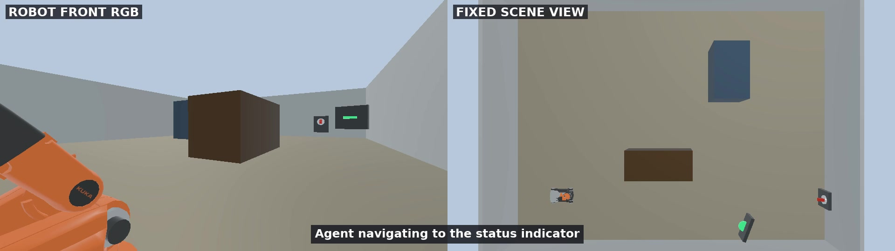
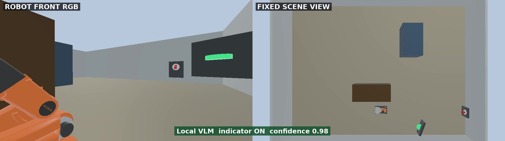
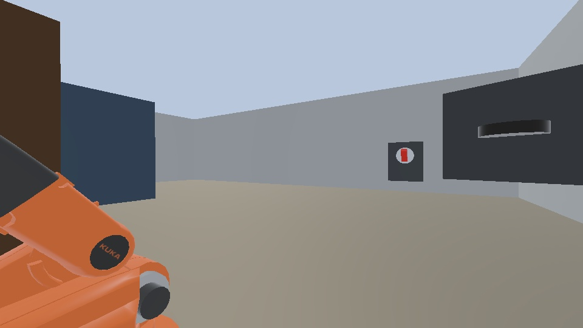
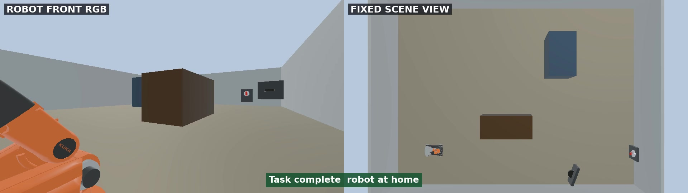

# 集成 Agents SDK 实现自动化任务规划

## 版本信息

| 组件 | 已验证版本 / 环境 |
| --- | --- |
| 操作系统 | Ubuntu 22.04.5 LTS，x86_64，X11 桌面 |
| GPU | NVIDIA GeForce RTX 5090 Laptop GPU，24 GB 显存 |
| NVIDIA 驱动 | 580.159.03 |
| Webots | R2025a |
| ROS 2 | Humble |
| Dora CLI 和 Python API | 1.0.0-rc.4 |
| OpenAI Agents SDK | `openai-agents==0.19.0` |
| Robot API | FastAPI 0.140.13，Pydantic 2.13.4 |
| 本地模型引擎 | Ollama 0.32.1 |
| 本地模型 | `qwen3-vl:8b-instruct` |
| Dora 运行时 Python | 3.11.14 |
| ROS 2 / 应用 worker Python | 3.10.12 |

## 下载

- [完整参考工程](../assets/agent-sdk-task-planning/agent-sdk-task-planning-reference.zip)
- [SHA-256 校验值](../assets/agent-sdk-task-planning/SHA256SUMS.txt)
- [Webots 场景](../assets/agent-sdk-task-planning/source/worlds/youbot_switch_office.wbt)
- [Dora dataflow](../assets/agent-sdk-task-planning/source/dora/dataflow.yml)
- [Agents SDK 入口](../assets/agent-sdk-task-planning/source/agent_cli.py)

压缩包包含 Webots world、控制器、Dora nodes、本地 Robot API、Agent 工具、
视觉分类器、Docker 文件和测试，不包含虚拟环境、缓存、日志、凭据或机器相关路径。
下载 ZIP 和校验文件后可以验证：

```bash
sha256sum -c SHA256SUMS.txt
unzip agent-sdk-task-planning-reference.zip -d agent-sdk-task-planning
cd agent-sdk-task-planning
```

## 目标

本章把“查看指示灯；如果亮着就关闭开关，确认灯灭后回到起点”交给一个本地
Agent。Agent 不会一次性生成固定动作计划，而是在每次工具返回结果后决定下一步：

1. 读取机器人状态。
2. 导航到 `indicator_station`，拍摄并判断指示灯是否亮着。
3. 只有在指示灯可见且亮着时，才导航到 `main_switch`。
4. 按 `ready -> press -> retract -> home` 的已验证姿态序列按下开关。
5. 返回指示灯位置复查，确认灯灭。
6. 返回 `home`，检查底盘位置和机械臂姿态后结束。



## Agent 不只是聊天

普通聊天模型接收一段文字并返回一段文字。即使回答中写出了合理步骤，它也不会
自动读取仿真状态、调用机器人能力或根据执行结果继续工作。

Agent 由**模型、指令、工具和运行循环**组成。OpenAI Agents SDK 的 `Runner`
会调用模型；如果模型选择工具，SDK 执行工具并把结果送回模型，然后继续下一轮，
直到模型返回最终答案或达到回合上限。工具的类型标注和 docstring 还能自动转换成
模型可见的 schema。

本章只使用一个 Agent。它的价值不在于多 Agent 协作，而在于建立最小且完整的
“观察、行动、再观察”闭环。进一步阅读：

- [OpenAI Agents SDK 概览](https://openai.github.io/openai-agents-python/)
- [Quickstart](https://openai.github.io/openai-agents-python/quickstart/)
- [Function tools](https://openai.github.io/openai-agents-python/tools/#function-tools)
- [Running agents 与 Agent loop](https://openai.github.io/openai-agents-python/running_agents/)

## 技术选型

| 层 | 选择 | 与示例的关系 |
| --- | --- | --- |
| Agent 编排 | OpenAI Agents SDK | 提供 `Agent`、`Runner`、函数工具和回合限制 |
| Agent 模型 | Ollama + Qwen3-VL 8B | 本地完成工具选择，也复用于 RGB 指示灯识别 |
| 机器人接口 | FastAPI + Pydantic | 给 Agent 提供严格、可校验的原子动作 |
| 数据流 | Dora 1.0.0-rc.4 | 分离状态、导航、机械臂、视觉和停止节点 |
| 仿真 | Webots R2025a + ROS 2 Humble | 运行 KUKA youBot、相机、开关和已验证轨迹 |

Agents SDK 默认可以连接 OpenAI 模型；本工程使用
`OpenAIChatCompletionsModel` 接入 Ollama 的 OpenAI 兼容本地 endpoint，
因此运行示例不需要真实的 OpenAI API key。代码里的 `api_key="ollama"` 只是
本地兼容客户端要求的非空占位值。

## 系统架构

上一章和本章使用相同的具名技能与安全边界，但模型参与执行的方式不同。

<div class="architecture-comparison">
  <section class="architecture-variant architecture-variant--plan">
    <div class="architecture-variant-heading">
      <span class="architecture-kicker">上一章</span>
      <strong>一次性生成完整计划</strong>
    </div>
    <div class="architecture-flow" role="img" aria-label="上一章在执行前生成并校验一份完整 JSON 计划，再由 Dora 执行器确定性地运行计划">
      <div class="architecture-node"><strong>自然语言任务</strong><small>目标与完成条件</small></div>
      <div class="architecture-arrow" aria-hidden="true">&rarr;</div>
      <div class="architecture-node"><strong>LLM Planner</strong><small>执行前调用一次模型</small></div>
      <div class="architecture-arrow" aria-hidden="true">&rarr;</div>
      <div class="architecture-node"><strong>完整 JSON Plan</strong><small>全部步骤与 when 条件</small></div>
      <div class="architecture-arrow" aria-hidden="true">&rarr;</div>
      <div class="architecture-node"><strong>校验器 / Dora Executor</strong><small>校验后确定性执行</small></div>
      <div class="architecture-arrow" aria-hidden="true">&rarr;</div>
      <div class="architecture-node"><strong>Robot Skills / Webots</strong><small>具名能力与仿真</small></div>
    </div>
    <p class="architecture-caption">运行时结果由任务状态机用于判断 <code>when</code> 条件，不会返回 LLM Planner 触发重新规划。</p>
  </section>

  <div class="architecture-shift">
    <strong>关键变化</strong>
    <span>模型从“执行前规划一次”变为“每次收到执行结果后选择下一步”。</span>
  </div>

  <section class="architecture-variant architecture-variant--agent">
    <div class="architecture-variant-heading">
      <span class="architecture-kicker">本章</span>
      <strong>根据执行结果循环决策</strong>
    </div>
    <div class="architecture-flow" role="img" aria-label="本章的 Agent 每次选择一个工具，经 Robot API 和 Dora 执行后读取结构化结果，再决定下一步">
      <div class="architecture-node"><strong>自然语言任务</strong><small>目标与完成条件</small></div>
      <div class="architecture-arrow" aria-hidden="true">&rarr;</div>
      <div class="architecture-node"><strong>Agents SDK</strong><small>选择一个具名工具</small></div>
      <div class="architecture-arrow" aria-hidden="true">&rarr;</div>
      <div class="architecture-node"><strong>Robot API</strong><small>校验参数与新鲜状态</small></div>
      <div class="architecture-arrow" aria-hidden="true">&rarr;</div>
      <div class="architecture-node"><strong>Dora Dataflow</strong><small>分派并关联动作结果</small></div>
      <div class="architecture-arrow" aria-hidden="true">&rarr;</div>
      <div class="architecture-node"><strong>Webots / Ollama</strong><small>运动、相机与视觉判断</small></div>
    </div>
    <div class="architecture-feedback" role="note">
      <span class="architecture-feedback-arrow" aria-hidden="true">&larr;</span>
      <span><strong>结构化结果返回 Agent</strong><small>读取最新状态，再选择下一个工具</small></span>
    </div>
  </section>
</div>

| 对比项 | 上一章：完整计划 | 本章：Agent 循环 |
| --- | --- | --- |
| 规划时机 | 机器人运动前生成一次 | 每个工具返回结果后继续决策 |
| 模型输出 | 一份包含全部步骤的 JSON plan | 一次一个带类型约束的工具调用 |
| 执行反馈 | 任务状态机读取结果并判断预定义条件 | 结构化结果返回 Agent 决定下一步 |
| 适应方式 | 沿计划中已经定义的条件分支执行 | 根据最新可观察状态选择工具 |
| 安全边界 | JSON Schema、计划校验器和具名 skills | 类型化工具、Robot API 和 Dora nodes |

Webots controller 把机器人状态发布给 Dora。Robot API 收到动作请求后，通过
gateway node 把它发送给导航、机械臂或视觉 node；node 的结构化结果沿相反方向
返回 Agent。Agent 只能根据这些可观察结果继续，不读取隐藏的仿真变量。

## 为什么使用原子 Robot API

如果把坐标、轮速、关节角或任意代码执行能力直接交给模型，一个错误工具调用就可能
越过场景约束。这里把接口改成一组受限的原子操作：

| 方法 | 路径 | 允许的参数 |
| --- | --- | --- |
| `GET` | `/v1/robot/state` | 无；返回新鲜的机器人状态 |
| `POST` | `/v1/actions/navigate` | `home`、`indicator_station`、`main_switch` |
| `POST` | `/v1/actions/observe` | 仅 `status_indicator` |
| `POST` | `/v1/actions/arm` | `home`、`ready`、`press`、`retract` |
| `GET` | `/v1/actions/{action_id}` | 已存在的动作 ID |
| `POST` | `/v1/stop` | 简短的停止原因 |

所有动作返回相同的 `ActionResponse`：请求 ID、动作 ID、状态、是否可重试、
错误码、消息、最新机器人状态和结果数据。统一返回结构让 Agent 能处理失败，而不是
把失败误当成成功。独立的停止接口也不与导航 node 共用执行路径。

## 实现流程

### 检查参考工程

先让编程助手理解提供的工程，不要重新生成场景或替换机器人：

```text
检查这个提供的 Webots R2025a、ROS 2 Humble、Dora 1.0.0-rc.4 和
OpenAI Agents SDK 参考工程。

说明 worlds、controllers、dora、robot_api、agent_runtime、config、
agent_tools.py、agent_cli.py 和 tests 的职责。画出从 Agent 工具调用到
Dora node，再到 Webots controller 和结构化结果返回的路径。

确认 Agent 只能使用具名位置和具名机械臂姿态，不能输出坐标、速度、轮速、
关节角、shell 命令或任意代码。暂时不要安装或修改文件，也不要输出用户名、
主机名、私有路径、网络地址、token 或无关环境变量。
```

助手应该识别出三个位置定义在 `config/locations.json`，但这些坐标不会出现在
工具 schema 中。`config/skill_manifest.json` 给出了模型可以理解的能力边界：

```json
{{#include ../assets/agent-sdk-task-planning/source/config/skill_manifest.json}}
```

### 准备本地模型与容器

在带 NVIDIA GPU 的 Ubuntu 22.04 桌面上，让助手先检查资源和已有版本：

```text
为这个提供的参考工程准备运行环境。

检查操作系统、CPU 架构、可用内存和磁盘、GPU、显存、NVIDIA 驱动、
Docker、NVIDIA Container Toolkit、Dora、Ollama 和 X11 DISPLAY。
目标版本以 pyproject.toml、requirements.txt 和 Dockerfile 为准。

保留已经可用的安装。安装或升级前先列出准确命令和影响范围。Ollama 只监听
本机地址，下载 qwen3-vl:8b-instruct；Webots 和 ROS 依赖使用提供的容器。
完成后运行测试。不要打印 API key、完整环境变量、用户名、主机名或私有地址。
```

已验证的准备命令为：

```bash
ollama pull qwen3-vl:8b-instruct
docker build -t dora-agent-sdk:humble .
chmod +x run-container.sh launch-webots.sh
/usr/bin/python3 -m pytest -q
```

24 GB 显存的验证机器可以同时运行 Webots、Qwen3-VL 和录屏。显存较小的设备应
先关闭录屏并观察 `nvidia-smi`；不要通过降低输出约束来换取更小的模型占用。

容器中的 Dora 使用 Python 3.11 virtual environment；ROS 2、FastAPI、Agents SDK
和应用 workers 使用系统 Python 3.10。通用 JSONL sidecar 把每个 worker 接入 Dora
inputs 和 outputs，同时保持两套依赖隔离。

### 加载提供的场景

启动交互式容器：

```bash
./run-container.sh
```

在容器中加载固定场景：

```bash
./launch-webots.sh
```

场景应包含 KUKA youBot、前向 RGB 相机、独立的绿色状态指示灯、红色机械开关和
三段无遮挡通道。机器人在 `home`，机械臂也处于 home 姿态。

<div class="media-pair">
  <figure>
    
    <figcaption><strong>观察指示灯：</strong>黑色面板上的横条呈绿色，表示设备开启</figcaption>
  </figure>
  <figure>
    
    <figcaption><strong>按下开关：</strong>机械臂末端接触并推动红色开关</figcaption>
  </figure>
</div>

### 定义 Dora Dataflow

让助手检查每个能力是否有独立的 node 和输入输出：

```text
检查 dora/dataflow.yml 和对应 Python nodes。

要求 gateway 只负责 Robot API、请求关联和分派；state 周期发布权威状态；
navigation、arm、vision、stop 分别处理一种能力。每个动作都携带 request_id
和 action_id，结果必须回到 gateway。停止动作必须有独立 node。

检查 inputs/outputs 是否一一对应，找出未连接、循环依赖、共享可变状态或
可能导致请求永远等待的路径。只修复能够由测试证明的问题。
```

完整 dataflow 如下：

```yaml
{{#include ../assets/agent-sdk-task-planning/source/dora/dataflow.yml}}
```

通用 sidecar 是运行在 Python 3.11 中、面向 Dora 的进程：

```python
{{#include ../assets/agent-sdk-task-planning/source/dora/runtime_bridge/sidecar_node.py}}
```

```python
{{#include ../assets/agent-sdk-task-planning/source/dora/runtime_bridge/sidecar_bridge.py}}
```

`gateway_node.py` worker 同时在 `127.0.0.1:8000` 启动 Robot API。它不会把 API
暴露到外部网络。

### 定义严格的 Robot API

使用下面的提示词生成或审查 contract：

```text
为 Agent 与 Dora 之间实现严格的 Robot API contract。

用 Pydantic 禁止未知字段。位置只能是 home、indicator_station 或
main_switch；机械臂姿态只能是 home、ready、press 或 retract。
所有动作返回统一 ActionResponse，包含 request_id、action_id、status、
retryable、error_code、message、robot_state 和 result。

拒绝原始坐标、速度、轮速、关节角和未知名称。动作开始前拒绝过期状态；
失败、拒绝或取消必须带错误码。为非法字段、过期状态、重复请求、timeout
和停止路径添加测试。
```

关键 contract 定义：

```python
{{#include ../assets/agent-sdk-task-planning/source/robot_api/contracts.py:9:82}}
```

具名 API 并不妨碍底层使用坐标和关节控制；它只是把这些实现细节留在经过测试的
导航和机械臂模块中。Agent 操作的是稳定语义，不是脆弱的电机参数。

### 暴露 Agents SDK 工具

让助手把 Robot API 客户端包装成函数工具：

```text
使用 OpenAI Agents SDK 的 @function_tool 包装本地 Robot API。

只公开 get_robot_state、navigate_to_named_pose、capture_observation、
move_arm_to_named_pose、get_action_status 和 stop_robot。参数使用 Literal
白名单，docstring 准确说明用途。工具返回紧凑 JSON，并只记录工具名、参数和
可观察结果，不输出或伪造模型的隐藏推理。

设置足够覆盖仿真动作的 HTTP timeout。HTTP 错误、拒绝、不可重试失败和未知
观察结果必须返回给 Agent，由 Agent 按规则停止或有限重试。
```

关键工具包装如下：

```python
{{#include ../assets/agent-sdk-task-planning/source/agent_tools.py:112:184}}
```

`Literal` 类型直接限制 schema：模型能选择 `main_switch`，但不能填写任意
`x`、`y`。这比在提示词里写“请不要生成坐标”更可靠。

### 创建 Agent 循环

Agent 指令规定任务边界，而不是写死一份动作列表：

```python
{{#include ../assets/agent-sdk-task-planning/source/agent_tools.py:11:32}}
```

让助手完成 Agent 入口：

```text
创建一个单 Agent 终端入口。

使用 OpenAI Agents SDK Agent 和 Runner，把 qwen3-vl:8b-instruct 通过
Ollama 的 OpenAI 兼容 endpoint 接入。temperature=0，
parallel_tool_calls=False，max_turns=30。

Agent 每次决策前读取新状态；先观察指示灯；只有 visible=true 且 lit=true
才按开关；按压后必须复查；导航前机械臂必须回 home；结束前验证位置和机械臂
姿态都是 home。未知或低置信度观察最多重试一次，不得盲目重复按压。

终端打印 INPUT、STATE、TOOL、RESULT 和 DONE 事件，不显示隐藏推理。
```

关键 Agent 与 Runner 配置：

```python
{{#include ../assets/agent-sdk-task-planning/source/agent_cli.py:27:72}}
```

`max_turns` 防止错误状态导致无限循环，`parallel_tool_calls=False` 保证机器人
动作按顺序执行。运动控制任务不应并行发出相互依赖的导航和机械臂命令。

### 启动完整应用

保持 Webots 窗口运行，在第二个终端进入容器并启动 Dora：

```bash
docker exec -it dora-agent-sdk bash
cd /workspace/dora
dora run dataflow.yml
```

在第三个终端检查 API 已经收到新鲜状态：

```bash
docker exec -it dora-agent-sdk bash
curl -s http://127.0.0.1:8000/v1/robot/state
```

返回值中的 `location`、`arm_pose` 不应是 `unknown`，`captured_at` 应持续更新。
然后运行任务：

```bash
docker exec -it dora-agent-sdk bash
cd /workspace
/usr/bin/python3 agent_cli.py --task \
  "查看指示灯；如果亮着就关闭开关，确认灯灭后回到起点。"
```

一段精简后的可观察日志如下。实际的 `request_id`、`action_id` 和置信度会变化：

```text
[INPUT] 查看指示灯；如果亮着就关闭开关，确认灯灭后回到起点。
[STATE] robot state location="home" arm_pose="home"
[TOOL] navigate_to_named_pose location="indicator_station"
[RESULT] navigation status="succeeded"
[TOOL] capture_observation target="status_indicator"
[RESULT] observation status="succeeded" observation={"visible":true,"lit":true}
[TOOL] navigate_to_named_pose location="main_switch"
[TOOL] move_arm_to_named_pose pose="ready"
[TOOL] move_arm_to_named_pose pose="press"
[TOOL] move_arm_to_named_pose pose="retract"
[TOOL] move_arm_to_named_pose pose="home"
[TOOL] navigate_to_named_pose location="indicator_station"
[RESULT] observation status="succeeded" observation={"visible":true,"lit":false}
[TOOL] navigate_to_named_pose location="home"
[STATE] robot state location="home" arm_pose="home"
[DONE] The indicator is off and the robot returned home.
```

### 检查视觉反馈与任务结果

视觉 node 把 RGB 图像发送给本地 Qwen3-VL，并要求严格结构化输出：

```python
{{#include ../assets/agent-sdk-task-planning/source/agent_runtime/indicator_vision.py:13:40}}
```

模型必须返回 `visible`、`lit` 和 `confidence`。如果指示灯被遮挡，
`visible=false` 且 `lit=null`；程序不会把“看不见”错误解释为“灯已经灭了”。

注意区分两个物体：画面中间带红色拨杆的是机械开关；它右侧黑色面板上的
横条才是状态指示灯。下面两张图是 VLM 实际接收的完整相机帧。

<div class="media-pair">
  <figure>
    
    <figcaption><strong>动作前：</strong>右侧横条呈绿色，指示灯亮</figcaption>
  </figure>
  <figure>
    
    <figcaption><strong>动作后：</strong>同一横条变为黑色，指示灯灭</figcaption>
  </figure>
</div>

下面的视频左侧是机器人前向固定相机，右侧是 Webots 第三方视角。可以看到 Agent
先观察亮灯，再移动到开关、完成按压、回到观察点确认灯灭，最后返回起点。

<video class="wide-demo-video" controls muted playsinline preload="metadata" width="1920" height="540" poster="../assets/agent-sdk-task-planning/media/agent-mission-poster.jpg">
  <source src="../assets/agent-sdk-task-planning/media/agent-mission.mp4" type="video/mp4">
</video>

最终状态同时满足 `location=home`、`arm_pose=home` 和复查结果 `lit=false`：



## 测试与故障边界

先运行不依赖 Webots 的测试：

```bash
/usr/bin/python3 -m pytest -q
```

参考工程包含 44 项测试，覆盖工具白名单、API contract、过期状态、重复请求、
超时、Dora wiring、具名路线、机械臂状态机和视觉输出校验。

常见问题：

- **API 返回 `STATE_STALE`**：确认 Webots 正在运行，Dora `state` node 持续发布，
  并检查容器时钟。
- **Agent 无法连接 Ollama**：检查 `OLLAMA_OPENAI_BASE_URL` 是否为
  `http://127.0.0.1:11434/v1`，以及主机的 Ollama 是否只在本地正常响应。
- **视觉结果为 unknown**：不要放宽 schema。先检查相机是否正对独立指示灯、
  灯是否完整可见，再有限重试一次。
- **机械臂动作被拒绝**：确认机器人位于 `main_switch`，并保持
  `ready -> press -> retract -> home` 顺序。
- **任务没有结束**：检查工具返回的 `status`、`retryable` 和 `error_code`，
  不要只查看 Agent 的最终文字。

## 继续扩展

新增能力时，先在仿真中完成确定性实现和测试，再把一个小的具名工具暴露给 Agent。
例如可以新增 `inspect_object(object_id)` 或 `place_at(named_zone)`，但不要把任意
坐标、任意关节轨迹或 shell 执行接口作为“通用工具”。任务空间可以扩大，安全边界
仍应保持清楚、可测试和可停止。
