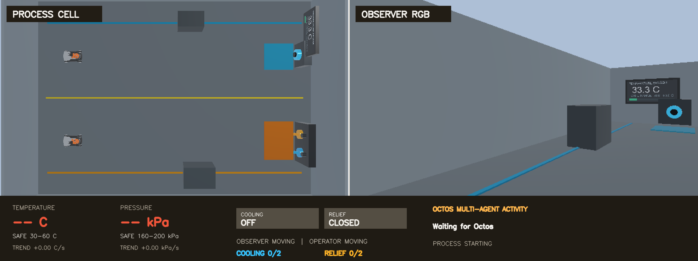
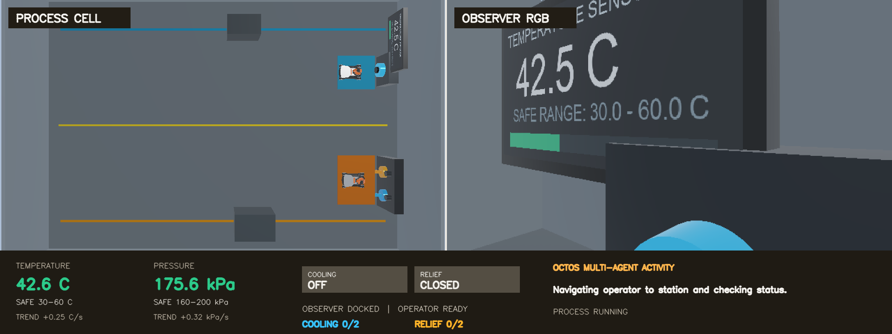
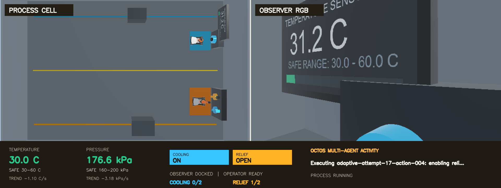

# 使用 Octos 构建多 Agent 连续过程监督

## 版本信息

| 组件 | 本章使用的版本 / 环境 |
| --- | --- |
| 操作系统 | Ubuntu 22.04 |
| GPU | NVIDIA GPU，建议 16 GB 以上显存；验证环境为 24 GB |
| NVIDIA 驱动 | 580.159.03 |
| Webots | R2025a |
| ROS | ROS 2 Humble |
| Dora CLI / Python | 0.5.0 |
| Octos | 2.0.2 |
| Ollama | 0.32.1 |
| Observer / Operator 模型 | `qwen3-vl:8b-instruct` |
| Supervisor 模型 | `qwen2.5-coder:7b` |

## 下载

- [完整参考工程 ZIP](../assets/octos-multi-agent-supervision/octos-multi-agent-supervision-reference.zip)
- [SHA-256 校验值](../assets/octos-multi-agent-supervision/SHA256SUMS.txt)
- <a href="../assets/octos-multi-agent-supervision/README.txt" download>英文 README</a>
- <a href="../assets/octos-multi-agent-supervision/README.zh-CN.txt" download>中文 README</a>

下载 ZIP 和校验文件后，在资产目录中验证：

```bash
sha256sum --ignore-missing -c SHA256SUMS.txt
unzip octos-multi-agent-supervision-reference.zip \
  -d octos-multi-agent-supervision
cd octos-multi-agent-supervision
```

## 目标

本章搭建一个持续升温、增压的仿真过程单元。观察点和控制点相距较远，因此使用
两台 KUKA youBot：

- **Observer** 前往观察站，对接压力传感器，并用 RGB 相机读取温度显示屏；
- **Operator** 前往控制站，操作冷却与泄压开关；
- **Supervisor** 根据温度、压力、变化速率、数据新鲜度和开关状态，决定何时
  观察以及是否改变控制状态。

正常温度范围是 30–60 °C，正常压力范围是 160–200 kPa。仿真启动后两个数值立即
缓慢上升；冷却打开后温度下降，泄压打开后压力下降。系统应在接近边界前采取动作，
并在接近下界时关闭控制，持续把过程维持在正常范围内。

这个任务没有自然终点。教程录屏在冷却和泄压各完成两次有效控制，并保持一段
安全、关闭状态后停止；实际监督循环可以继续运行。

<div class="media-pair media-pair--ultrawide">
  <figure>
    
    <figcaption><strong>过程启动：</strong>数值先开始变化，两台机器人同时前往各自工作站</figcaption>
  </figure>
  <figure>
    
    <figcaption><strong>角色就位：</strong>Observer 读取传感器，Operator 等待控制请求</figcaption>
  </figure>
</div>

## 为什么选择 Octos

[Octos](https://octos-org.github.io/octos/) 是开源 Agent 平台。它把模型、
Profile、Skill、工具策略、会话、沙箱和模型 Provider 组织在同一个运行时中。
本章使用 `octos chat --message` 启动可重复的单次 Agent 执行，并为三个角色配置
不同模型、角色指令与编排职责。

`adora` 曾用于验证 Dora 面向 agentic workflow 的实验性设计；相关工作已经
整合回 [Dora](https://github.com/dora-rs/dora)，因此本章直接使用 Dora CLI 和
dataflow，不需要安装独立的 adora 运行时。历史背景可查看
[adora 仓库说明](https://github.com/dora-rs/adora)。

### Agent、Agents SDK 与 Octos

| 概念 | 主要解决的问题 | 在这些示例中的用法 |
| --- | --- | --- |
| Agent | 让模型在循环中观察结果并选择工具 | “观察、行动、再观察”的基本工作方式 |
| Agents SDK | 在应用代码中定义 Agent、工具和运行循环 | 单个 Agent 顺序完成一个开关任务 |
| Octos | 管理 Profile、Skill、模型、工具策略、沙箱和多个独立 Agent 角色 | Observer、Operator、Supervisor 分工完成持续监督 |

Octos 并不是因为“比 SDK 多一个循环”才有价值。这个示例真正用到的是：

- **角色分工**：runner 只把感知任务交给 Observer、把开关任务交给 Operator，
  Supervisor 不具备机器人工具；Observer 与 Operator 仍共享同一个 Skill，因此
  这里依靠编排与指令约束，而不是不同的工具白名单；
- **不同模型服务不同角色**：视觉角色使用 Qwen3-VL，策略生成使用较小的代码模型；
- **Skill 可复用**：具名工具、参数 schema、安全规则和任务语义一起安装；
- **独立记录与故障定位**：每个角色有单独调用结果，容易判断感知、策略还是执行失败；
- **资源调度更清楚**：视觉模型与代码模型分阶段加载，不必同时占满显存；
- **coding to action**：Supervisor 生成受限策略代码，经验证后再用于连续决策。

本章没有使用 Octos 的 swarm 自动派生角色。参考工程用一个很薄的 Python runner
显式启动三个 Octos Agent、传递结构化结果并管理生命周期，这样角色职责和失败路径
更容易阅读与测试。

## 三种架构的区别

三个示例共享具名技能、结构化结果和 Dora 执行层，模型参与任务的方式逐步变化。

<div class="architecture-comparison">
  <section class="architecture-variant architecture-variant--plan">
    <div class="architecture-variant-heading">
      <span class="architecture-kicker">示例一</span>
      <strong>一次性生成完整动作计划</strong>
    </div>
    <div class="architecture-flow" role="img" aria-label="自然语言任务经过大语言模型生成完整 JSON 计划，校验后由 Dora 和 Webots 确定性执行">
      <div class="architecture-node"><strong>自然语言任务</strong><small>目标与完成条件</small></div>
      <div class="architecture-arrow" aria-hidden="true">&rarr;</div>
      <div class="architecture-node"><strong>LLM Planner</strong><small>执行前调用一次</small></div>
      <div class="architecture-arrow" aria-hidden="true">&rarr;</div>
      <div class="architecture-node"><strong>完整 JSON Plan</strong><small>步骤与条件分支</small></div>
      <div class="architecture-arrow" aria-hidden="true">&rarr;</div>
      <div class="architecture-node"><strong>计划校验器</strong><small>拒绝非法序列</small></div>
      <div class="architecture-arrow" aria-hidden="true">&rarr;</div>
      <div class="architecture-node"><strong>Dora / Webots</strong><small>按计划执行</small></div>
    </div>
    <p class="architecture-caption">适合目标清楚、步骤有限、运行中不需要重新规划的任务。</p>
  </section>

  <div class="architecture-shift">
    <strong>第一次变化</strong>
    <span>模型从“执行前规划一次”变为“每次收到工具结果后决定下一步”。</span>
  </div>

  <section class="architecture-variant architecture-variant--agent">
    <div class="architecture-variant-heading">
      <span class="architecture-kicker">示例二</span>
      <strong>单 Agent 根据结果循环决策</strong>
    </div>
    <div class="architecture-flow" role="img" aria-label="一个 Agents SDK Agent 选择具名工具，经 Robot API 和 Dora 执行后读取结构化结果，再决定下一步">
      <div class="architecture-node"><strong>自然语言任务</strong><small>一次性任务目标</small></div>
      <div class="architecture-arrow" aria-hidden="true">&rarr;</div>
      <div class="architecture-node"><strong>Agents SDK</strong><small>单 Agent 工具循环</small></div>
      <div class="architecture-arrow" aria-hidden="true">&rarr;</div>
      <div class="architecture-node"><strong>Robot API</strong><small>类型化原子工具</small></div>
      <div class="architecture-arrow" aria-hidden="true">&rarr;</div>
      <div class="architecture-node"><strong>Dora Dataflow</strong><small>动作分派与回执</small></div>
      <div class="architecture-arrow" aria-hidden="true">&rarr;</div>
      <div class="architecture-node"><strong>Webots / VLM</strong><small>运动和视觉反馈</small></div>
    </div>
    <div class="architecture-feedback" role="note">
      <span class="architecture-feedback-arrow" aria-hidden="true">&larr;</span>
      <span><strong>结构化结果返回同一个 Agent</strong><small>它继续选择下一个工具，直到一次性任务完成</small></span>
    </div>
  </section>

  <div class="architecture-shift">
    <strong>第二次变化</strong>
    <span>任务从单机器人、有限步骤，扩展为多角色、异构模型和没有自然终点的持续监督。</span>
  </div>

  <section class="architecture-variant architecture-variant--multi">
    <div class="architecture-variant-heading">
      <span class="architecture-kicker">本章</span>
      <strong>Octos 多 Agent 持续监督</strong>
    </div>
    <div class="architecture-flow" role="img" aria-label="Octos Supervisor 生成自适应策略，Observer 和 Operator 通过受限 Skill 调用 Dora，Dora 和 Webots 返回可观察状态形成持续反馈">
      <div class="architecture-node"><strong>持续过程目标</strong><small>范围、趋势与安全条件</small></div>
      <div class="architecture-arrow" aria-hidden="true">&rarr;</div>
      <div class="architecture-node"><strong>Octos Supervisor</strong><small>生成并复核策略</small></div>
      <div class="architecture-arrow" aria-hidden="true">&rarr;</div>
      <div class="architecture-node"><strong>Observer / Operator</strong><small>感知与控制分权</small></div>
      <div class="architecture-arrow" aria-hidden="true">&rarr;</div>
      <div class="architecture-node"><strong>Octos Skill / API</strong><small>具名工具与回执</small></div>
      <div class="architecture-arrow" aria-hidden="true">&rarr;</div>
      <div class="architecture-node"><strong>Dora / Webots</strong><small>数据流、动作与仿真</small></div>
    </div>
    <div class="architecture-feedback architecture-feedback--multi" role="note">
      <span class="architecture-feedback-arrow" aria-hidden="true">&larr;</span>
      <span><strong>值、趋势、新鲜度和开关状态持续返回</strong><small>策略选择传感器、观察间隔和下一组独立控制动作</small></span>
    </div>
  </section>
</div>

| 对比项 | 一次性 LLM 计划 | 单 Agent / Agents SDK | Octos 多 Agent |
| --- | --- | --- | --- |
| 规划时机 | 执行前一次 | 每个工具结果之后 | 持续决策，并可定期复核策略 |
| 角色数量 | 一个 Planner | 一个执行 Agent | Observer、Operator、Supervisor |
| 模型输出 | 完整 JSON 序列 | 下一次工具调用 | 受限策略代码、观察请求和动作 |
| 状态范围 | 一次任务状态 | 单机器人任务上下文 | 时间序列、速率、新鲜度与多机器人状态 |
| 失败隔离 | 计划或执行 | 单一循环内处理 | 感知、策略和执行可分别定位 |
| 适用任务 | 有限、可预先枚举 | 需要反馈的一次性任务 | 长时间、多角色、持续变化的任务 |

## 智能决策与可靠执行

这个工程由 Octos + LLM **驱动策略**，但不是“没有程序逻辑”。清楚划分责任，
比把所有行为都交给模型更重要。

| Octos 与模型决定 | 确定性程序保证 |
| --- | --- |
| 选择读取压力、RGB 温度或两者 | Dora 以固定频率传输状态和请求 |
| 根据趋势选择下一次观察间隔 | JSON Schema、Pydantic 和工具白名单校验参数 |
| 决定打开或关闭冷却、泄压 | 具名导航和机械臂动作执行实际操作 |
| Supervisor 生成并修订 `decide(context)` | AST 限制、隔离运行和边界 replay 验证策略 |
| 根据动作后的新证据继续调整 | `action_id` 回执保证重试不会重复按开关 |
| 选择何时继续观察 | 仿真安全层在硬下限处自动关闭控制 |

模型看不到隐藏的温度、压力真值，也不能输出坐标、轮速、关节角或任意 shell。
压力只有 Observer 停靠后才能通过 Dora 节点读取；温度必须来自一张新 RGB 图像和
本地 VLM 结构化结果。

## 实现流程

### 检查参考工程

先让编程助手理解工程边界，不要立即改写场景：

```text
检查这个提供的 Webots R2025a、ROS 2 Humble、Dora 0.5.0、
Octos 2.0.2 和 Ollama 参考工程。

说明 worlds、controllers、dora、week11_api、week11_runtime、
octos-skills、tools、config 和 tests 的职责。画出 Observer、
Operator、Supervisor 从 Octos Skill 到 Dora node，再到 Webots
和结构化结果返回的路径。

特别标出哪些决策由模型完成，哪些校验、执行和安全逻辑是确定性的。
不要安装或修改文件，也不要输出用户名、主机名、私有地址、token、
完整环境变量或本机绝对路径。
```

助手应识别出 `worlds/week11_process_supervision.wbt` 是场景入口，
`dora/week11_dataflow.yml` 是运行时拓扑，`octos-skills/` 定义模型可见能力，
`tools/run_octos_multi_agent.py` 只负责启动角色、传递结果和管理策略生命周期。

### 准备环境

让助手先检查硬件和已有安装，再执行固定版本的命令：

```text
为这个参考工程准备 Ubuntu 22.04 环境。

检查 CPU 架构、内存、磁盘、NVIDIA GPU 与显存、驱动、Docker、
NVIDIA Container Toolkit、X11 DISPLAY、Dora、Octos 和 Ollama。
版本以 README.md、Dockerfile 和 pyproject.toml 为准。

保留已经满足版本要求的安装。变更前列出命令和影响范围。
Octos 与 Ollama 只在宿主机运行，Webots、ROS 2 和 Dora Python nodes
在提供的容器中运行。不要显示 token、完整环境变量或私人路径。
```

已验证的安装与模型准备命令：

```bash
npm install -g @octos-org/octos@2.0.2
octos --version

ollama pull qwen3-vl:8b-instruct
ollama pull qwen2.5-coder:7b

docker build -t octos-process-supervision:humble .
chmod +x run-container.sh launch-webots.sh
```

验证机器有 24 GB 显存。runner 在视觉阶段结束后卸载 Qwen3-VL，再加载 Supervisor
代码模型；策略生成完成后反向切换，因此两个模型不必常驻显存。显存较小的设备可
降低模型规模，但应重新验证视觉结构化输出和策略 replay。

### 加载仿真场景

启动交互式容器，并在容器内打开 Webots：

```bash
./run-container.sh
./launch-webots.sh
```

可以用下面的提示词检查场景，而不是重新生成它：

```text
检查已加载的连续过程监督场景。

确认 Observer 和 Operator 从两个独立起点出发；观察站包含压力接口和
完整可见的温度显示屏；控制站包含冷却与泄压两个开关；固定场景相机能同时
看到两条路线和两个工作站；Observer RGB 相机在停靠后能完整看到温度数值。

确认温度和压力从仿真开始就上升，安全范围分别是 30-60 C 和
160-200 kPa。只报告检查结果，不修改世界文件。
```

初始状态下，底部仪表尚未收到 Agent 的传感器读数，但仿真过程已经开始变化。
两台机器人会并发移动，避免先等观察机器人、再启动操作机器人的空白时间。

### 定义 Dora Dataflow

让助手检查数据是否真正通过 Dora，而不是由 runner 读取仿真内部变量：

```text
检查 dora/week11_dataflow.yml 及其节点。

gateway 只负责本地 API、请求关联和分派；state 周期发布脱敏状态；
command 只处理具名导航与开关动作；observation 只处理压力和 RGB 温度；
activity 只把简短的 Agent 活动显示到场景 UI。

确认每个 request_id 都能收到对应结果，温度和压力真值不会通过
GET /v1/status 暴露给 Agent，所有 HTTP 端口只监听 127.0.0.1。
找出未连接输入、错误 topic、无限等待或绕过 Dora 的路径。
```

完整 dataflow：

```yaml
{{#include ../assets/octos-multi-agent-supervision/source/dora/week11_dataflow.yml}}
```

`gateway` 在 `127.0.0.1:8111` 提供本地接口。Dora 的 `state`、
`command`、`observation` 和 `activity` 节点仍保持单一职责。

### 定义 Octos Skill

Skill 把机器人能力和安全语义一起交给 Agent：

```text
检查 octos-skills/week11-process-supervision。

Observer 和 Operator 共享这个 Skill。确认 SKILL.md 把传感器职责分配给
Observer、把开关职责分配给 Operator，并检查 runner 的角色提示词是否保持这项
分工。Supervisor 使用无工具配置，不能直接访问任何机器人工具。

工具参数只允许 role、home/station、cooling/relief、enabled、
action_id、message 和 1-120 秒等待。拒绝坐标、速度、轮速、关节角、
隐藏仿真真值、shell 和任意代码执行。

检查 manifest schema、SKILL.md 规则与 main adapter 是否一致，
并确认相同 action_id 的重试只返回原回执。
```

在这个参考工程中，Observer 与 Operator 的分工位于编排和指令层，并没有使用不同
的工具白名单。对权限隔离有强要求的生产系统，应增加按角色配置的 Profile 或
tool policy，并重新验证每个角色。

完整工具 manifest：

```json
{{#include ../assets/octos-multi-agent-supervision/source/octos-skills/week11-process-supervision/manifest.json}}
```

关键 adapter 把 Octos 工具映射到本地 Dora API：

```python
{{#include ../assets/octos-multi-agent-supervision/source/octos-skills/week11-process-supervision/main:42:87}}
```

runner 启动时会把这三个 Skill 文件同步到工程内的
`.octos/skills/week11-process-supervision/`。这个目录是运行时生成内容，
不会进入下载包。

### 配置三个 Agent

让助手实现按角色编排和模型切换：

```text
使用 Octos CLI 配置三个独立角色。

Observer 使用 qwen3-vl:8b-instruct，通过指令把工作限制为导航、压力读取和
RGB 温度读取。Operator 使用 qwen3-vl:8b-instruct，通过指令把工作限制为导航和
具名开关动作。
Supervisor 使用 qwen2.5-coder:7b、coding profile 和无工具策略，
只返回一个包含完整 strategy_source 与 reason 的 JSON 对象。

三个角色都使用本地 Ollama 的 OpenAI 兼容 endpoint、read-only sandbox、
never approval 和 JSON 输出。Observer 与 Operator 并发准备。
不要记录隐藏推理，只记录角色、工具、结构化结果、耗时和错误。
```

runner 为每个角色调用同一个 Octos 二进制，但使用独立输出和模型配置：

```python
{{#include ../assets/octos-multi-agent-supervision/source/tools/run_octos_multi_agent.py:129:214}}
```

Supervisor 的配置文件不暴露任何工具：

```json
{{#include ../assets/octos-multi-agent-supervision/source/config/octos-supervisor.json}}
```

### 生成并验证自适应策略

Supervisor 不是输出固定动作序列，而是生成每次观察后都会调用的
`decide(context)`：

```text
你是连续过程单元的 Supervisor Agent。生成一个小型 Python 策略：

def decide(context):

目标是把温度保持在 30-60 C，把压力保持在 160-200 kPa。
context 包含带时间戳的 history、每秒变化 rates、switch_state、
normal_ranges、freshness_seconds 和 completed_cycles。

根据当前值、趋势、数据新鲜度和开关状态：
1. 选择下一轮读取 pressure、temperature_rgb 或两者；
2. 决定立即打开或关闭 cooling、relief，可独立操作；
3. 自己选择 1-120 秒内的下一次观察间隔；
4. 动作后尽快复查，并在接近下界时提前关闭控制；
5. 任务没有自然终点，应持续监督。

只定义 decide(context)，不要 import、文件、网络、shell、类、异常、
while、动态执行或私有名称。返回 observe、actions、
observe_after_seconds 和 reason。只返回包含 strategy_source 和 reason
的 JSON 对象。
```

一次实际运行生成并启用的初始策略如下：

```python
{{#include ../assets/octos-multi-agent-supervision/source/examples/generated_strategy.py}}
```

它不是未经检查就被执行。`validate_strategy_source` 只允许一个
`decide(context)`，拒绝 import、文件、网络、`while`、异常、类和动态执行；
策略在隔离的 Python 进程中运行，并必须通过启动、上界和下界 replay：

```python
{{#include ../assets/octos-multi-agent-supervision/source/week11_runtime/adaptive_policy.py:35:88}}
```

如果候选策略无效，Supervisor 最多获得有限次数的结构化修正机会；仍然失败时，
runner 使用已经通过 replay 的基线策略。每完成三个控制周期，Supervisor 可以
根据新测得的速率保留或修订策略。

### 启动完整应用

保持 Webots 窗口运行，在第二个终端进入容器并启动 Dora：

```bash
docker exec -it octos-process-supervision bash
cd /workspace/dora
dora run week11_dataflow.yml
```

在宿主机第三个终端检查本地 API：

```bash
curl -s http://127.0.0.1:8111/health
curl -s http://127.0.0.1:8111/v1/status
```

`status` 应包含机器人位置、开关状态、安全范围和过程阶段，但不包含当前温度与
压力真值。然后启动三个 Octos Agent：

```bash
python3 tools/run_octos_multi_agent.py
```

也可以显式指定二进制和模型：

```bash
python3 tools/run_octos_multi_agent.py \
  --octos "$(command -v octos)" \
  --ollama "$(command -v ollama)" \
  --vision-model qwen3-vl:8b-instruct \
  --supervisor-model qwen2.5-coder:7b
```

一段精简后的可观察事件如下；实际数值和 `action_id` 会变化：

```text
[Observer] navigating to station and acquiring pressure + RGB temperature
[Operator] navigating to control station
[Supervisor] strategy-v001 accepted by AST and replay validation
[Strategy] observe=["pressure"] actions=[relief=true] next=3s
[Operator] action receipt status=succeeded relief_open=true
[Observer] pressure=167.3 kPa
[Strategy] observe=["temperature_rgb"] actions=[] next=10s
[Observer] temperature=51.8 C visible=true confidence=0.99
[Strategy] actions=[cooling=true] next=3s
[Operator] action receipt status=succeeded cooling_on=true
[Strategy] actions=[cooling=true, relief=true] next=3s
```

按 `Ctrl+C` 时，runner 会请求关闭仍然开启的控制并记录最后状态。不要直接关闭
Webots 窗口来代替受控退出。

### 检查控制证据

下面两张图分别展示第二次冷却和第二次泄压。左侧是固定第三方视角，右侧是
Observer RGB；底部同时显示传感器值、趋势、阀门状态、机器人状态、独立控制次数
和当前 Octos 活动。

<div class="media-pair media-pair--ultrawide">
  <figure>
    
    <figcaption><strong>冷却：</strong>温度趋势变为 −1.10 °C/s，泄压保持关闭</figcaption>
  </figure>
  <figure>
    
    <figcaption><strong>泄压：</strong>压力趋势变为 −3.18 kPa/s，冷却保持关闭</figcaption>
  </figure>
</div>

视频以 2.5 倍速播放完整过程。可以看到两台机器人并发就位、VLM 读取温度、
Supervisor 激活策略、Operator 多次独立切换两个控制，以及每次动作后的重新观察。
封面和视频均为 1920×720，开始播放时页面不会重新定位。

<video class="process-demo-video" controls muted playsinline preload="metadata" width="1920" height="720" poster="../assets/octos-multi-agent-supervision/media/process-complete.png">
  <source src="../assets/octos-multi-agent-supervision/media/octos-process-supervision.mp4" type="video/mp4">
</video>

教程录制停止时，两个控制都关闭，温度为 30.9 °C，压力为 162.7 kPa。`2/2`
只是录屏目标，不是 Agent 的完成条件。


## 测试与故障边界

在容器内运行完整测试：

```bash
cd /workspace
python3 -m pytest -q
```

参考运行包含 145 项测试，覆盖 Dora wiring、本地 API、角色行为约束、Skill schema、
幂等动作、RGB 温度 contract、趋势计算、策略 AST、隔离执行、边界 replay、
场景 contract、布局和录屏结束条件。

常见问题：

- **Octos 找不到 Skill**：从工程根目录运行 runner，检查
  `.octos/skills/week11-process-supervision/manifest.json` 是否已经同步。
- **Agent 无法连接 Ollama**：确认 `ollama list` 可用，并检查本机
  `127.0.0.1:11434/v1`；不要把服务开放到外部网络来规避配置问题。
- **压力返回 `OBSERVER_NOT_DOCKED`**：等待 Observer 到达 station，不要读取隐藏真值。
- **温度结果不可见或置信度低**：确认温度屏完整位于 Observer RGB 中，再请求一张
  新图；不要把上一次结果当成新观察。
- **策略被拒绝**：查看拒绝原因是语法、AST、输出 schema 还是边界 replay，
  只让 Supervisor 修正对应问题。
- **动作看似重复**：检查 `action_id` 和 receipt；同一 ID 不应再次执行物理动作。
- **低于正常下限**：确定性安全层会关闭对应控制，下一轮必须从实际开关状态继续，
  不能沿用 Agent 记忆中的旧状态。
- **显存不足**：确认视觉模型和代码模型按阶段卸载；缩小模型后重新验证结构化输出，
  不要删除 schema、replay 或安全联锁。

## 继续扩展

新增第三个过程量时，保持同样的边界：先在 Dora 中实现可观察传感器、具名控制和
确定性保护，再将一个小工具加入 Octos Skill。新的 Agent 可以拥有自己的 Profile
和模型，但不应通过共享任意代码执行、隐藏状态或底层电机参数来获得“通用能力”。

可以进一步把 Python runner 替换成 Octos 的持久服务、pipeline 或原生多 Agent
拓扑；无论编排方式如何变化，传感器证据、动作回执、策略验证和停止路径仍应保持
结构化、可测试和可审计。

## 课程小结

这个案例已经初步呈现出现代机器人长期任务管理与机器人集群治理系统的雏形：多个
角色围绕一个持续目标分工协作，根据可观察数据调整策略，并通过 Dora 执行结构化、
可验证、可审计的动作。

不过，它距离成熟的具身智能仍有一段距离。现实机器人还需要学习或获得具体的操作
技能，实现机械臂的精细控制、双手协同、复杂物理环境适应和长期安全运行。我们在
这里完成的是一个清晰、可复现的起点，而不是终点。

至此，本教程全部结束。感谢你读到这里，希望这些示例能帮助你继续构建自己的 Dora
机器人应用与系统。
